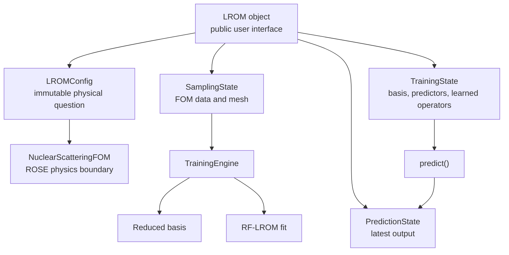
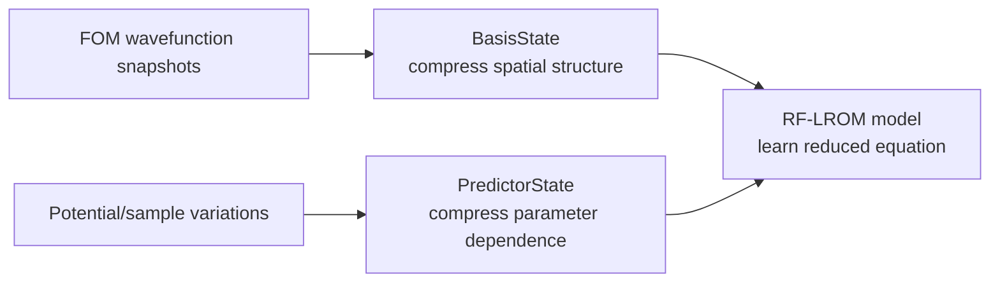
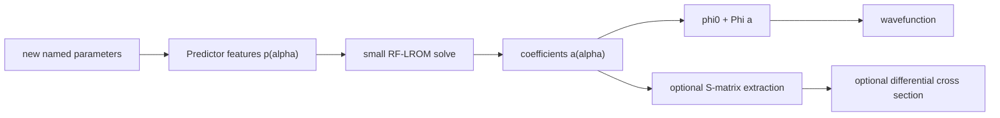

# Notebook 01 ROSE Free-Reference Correction Implementation Plan

> **For agentic workers:** REQUIRED SUB-SKILL: Use superpowers:subagent-driven-development (recommended) or superpowers:executing-plans to implement this plan task-by-task. Steps use checkbox (`- [ ]`) syntax for tracking.

**Goal:** Correct notebook 01's ROSE comparison using ROSE's free-reference convention and frozen `lrom_legacy.v1_2`, diagnose the three existing ws_3 outliers, and add singular-value evidence without changing package code.

**Architecture:** `tools/generate_notebook01.py` remains the sole source of the notebook. The LROM side imports `lrom_legacy.v1_2 as lrom`; the ROSE side consumes the same v1.2 snapshots but builds a separate four-vector, free-centered `CustomBasis`. All additional spectra and before/after evidence are notebook- or agent-owned diagnostics, so both package trees remain byte-identical.

**Tech Stack:** Python 3.12, NumPy, SciPy, Matplotlib, pandas, nbformat/nbclient, public `nuclear-rose`, pytest.

## Global Constraints

- Target `notebooks/01_rbm_vs_lrom_single_wavefunction.ipynb` through `tools/generate_notebook01.py`; never hand-edit notebook JSON.
- Use `lrom_legacy.v1_2`, version `1.2.0`, as the notebook's LROM package.
- Do not modify `lrom/__init__.py`, any file under `lrom_legacy/`, the installed ROSE package, or `scientific_archive/`.
- Keep the three scientific sections and the save/load demonstration.
- ROSE and LROM use the same training rows, snapshots, mesh, and retained rank `K = 4`, but their own reference conventions.
- Never overlay, subtract, or otherwise treat ROSE and LROM coefficients as coordinates in the same basis.
- All spatial plots expose physical radius `r` in fm.
- Use fixed method colors: LS blue, LROM yellow/orange, ROSE red.
- `DISPLAY_ERROR_FLOOR = 1e-11` clips plots only; calculated metrics remain raw.
- Keep the exact central Vv case in data, but exclude it from aggregate plots.
- The user's final sentence-by-sentence prose ownership pass remains pending after implementation.
- Stage only scoped files; preserve the user's untracked advisor backlog and restored `scientific_archive/ROSE_Guide/`.

## File Map

- Modify `tools/generate_notebook01.py`: v1.2 import, free-reference ROSE construction, separate coordinate conventions, singular spectra, display floor, central-case plot mask, and explanatory notebook text.
- Modify `tests/test_notebook01_generation.py`: assert the generated setup binds to v1.2 and clears stale current/legacy modules.
- Modify `tests/test_notebook01_lrom_flow.py`: assert the free-reference construction and revised diagnostics while rejecting the invalid assignments.
- Create `.agents/validation/notebook01_rose_reference_diagnostic.py`: reproduce only the ws_3 before/after reference experiment and print deterministic evidence.
- Create `.agents/validation/2026-07-20-notebook01-rose-reference-results.md`: reviewed diagnostic output and interpretation.
- Create `docs/LROM_ARCHITECTURE_UNDERSTANDING.md`: maintained user-facing architecture and change-explanation guide.
- Regenerate and execute `notebooks/01_rbm_vs_lrom_single_wavefunction.ipynb`.
- Do not modify package files.

---

### Task 1: Lock the v1.2 and Free-Reference Source Contract

**Files:**
- Modify: `tests/test_notebook01_generation.py`
- Modify: `tests/test_notebook01_lrom_flow.py`
- Modify: `tools/generate_notebook01.py`

**Interfaces:**
- Consumes: `generate_notebook01.repo_bootstrap_source()` and `generate_notebook01.notebook_cells()`.
- Produces: setup source in which the local repository is found, stale `lrom` and `lrom_legacy` modules are cleared, and `lrom_legacy.v1_2` is imported as `lrom`.

- [ ] **Step 1: Record the protected hashes and baseline tests**

Run:

```bash
shasum -a 256 lrom/__init__.py lrom_legacy/v1_2/__init__.py
python -m pytest -q
```

Expected: record both hashes in the implementation notes; the current suite passes before edits.

- [ ] **Step 2: Replace the setup tests with a failing v1.2 contract**

In `tests/test_notebook01_generation.py`, rename the bootstrap test and use this import/assertion body:

```python
def test_notebook01_bootstrap_finds_frozen_v1_2_package() -> None:
    script = f"""
from pathlib import Path
import os
import sys

os.chdir({str(ROOT / "notebooks")!r})
sys.path = [p for p in sys.path if p not in {{{str(ROOT)!r}, {str(ROOT / "notebooks")!r}}}]

{generate_notebook01.repo_bootstrap_source()}

import lrom_legacy.v1_2 as lrom

assert ROOT == Path({str(ROOT)!r})
assert sys.path[0] == {str(ROOT)!r}
assert lrom.__version__ == "1.2.0"
assert lrom.LROM.__name__ == "LROM"
"""
    result = subprocess.run(
        [sys.executable, "-c", script],
        check=False,
        capture_output=True,
        text=True,
    )
    assert result.returncode == 0, result.stderr
```

Replace the setup-cell assertions with:

```python
def test_setup_cell_uses_frozen_v1_2_and_clears_stale_modules() -> None:
    setup = generate_notebook01.notebook_cells()[2]["source"]

    assert generate_notebook01.repo_bootstrap_source() in setup
    assert "import lrom_legacy.v1_2 as lrom" in setup
    assert 'name in ("lrom", "lrom_legacy")' in setup
    assert 'name.startswith(("lrom.", "lrom_legacy."))' in setup
    assert 'print("LROM package:", lrom.__version__)' in setup
    assert "lrom_bench" not in setup
    compile(setup, "notebook01 setup", "exec")
```

- [ ] **Step 3: Add failing flow assertions for correct ROSE ownership**

Append to `tests/test_notebook01_lrom_flow.py`:

```python
def test_notebook01_rose_uses_free_reference_without_lrom_basis_overwrites() -> None:
    text = source()

    assert text.count("rose.free_solutions.phi_free(") == 2
    assert text.count("rose.basis.CustomBasis(") == 2
    assert text.count("subtract_phi0=True") == 2
    assert text.count("use_svd=True") >= 2
    assert "phi_0=np.asarray(vv_emulator.samples.central_wavefunctions" not in text
    assert "phi_0=np.asarray(ws3_emulator.samples.central_wavefunctions" not in text
    assert "vv_rose_basis.vectors =" not in text
    assert "vv_rose_basis.phi_0 =" not in text
    assert "ws3_rose_basis.vectors =" not in text
    assert "ws3_rose_basis.phi_0 =" not in text


def test_notebook01_declares_equal_rank_but_separate_coordinate_conventions() -> None:
    text = source()

    assert "BASIS_SIZE = 4" in text
    assert "same training snapshots and retained rank" in text
    assert "different reference functions" in text
    assert "|LS - ROSE|" not in text
    assert "shared-basis" not in text.lower()
```

Replace the existing approved-size assertion so it accepts the named constant:

```python
def test_notebook01_uses_approved_sample_and_model_sizes() -> None:
    text = source()

    assert "training_size=35" in text
    assert "testing_size=41" in text
    assert "training_size=70" in text
    assert "testing_size=81" in text
    assert "BASIS_SIZE = 4" in text
    assert text.count("basis_size=BASIS_SIZE") == 2
    assert text.count("n_basis=BASIS_SIZE") == 2
    assert "predictor_count=6" in text
    assert "eim_basis_size=8" in text
```

Replace the two existing coefficient tests with the convention-correct versions:

```python
def test_vv_coefficients_use_separate_lrom_and_rose_coordinate_figures() -> None:
    text = source()

    assert "for coefficient_index in range(2)" in text
    assert 'for method, color in (("ls", "blue"), ("lrom", "orange"))' in text
    assert "coefficients[method][0][:, coefficient_index]" in text
    assert "vv_rose_coefficients[:, coefficient_index]" in text
    assert "np.abs(ls_coefficients - lrom_coefficients)" in text
    assert "|LS - ROSE|" not in text


def test_ws3_coefficients_are_separate_and_wavefunctions_keep_absolute_differences() -> None:
    text = source()

    assert "np.abs(ws3_ls_coefficients - ws3_lrom_coefficients)" in text
    assert "np.abs(ws3_ls_coefficients - ws3_rose_coefficients)" not in text
    for method in ("ls", "lrom"):
        assert f"np.abs(case.high_fidelity[0] - case.{method}[0])" in text
    assert "np.abs(case.high_fidelity[0] - ws3_rose_wf_test[representative_index])" in text
```

- [ ] **Step 4: Run the focused tests to verify RED**

Run:

```bash
python -m pytest -q tests/test_notebook01_generation.py tests/test_notebook01_lrom_flow.py
```

Expected: failures show the current-package import, central-wavefunction `phi_0`, basis overwrites, and shared-coordinate language.

- [ ] **Step 5: Implement the v1.2 setup and constants**

In the setup source built by `tools/generate_notebook01.py`, replace module cleanup/import lines and add constants:

```python
for name in list(sys.modules):
    if name in ("lrom", "lrom_legacy") or name.startswith(("lrom.", "lrom_legacy.")):
        del sys.modules[name]

import scipy.special
if not hasattr(scipy.special, "sph_harm") and hasattr(scipy.special, "sph_harm_y"):
    # legacy sph_harm took (theta=azimuthal, phi=polar); sph_harm_y takes (polar, azimuthal)
    scipy.special.sph_harm = lambda m, n, theta, phi: scipy.special.sph_harm_y(n, m, phi, theta)

import rose
import lrom_legacy.v1_2 as lrom

BASIS_SIZE = 4
DISPLAY_ERROR_FLOOR = 1e-11
print("LROM package:", lrom.__version__)
```

Replace literal `basis_size=4` and ROSE `n_basis=4` values in the two study setup cells with `BASIS_SIZE`.

- [ ] **Step 6: Implement free-reference ROSE bases without overwrites**

In the Vv study, replace the central-reference block with:

```python
vv_rose_phi0 = np.asarray([
    rose.free_solutions.phi_free(float(rho), 0, vv_emulator.kinematics.eta)
    for rho in vv_emulator.samples.mesh.rho
], dtype=np.complex128)
vv_rose_basis = rose.basis.CustomBasis(
    solutions=np.asarray(
        vv_emulator.samples.training_wavefunctions[0], dtype=np.complex128
    ).T.copy(),
    phi_0=vv_rose_phi0.copy(),
    rho_mesh=vv_emulator.samples.mesh.rho,
    n_basis=BASIS_SIZE,
    solver=vv_emulator.full_order_model[0].solver,
    subtract_phi0=True,
    use_svd=True,
    center=False,
    scale=False,
)
vv_rose_rbe = rose.reduced_basis_emulator.ReducedBasisEmulator(
    vv_emulator.full_order_model[0].interaction,
    vv_rose_basis,
    s_0=vv_emulator.full_order_model[0].base_solver.s_0,
    initialize_emulator=True,
)
```

In the ws_3 study, repeat the construction with these exact study-owned names:

```python
ws3_rose_phi0 = np.asarray([
    rose.free_solutions.phi_free(float(rho), 0, ws3_emulator.kinematics.eta)
    for rho in ws3_emulator.samples.mesh.rho
], dtype=np.complex128)
ws3_rose_basis = rose.basis.CustomBasis(
    solutions=np.asarray(
        ws3_emulator.samples.training_wavefunctions[0], dtype=np.complex128
    ).T.copy(),
    phi_0=ws3_rose_phi0.copy(),
    rho_mesh=ws3_emulator.samples.mesh.rho,
    n_basis=BASIS_SIZE,
    solver=ws3_emulator.full_order_model[0].solver,
    subtract_phi0=True,
    use_svd=True,
    center=False,
    scale=False,
)
ws3_rose_rbe = rose.reduced_basis_emulator.ReducedBasisEmulator(
    ws3_emulator.full_order_model[0].interaction,
    ws3_rose_basis,
    s_0=ws3_emulator.full_order_model[0].base_solver.s_0,
    initialize_emulator=True,
)
```

Do not add any assignment to either ROSE basis's `.vectors` or `.phi_0`.

- [ ] **Step 7: Separate coefficient figures at the same scientific seam**

For the Vv LROM-coordinate figure, include only `LS` blue and `LROM` orange, plus `|LS - LROM|`. For the Vv ROSE-native figure, plot the first two ROSE coefficients in red against Vv with no LS subtraction.

For ws_3, retain case index during this A1-A3 milestone but create one LROM-coordinate figure for LS/LROM and one ROSE-native figure for ROSE. Use exact titles containing `LROM-coordinate diagnostics` and `ROSE-native coordinates`. Every panel gets a legend.

Use explicit names in the LROM difference calculations:

```python
ls_coefficients = np.real(coefficients["ls"][0][:, coefficient_index])
lrom_coefficients = np.real(coefficients["lrom"][0][:, coefficient_index])
coefficient_difference = np.abs(ls_coefficients - lrom_coefficients)
```

For ws_3 use:

```python
ws3_ls_coefficients = np.real(
    ws3_emulator.testing_results.coefficients["ls"][0][:, 0]
)
ws3_lrom_coefficients = np.real(
    ws3_emulator.testing_results.coefficients["lrom"][0][:, 0]
)
ws3_coefficient_difference = np.abs(
    ws3_ls_coefficients - ws3_lrom_coefficients
)
```

Never add ROSE coefficients to the `coefficients` dictionary copied from LROM results.

- [ ] **Step 8: Update the notebook's method statement**

Replace the introductory shared-basis claim with this exact statement:

```markdown
The LROM calculations use the frozen `lrom_legacy.v1_2` implementation.
ROSE and LROM use the same high-fidelity training snapshots and retained rank,
but they use different reference functions: LROM is centered on the central
potential solution, while ROSE is centered on the free solution required by
its reduced-basis equations. Their reconstructed wavefunctions can be compared;
their coefficient values belong to different coordinate systems and are shown
separately.
```

- [ ] **Step 9: Run focused tests to verify GREEN**

Run:

```bash
python -m pytest -q tests/test_notebook01_generation.py tests/test_notebook01_lrom_flow.py
```

Expected: all focused tests pass.

- [ ] **Step 10: Commit and push the source-contract milestone**

```bash
python tools/generate_notebook01.py
git add tools/generate_notebook01.py tests/test_notebook01_generation.py tests/test_notebook01_lrom_flow.py notebooks/01_rbm_vs_lrom_single_wavefunction.ipynb
git commit -m "Correct notebook 01 ROSE reference convention"
git push origin main
```

Stage no package or archive files.

---

### Task 2: Capture the Three-Case Before/After Diagnosis

**Files:**
- Create: `.agents/validation/notebook01_rose_reference_diagnostic.py`
- Create: `.agents/validation/2026-07-20-notebook01-rose-reference-results.md`
- Test: `tests/test_notebook01_lrom_flow.py`

**Interfaces:**
- Consumes: v1.2 `LROM`, the exact notebook ws_3 sampling design, `rose.basis.CustomBasis`, and ROSE RBE matrix components.
- Produces: deterministic rows for `test-0021`, `test-0039`, and `test-0065`, each with parameters, interpolation status, coefficient norm, reduced-matrix condition number, and wavefunction relative-L2 error under both references.

- [ ] **Step 1: Add a failing source test for named-case reporting**

Append:

```python
def test_notebook01_reports_corrected_rose_outliers_by_named_case() -> None:
    text = source()

    assert "ws3_rose_coefficient_norm" in text
    assert "ws3_rose_worst_indices" in text
    assert "worst corrected ROSE cases" in text
    assert "case_id" in text
    assert "coefficient infinity norm" in text
    assert "relative L2 error" in text
```

- [ ] **Step 2: Run the new test to verify RED**

Run:

```bash
python -m pytest -q tests/test_notebook01_lrom_flow.py::test_notebook01_reports_corrected_rose_outliers_by_named_case
```

Expected: FAIL because the notebook does not yet report named corrected cases.

- [ ] **Step 3: Create the standalone diagnostic script**

Create `.agents/validation/notebook01_rose_reference_diagnostic.py` with a flat `main()` workflow. It must:

```python
from __future__ import annotations

import scipy.special
if not hasattr(scipy.special, "sph_harm") and hasattr(scipy.special, "sph_harm_y"):
    scipy.special.sph_harm = lambda m, n, theta, phi: scipy.special.sph_harm_y(n, m, phi, theta)

import numpy as np
import rose
import lrom_legacy.v1_2 as lrom

CASE_IDS = ("test-0021", "test-0039", "test-0065")
BASIS_SIZE = 4


def reduced_matrix(rbe, theta: np.ndarray) -> np.ndarray:
    invk, beta = rbe.interaction.coefficients(theta)
    return (
        rbe.A_13
        + np.einsum("i,ijk", beta, rbe.A_2)
        + invk * rbe.A_3_coulomb
    )


def build_rbe(emulator, phi0: np.ndarray, *, overwrite_with_lrom: bool):
    basis = rose.basis.CustomBasis(
        solutions=np.asarray(
            emulator.samples.training_wavefunctions[0], dtype=np.complex128
        ).T.copy(),
        phi_0=np.asarray(phi0, dtype=np.complex128).copy(),
        rho_mesh=emulator.samples.mesh.rho,
        n_basis=BASIS_SIZE,
        solver=emulator.full_order_model[0].solver,
        subtract_phi0=True,
        use_svd=True,
        center=False,
        scale=False,
    )
    if overwrite_with_lrom:
        basis.vectors = np.asarray(emulator.basis[0].vectors, dtype=np.complex128)
        basis.phi_0 = np.asarray(emulator.basis[0].phi0, dtype=np.complex128)
    return rose.reduced_basis_emulator.ReducedBasisEmulator(
        emulator.full_order_model[0].interaction,
        basis,
        s_0=emulator.full_order_model[0].base_solver.s_0,
        initialize_emulator=True,
    )
```

Its `main()` must recreate the notebook's ws_3 object, ranges, sizes, `mesh_size=900`, seed `1204`, EIM size `8`, four-vector basis, and six potential predictors. Build:

```python
central_rbe = build_rbe(
    emulator,
    emulator.samples.central_wavefunctions[0],
    overwrite_with_lrom=True,
)
free_phi0 = np.asarray([
    rose.free_solutions.phi_free(float(rho), 0, emulator.kinematics.eta)
    for rho in emulator.samples.mesh.rho
], dtype=np.complex128)
free_rbe = build_rbe(emulator, free_phi0, overwrite_with_lrom=False)
```

For both RBE objects and every `CASE_IDS` row, print a pipe-delimited Markdown row containing:

```python
coeff = rbe.coefficients(theta)
wavefunction = rbe.emulate_wave_function(theta)
relative_l2 = np.linalg.norm(wavefunction - exact) / np.linalg.norm(exact)
condition = np.linalg.cond(reduced_matrix(rbe, theta))
coefficient_norm = np.linalg.norm(coeff, ord=np.inf)
```

Compute `interpolation` by checking all three named values against `ws3_training_ranges`.

- [ ] **Step 4: Run the diagnostic and review the evidence**

Run:

```bash
MPLCONFIGDIR=/private/tmp/lrom-notebook01-mpl python .agents/validation/notebook01_rose_reference_diagnostic.py
```

Expected: six deterministic result rows, two reference conventions times three named cases. Confirm whether the coefficient/conditioning spikes and wavefunction errors improve. If any remains pathological, stop and invoke `superpowers:systematic-debugging` before changing methodology.

- [ ] **Step 5: Write the evidence report**

Create `.agents/validation/2026-07-20-notebook01-rose-reference-results.md` with these exact sections. Under `Results`, copy the six pipe-delimited rows produced in Step 4 without rounding them again. Under `Interpretation`, choose the first conclusion only if all three corrected cases lose their isolated coefficient/conditioning spikes and their relative-L2 errors improve; otherwise use the second conclusion and name the cases that remain pathological.

```markdown
# Notebook 01 ROSE Reference Diagnostic

## Question

Does replacing the invalid central-solution ROSE reference with ROSE's native free reference remove the isolated ws_3 failures?

## Controlled comparison

- LROM implementation: `lrom_legacy.v1_2` 1.2.0.
- Same training/testing rows, high-fidelity snapshots, EIM interaction, mesh, solver, and retained rank.
- Changed variable: ROSE reference/basis convention only.

## Results

The diagnostic command prints a header and six rows here: central-reference and
free-reference results for `test-0021`, `test-0039`, and `test-0065`.

## Interpretation

Use one evidence-supported conclusion:

- The controlled comparison supports the wrong ROSE reference as the cause of
  the three isolated failures; report the measured reduction in coefficient
  norm, condition number, and wavefunction error for each case.
- The free reference does not fully resolve the isolated failures; report which
  cases remain pathological and carry their reduced-matrix/EIM diagnosis forward.
```

The finished report must replace the procedural sentences under `Results` and `Interpretation` with the measured rows and the applicable evidence-supported conclusion.

- [ ] **Step 6: Add corrected worst-case reporting to the generator**

After computing `ws3_rose_rel_test`, add:

```python
ws3_rose_coefficient_norm = np.linalg.norm(ws3_rose_coefficients, ord=np.inf, axis=1)
ws3_rose_worst_indices = np.argsort(ws3_rose_coefficient_norm)[-3:][::-1]
print("worst corrected ROSE cases")
for index in ws3_rose_worst_indices:
    print({
        "case_id": ws3_emulator.samples.design.testing.case_ids[index],
        "parameters": ws3_emulator.samples.design.testing.named(index=index),
        "coefficient infinity norm": float(ws3_rose_coefficient_norm[index]),
        "relative L2 error": float(ws3_rose_rel_test[index]),
    })
```

- [ ] **Step 7: Run the named-case test to verify GREEN**

Run:

```bash
python -m pytest -q tests/test_notebook01_lrom_flow.py::test_notebook01_reports_corrected_rose_outliers_by_named_case
```

Expected: PASS.

- [ ] **Step 8: Commit and push the diagnostic milestone**

```bash
python tools/generate_notebook01.py
git add .agents/validation/notebook01_rose_reference_diagnostic.py .agents/validation/2026-07-20-notebook01-rose-reference-results.md tools/generate_notebook01.py tests/test_notebook01_lrom_flow.py notebooks/01_rbm_vs_lrom_single_wavefunction.ipynb
git commit -m "Diagnose notebook 01 ROSE reference outliers"
git push origin main
```

---

### Task 3: Add Separate Basis, Spectrum, Coefficient, and Error Displays

**Files:**
- Modify: `tools/generate_notebook01.py`
- Modify: `tests/test_notebook01_lrom_flow.py`

**Interfaces:**
- Consumes: v1.2 snapshots and central states, corrected `vv_rose_basis` and `ws3_rose_basis`, method result arrays.
- Produces: separate LROM and ROSE coordinate diagnostics, normalized spectra, central-case plotting masks, and display-only error clipping.

- [ ] **Step 1: Add failing display-contract tests**

Append:

```python
def test_notebook01_pairs_each_basis_with_its_singular_spectrum() -> None:
    text = source()

    assert "vv_lrom_singular_values = np.linalg.svd(" in text
    assert "ws3_lrom_singular_values = np.linalg.svd(" in text
    assert "vv_rose_basis.singular_values" in text
    assert "ws3_rose_basis.singular_values" in text
    assert text.count('set_yscale("log")') >= 4
    assert text.count('axvline(BASIS_SIZE') >= 4
    assert text.count("normalized singular value") >= 4


def test_notebook01_uses_display_floor_and_omits_only_central_plot_point() -> None:
    text = source()

    assert "DISPLAY_ERROR_FLOOR = 1e-11" in text
    assert "vv_plot_mask = ~np.isclose(vv_test, Vv0" in text
    assert "vv_fom_test" in text
    assert "np.log10(" not in text
    assert 'set_yscale("log")' in text
```

- [ ] **Step 2: Run the two tests to verify RED**

Run:

```bash
python -m pytest -q tests/test_notebook01_lrom_flow.py -k "singular or display_floor"
```

Expected: both new tests fail because spectra, the central mask, and the `1e-11` display floor are not yet present.

- [ ] **Step 3: Compute full LROM spectra notebook-side**

For Vv:

```python
vv_lrom_centered_snapshots = (
    vv_emulator.samples.training_wavefunctions[0]
    - vv_emulator.samples.central_wavefunctions[0][None, :]
)
vv_lrom_singular_values = np.linalg.svd(
    vv_lrom_centered_snapshots, compute_uv=False
)
```

For ws_3:

```python
ws3_lrom_centered_snapshots = (
    ws3_emulator.samples.training_wavefunctions[0]
    - ws3_emulator.samples.central_wavefunctions[0][None, :]
)
ws3_lrom_singular_values = np.linalg.svd(
    ws3_lrom_centered_snapshots, compute_uv=False
)
```

These arrays are plotting diagnostics only; do not assign them into package state.

- [ ] **Step 4: Replace each basis display with separate two-panel figures**

For each study and method, use the pattern below with study-owned names:

```python
fig, axes = plt.subplots(1, 2, figsize=(11.0, 3.8))
for index in range(BASIS_SIZE):
    axes[0].plot(
        radius,
        np.real(basis_vectors[:, index]),
        label=f"basis {index + 1}",
    )
axes[0].set(
    xlabel="r [fm]",
    ylabel="Re(basis vector)",
    title="LROM central-reference basis",
)
axes[0].legend()

normalized_singular_values = singular_values / singular_values[0]
mode = np.arange(1, len(normalized_singular_values) + 1)
axes[1].plot(mode, normalized_singular_values, "o-", color="black")
axes[1].axvline(BASIS_SIZE + 0.5, color="gray", linestyle="--", label="retained K = 4")
axes[1].set_yscale("log")
axes[1].set(
    xlabel="mode j",
    ylabel="normalized singular value",
    title="Central-centered snapshot spectrum",
)
axes[1].legend()
fig.tight_layout()
plt.show()
```

Use the ROSE basis vectors and ROSE `basis.singular_values` for the ROSE figure, with titles `ROSE free-reference basis` and `Free-centered snapshot spectrum`. Repeat for Vv and ws_3. Do not create plotting helper functions.

- [ ] **Step 5: Add the Vv central plotting mask and display floor**

After `vv_test` is defined:

```python
vv_plot_mask = ~np.isclose(vv_test, Vv0, rtol=0.0, atol=1e-12)
```

Apply `vv_plot_mask` to aggregate Vv coefficient and error plots, not to stored arrays or representative-case selection.

Replace plot-only floors `1e-16` and `1e-14` with `DISPLAY_ERROR_FLOOR`. Do not wrap metric calculations with this constant.

- [ ] **Step 6: Put violin data on a true logarithmic axis**

Replace `np.log10(np.maximum(...))` data transformations with raw positive error arrays:

```python
training_values = [
    np.maximum(training_metrics[method], np.finfo(float).tiny)
    for method in methods
]
testing_values = [
    np.maximum(testing_metrics[method], np.finfo(float).tiny)
    for method in methods
]
```

Set:

```python
ax.set_yscale("log")
ax.set_ylabel("relative L2 error")
```

Add two median legend handles so `<` means training median and `>` means testing median. Keep method colors LS blue, LROM orange, and ROSE red.

- [ ] **Step 7: Run focused tests to verify GREEN**

Run:

```bash
python -m pytest -q tests/test_notebook01_generation.py tests/test_notebook01_lrom_flow.py
```

Expected: all notebook-generation and flow tests pass.

- [ ] **Step 8: Commit and push the diagnostics milestone**

```bash
python tools/generate_notebook01.py
git add tools/generate_notebook01.py tests/test_notebook01_lrom_flow.py notebooks/01_rbm_vs_lrom_single_wavefunction.ipynb
git commit -m "Add notebook 01 basis spectra and separate coordinates"
git push origin main
```

---

### Task 4: Create the User's Architecture Understanding Guide

**Files:**
- Create: `docs/LROM_ARCHITECTURE_UNDERSTANDING.md`
- Test: `tests/test_project_metadata.py`

**Interfaces:**
- Consumes: the public lifecycle and state types in the packages plus the approved user diagrams.
- Produces: a maintained user-facing explanation of object ownership, data flow, ROSE boundaries, notebook version binding, and the required change-explanation format.

- [ ] **Step 1: Add a failing documentation-presence test**

Append to `tests/test_project_metadata.py`:

```python
def test_architecture_understanding_guide_covers_user_ownership_model() -> None:
    text = (ROOT / "docs" / "LROM_ARCHITECTURE_UNDERSTANDING.md").read_text()

    for phrase in (
        "LROMConfig",
        "SamplingState",
        "TrainingState",
        "PredictionState",
        "NuclearScatteringFOM",
        "TrainingEngine",
        "lrom_legacy.v1_2",
        "central-reference",
        "free-reference",
        "Methodology",
        "Before",
        "After",
        "Execution",
        "What did not change",
        "Final prose ownership",
    ):
        assert phrase in text
```

- [ ] **Step 2: Run the test to verify RED**

Run:

```bash
python -m pytest -q tests/test_project_metadata.py::test_architecture_understanding_guide_covers_user_ownership_model
```

Expected: FAIL with `FileNotFoundError`.

- [ ] **Step 3: Create the guide with the user's model and refinements**

Create `docs/LROM_ARCHITECTURE_UNDERSTANDING.md` with this complete initial content:

````markdown
# LROM Architecture Understanding

## Purpose and ownership

This document is Daniel's maintained mental model of the LROM code. It explains
what owns each state, where physics enters, and how a requested parameter set
becomes a wavefunction. Final prose ownership remains Daniel's: assistant-written
text must receive his sentence-by-sentence review before advisor presentation.

## Object and state ownership



| Object part | Owns | Does not own |
|---|---|---|
| `LROMConfig` | Immutable physical identity | Solver outputs |
| `SamplingState` | FOM snapshots and mesh | Learned model |
| `TrainingState` | Basis, predictors, RF operators, diagnostics | Latest inference |
| `PredictionState` | Latest requested result | Training data |
| `LROM` | Lifecycle and public API | Raw numerical implementation details |

The `LROM` object coordinates the lifecycle. The state objects make the result
of each lifecycle stage explicit, so configuration, expensive samples, trained
models, and the latest prediction are not confused with one another.

## Training data flow



The wavefunction snapshots contain how the solution varies over physical radius.
The predictor features contain how the physical inputs vary across parameter
space. RF-LROM learns the reduced equation that connects those two compressed
descriptions.

## Prediction data flow



Here `alpha` is the named physical parameter vector. The predictor map produces
`p(alpha)`, the small RF-LROM equation produces reduced coefficients `a(alpha)`,
and the basis reconstructs the physical wavefunction. Coefficients are coordinates
inside a particular basis convention; they are not observables by themselves.

## Lifecycle calls and state transitions

- `LROM(...)` validates the immutable physical question and creates `LROMConfig`.
- `.sampling(...)` chooses training/testing parameters, builds the mesh, and runs
  the high-fidelity solver. It creates `SamplingState` and clears stale training
  and prediction state.
- `.train(...)` requires samples, builds bases and predictors, fits RF-LROM, and
  creates `TrainingState`. It clears the previous prediction.
- `.predict(...)` requires a trained model and creates the latest
  `PredictionState` from new named parameters.
- `.save(...)` requires a trained model and writes the portable inference state.
- `lrom.load(...)` reconstructs an inference-only `LROM` object; it does not
  recreate high-fidelity sampling runtime objects.

## Physics and ROSE boundaries

ROSE has two different roles. Inside `NuclearScatteringFOM`, ROSE supplies the
high-fidelity scattering solver used to create authoritative snapshots. In a
benchmark notebook, a separate notebook-owned ROSE reduced-basis emulator is a
comparison method; it is not part of package training or prediction.

LROM uses a central-reference affine basis,
`phi(alpha) approximately phi_central + Phi_LROM a_LROM(alpha)`. ROSE uses a
free-reference affine basis,
`phi(alpha) approximately phi_free + Phi_ROSE a_ROSE(alpha)`. Reconstructed
wavefunctions and their errors can be compared because they represent the same
physical solution. Raw coefficient values cannot be compared across the two
bases because their reference functions and vectors differ.

## Package version used by notebook 01

Notebook 01 deliberately imports `lrom_legacy.v1_2` version 1.2.0 for this
advisor test. The notebook reads that frozen implementation through its public
API. It does not alter the current `lrom` package or the frozen snapshot.

## Save/load boundary

The portable artifact retains the immutable configuration, physical mesh,
kinematics, reduced bases, predictor state, RF-LROM operators, training options,
and provenance needed for inference. It does not own the training/testing FOM
snapshot arrays or live ROSE solver objects. Loading restores prediction ability,
not the ability to repeat sampling.

## How functional changes are explained

For every functional change, record five things:

1. **Methodology:** the scientific or architectural reason.
2. **Before:** the previous behavior and its consequence.
3. **After:** the implemented behavior and the function/state that owns it.
4. **Execution:** commands and measured evidence used to verify it.
5. **What did not change:** protected packages, data definitions, and unaffected
   lifecycle stages.

## Change record

### Notebook 01 ROSE reference correction

- **Methodology:** ROSE's reduced equations require the free, no-interaction
  solution as their affine reference. Equal training data and equal retained
  rank do not require equal coordinate conventions.
- **Before:** notebook 01 supplied LROM's central solution and vectors to ROSE,
  then compared the resulting coefficients as if both methods used one basis.
- **After:** notebook 01 uses frozen `lrom_legacy.v1_2` for LROM and constructs
  a separate four-vector ROSE basis from the same snapshots around the free
  solution. It compares reconstructed wavefunctions and shows coefficients in
  separate convention-specific figures.
- **Execution:** the change is verified by a controlled three-case diagnostic,
  complete notebook execution, visual figure inspection, focused tests, and the
  full project test suite. Measured results are recorded in the implementation
  handoff and agent validation report.
- **What did not change:** neither package tree, the installed ROSE package, the
  scientific archive, parameter samples, high-fidelity snapshots, or retained
  rank is modified.

Final prose ownership: pending Daniel's review.
````

- [ ] **Step 4: Run the documentation test to verify GREEN**

Run:

```bash
python -m pytest -q tests/test_project_metadata.py::test_architecture_understanding_guide_covers_user_ownership_model
```

Expected: PASS.

- [ ] **Step 5: Commit and push the architecture milestone**

```bash
git add docs/LROM_ARCHITECTURE_UNDERSTANDING.md tests/test_project_metadata.py
git commit -m "Document LROM architecture understanding"
git push origin main
```

---

### Task 5: Generate, Execute, Inspect, and Verify Notebook 01

**Files:**
- Modify generated artifact: `notebooks/01_rbm_vs_lrom_single_wavefunction.ipynb`
- Update: `.agents/validation/2026-07-20-notebook01-rose-reference-results.md` only if execution reveals measured values that differ from the diagnostic run
- Update: workspace `_memory/Daily Notes/2026-07-20.md`
- Update: workspace `_memory/Context/active-state.md`

**Interfaces:**
- Consumes: completed generator, tests, diagnostic evidence, and architecture guide.
- Produces: a fully executed notebook, verified plots/results, synchronized `main`, and a user handoff that explains methodology, changes, and execution.

- [ ] **Step 1: Generate the notebook**

Run:

```bash
python tools/generate_notebook01.py
```

Expected: `wrote .../notebooks/01_rbm_vs_lrom_single_wavefunction.ipynb`.

- [ ] **Step 2: Run source-focused tests before execution**

Run:

```bash
python -m pytest -q tests/test_notebook01_generation.py tests/test_notebook01_lrom_flow.py tests/test_project_metadata.py
```

Expected: all selected tests pass.

- [ ] **Step 3: Execute the generated notebook end to end**

Run:

```bash
MPLCONFIGDIR=/private/tmp/lrom-notebook01-mpl python -m jupyter nbconvert --to notebook --execute --inplace --ExecutePreprocessor.timeout=1800 notebooks/01_rbm_vs_lrom_single_wavefunction.ipynb
```

Expected: exit 0 and the notebook is rewritten with outputs. If macOS blocks Jupyter process inspection, rerun the identical command with approved escalated execution; do not alter notebook code to work around the environment.

- [ ] **Step 4: Assert execution completeness**

Run a `jq` query that reports:

```text
unexecuted_code_cells=0
error_outputs=0
```

Also extract stream output for:

- `LROM package: 1.2.0`;
- the three corrected worst ROSE cases;
- the portable artifact prediction shape.

- [ ] **Step 5: Inspect representative output figures**

Extract notebook PNG outputs to `/private/tmp` and inspect with `view_image`:

- Vv LROM basis plus spectrum;
- Vv ROSE basis plus spectrum;
- ws_3 LROM basis plus spectrum;
- ws_3 ROSE basis plus spectrum;
- separate Vv coordinate figures;
- separate ws_3 coordinate figures;
- representative wavefunction/error comparison;
- final relative-L2 violin plot.

Require readable labels, correct method colors, physical-radius axes, log spectra/errors, no central Vv aggregate point, and visible median legend meaning.

- [ ] **Step 6: Run focused and full verification**

Run:

```bash
python -m pytest -q tests/test_notebook01_generation.py tests/test_notebook01_lrom_flow.py tests/test_project_metadata.py
python -m pytest -q
```

Expected: both commands pass.

- [ ] **Step 7: Recheck protected hashes and scoped status**

Run:

```bash
shasum -a 256 lrom/__init__.py lrom_legacy/v1_2/__init__.py
git diff --check
git status --short
```

Expected: both hashes exactly match Task 1, no package/archive modifications appear, and only the generated notebook plus any measured report correction remains uncommitted.

- [ ] **Step 8: Update memory documentation**

Append `[LROM_Project]` entries to `_memory/Daily Notes/2026-07-20.md` and update the separate LROM checklist in `_memory/Context/active-state.md` with:

- corrected methodology and v1.2 binding;
- the three-case diagnostic conclusion and measured values;
- modified files;
- notebook execution status and test count;
- protected-hash confirmation;
- final prose ownership still pending the user.

- [ ] **Step 9: Commit and push the executed-notebook milestone**

```bash
git add notebooks/01_rbm_vs_lrom_single_wavefunction.ipynb .agents/validation/2026-07-20-notebook01-rose-reference-results.md
git commit -m "Execute notebook 01 with corrected ROSE basis"
git push origin main
```

Do not stage `.agents/backlog/2026-07-15-advisor-review-notebook01.md`, `scientific_archive/ROSE_Guide/`, or either package tree.

- [ ] **Step 10: Prepare the ownership-oriented handoff**

Report in this order:

1. scientific conclusion about the ROSE reference and three outliers;
2. methodology used;
3. exact functional changes, organized by generator/diagnostic/documentation;
4. execution evidence, notebook status, plots inspected, and test count;
5. protected files and unchanged behavior;
6. commit hashes pushed to `origin/main`;
7. a link to `docs/LROM_ARCHITECTURE_UNDERSTANDING.md`;
8. markdown passages requiring the user's final prose-ownership review.
