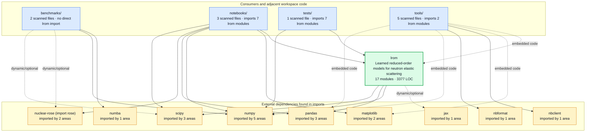
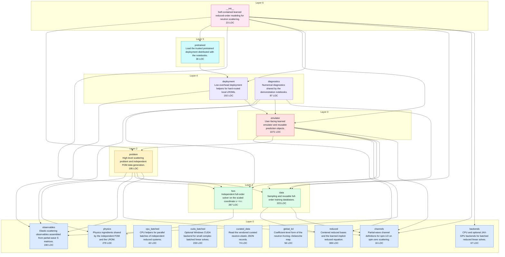
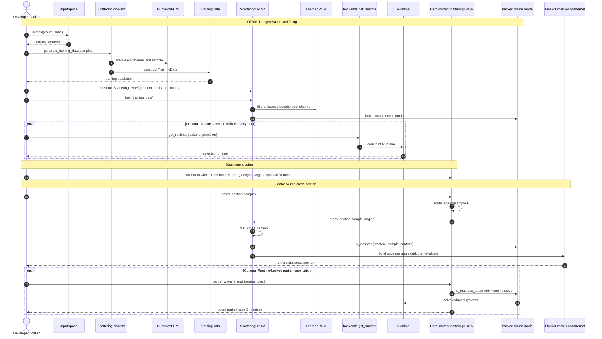

<!-- Generated by tools/render_architecture.py from docs/architecture.json. Do not edit by hand. -->
# `lrom` architecture

This source-derived snapshot covers 17 modules, 3,377 physical lines, and 29 internal import edges. The internal graph is a DAG. [Evidence: `architecture.json`](architecture.json) (`summary`, `cycles`).

Regenerate it from the package root:

```bash
python tools/architecture_graph.py
python tools/render_architecture.py
python tools/render_architecture.py --check
```

The JSON is the evidence; this Markdown is a rendering of it. Solid arrows are static imports or calls. Dashed arrows are dynamic/optional imports or Python embedded in a generator. *(Evidence: `nodes`, `edges`, `consumer_edges`, `workflow`.)*

## View 1 — Context: what is this, and who calls it?

Consumer and dependency nodes are derived from imports found under `notebooks/`, `tools/`, `tests/`, `benchmarks/`, and `lrom/`. `benchmarks/` is shown even though it has no direct `lrom` import; its external-reference role remains visible without inventing an edge. *(Evidence: `consumer_groups`, `consumer_edges`, `consumer_external_dependencies`.)*



## View 2 — Layers: what depends on what?

Arrows point from importer to dependency, always downward. Layer 0 modules have no internal dependencies; every higher index is one plus the longest dependency path below that module. *(Evidence: `nodes[].layer`, `edges`, `cycles`.)*



## View 3 — Flow: how does a call move?

The current API constructs `ScatteringLROM` directly and then calls `train`; there is no `ScatteringLROM.build` method. The scalar routed `cross_section` path does not consult `Runtime`; the optional runtime enters the routed partial-wave batch path. *(Evidence: `workflow.groups`, `workflow.observations`.)*



## Module inventory

The table is sorted from the highest derived layer to the leaves. In/out degrees count internal import edges only. *(Evidence: `nodes`, `edges`.)*

| Layer | Module | Role from module docstring | LOC | In | Out | Internal dependencies | External dependencies |
|---:|---|---|---:|---:|---:|---|---|
| 6 | `__init__` | Self-contained learned reduced-order modeling for neutron scattering. | 23 | 0 | 8 | backends, channels, data, deployment, emulator, fom, pretrained, problem | — |
| 5 | `pretrained` | Load the trusted pretrained deployment distributed with the notebooks. | 36 | 1 | 1 | deployment | numpy |
| 4 | `deployment` | Low-overhead deployment helpers for hard-routed local LROMs. | 192 | 2 | 2 | emulator, observables | numpy |
| 4 | `diagnostics` | Numerical diagnostics shared by the demonstration notebooks. | 87 | 0 | 4 | data, emulator, fom, observables | numpy |
| 3 | `emulator` | User-facing learned emulator and reusable prediction objects. | 1071 | 3 | 6 | channels, data, fom, observables, problem, reduced | numpy, scipy |
| 2 | `problem` | High-level scattering problem and independent FOM data generation. | 195 | 2 | 5 | channels, data, fom, observables, physics | numpy |
| 1 | `data` | Sampling and reusable full-order training databases. | 223 | 4 | 2 | channels, reduced | numpy |
| 1 | `fom` | Independent full-order solver on the scaled coordinate ``s = k r``. | 287 | 4 | 1 | physics | numpy, scipy |
| 0 | `backends` | CPU and optional JAX-GPU backends for batched reduced linear solves. | 67 | 1 | 0 | — | jax (dynamic), numpy |
| 0 | `channels` | Partial-wave channel definitions for spin-1/2 on spin-zero scattering. | 16 | 4 | 0 | — | — |
| 0 | `cpu_batched` | CPU helpers for parallel batches of independent reduced systems. | 42 | 0 | 0 | — | numpy |
| 0 | `cuda_batched` | Optional Windows CUDA backend for small complex batched linear solves. | 233 | 0 | 0 | — | numpy |
| 0 | `curated_data` | Read the vendored curated neutron-elastic JSON records. | 74 | 0 | 0 | — | numpy, pandas |
| 0 | `global_kd` | Coefficient-level form of the neutron Koning--Delaroche map. | 56 | 0 | 0 | — | numpy |
| 0 | `observables` | Elastic-scattering observables assembled from partial-wave S matrices. | 190 | 4 | 0 | — | numpy, scipy |
| 0 | `physics` | Physics ingredients shared by the independent FOM and the LROM. | 279 | 2 | 0 | — | numpy |
| 0 | `reduced` | Centered reduced bases and the learned implicit reduced equation. | 306 | 2 | 0 | — | numpy |

## Caveats

- **Dynamic backend edge.** `backends` has no internal import edge to `cpu_batched` or `cuda_batched`. Its `jax` dependency is marked dynamic because the import is function-local. This is an absent source edge, not permission to remove either helper. *(Evidence: `nodes[module=backends].external_dependencies`, `edges`.)*
- **Consumer-only curated data.** `curated_data` has internal in-degree 0, but it is imported at `notebooks/03_curated_data_and_global_lrom.ipynb#cell-2` line 13, `tools/build_collaborator_notebooks.py#embedded-381` line 394 (embedded Python). It is notebook-facing rather than dead. *(Evidence: `nodes[module=curated_data].in_degree`, `consumer_edges`.)*
- **Currently unreferenced source modules.** `cpu_batched`, `cuda_batched`, `global_kd` total 331 LOC and have no inbound internal import, scanned consumer import, or module-like string in the 3 inspected model pickles. The safe opcode scan found pickle references to `emulator`, `fom`, `physics`, `problem`, `reduced`; it never unpickled the artifacts. Static evidence cannot rule out callers outside the scanned tree. *(Evidence: `summary.unreferenced_modules`, `consumer_edges`, `pickle_references`.)*

## Recommendations (non-binding, not acted on)

These observations are non-binding. No package change was made from them.

1. **High confidence on strength and mass; no volatility evidence.** `emulator` is 1,071 of 3,377 physical lines (31.7%) and directly imports 6 internal modules, the strongest implementation-module fan-out in this graph. That is a concentration worth watching, but this snapshot contains no change-history evidence about volatility, so it does not by itself justify a split. *(Evidence: `summary.total_loc`, `nodes[module=emulator]`, `edges`.)*
2. **High confidence on distance and overlap; low confidence on defect risk.** `emulator` directly depends on `problem` (distance 1), and the two share 4 direct dependencies: `channels`, `data`, `fom`, `observables`. Before treating that overlap as undesirable coupling, compare their change history to learn whether the relationship is stable or volatile. *(Evidence: `edges` for sources `emulator` and `problem`.)*
3. **High confidence for this repository snapshot; medium confidence beyond it.** `cpu_batched`, `cuda_batched`, `global_kd` are unreferenced by the scanned source and model opcodes. Document their intended entry points or add integration evidence before any future retention or removal decision. *(Evidence: `summary.unreferenced_modules`, `consumer_edges`, `pickle_references`.)*
