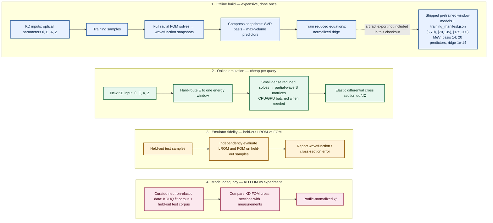

# Big picture: a learned reduced-order model for neutron elastic scattering

The offline calculation pays for independent radial FOM snapshots once and trains a
reduced model.  This checkout ships and loads pretrained three-window artifacts, but
does not include their export or manifest-generation pipeline.  A new KD input is routed
to one window, where the LROM replaces the full radial solve with a small learned reduced
system before assembling partial waves into the elastic cross section.  The two validation
lanes answer different questions: held-out LROM–FOM agreement establishes emulator
fidelity, while KD FOM–data agreement tests the adequacy of the underlying optical model.
Thus, a KD–experiment mismatch is not evidence that the emulator failed.

| Concept | Code symbol / file | Notebook |
| --- | --- | --- |
| FOM snapshots from sampled inputs | `ScatteringProblem.generate_training_data()` in `lrom/problem.py`; `NumerovFOM.solve()` in `lrom/fom.py` | `01_single_wavefunction.ipynb`, `02_elastic_cross_sections.ipynb` |
| SVD/max-volume reduction and regularized reduced equations | `ReducedBasis.fit()` and `LearnedROM.fit()` in `lrom/reduced.py`; `ScatteringLROM.train()` in `lrom/emulator.py` | `01_single_wavefunction.ipynb`, `02_elastic_cross_sections.ipynb` |
| Three-window pretrained deployment | `load_three_window_lrom()` in `lrom/pretrained.py` loads checked-in `energy_window_*_b14_p20_ridge1e-14.pkl` artifacts; `models/three_window/training_manifest.json` is provenance/configuration metadata, not loader input | `03_curated_data_and_global_lrom.ipynb` |
| Route, reduced solve, partial waves, and elastic cross section | `HardRoutedScatteringLROM.route_energy()` / `HardRoutedScatteringLROM.cross_section()` in `lrom/deployment.py`; `ScatteringLROM.cross_section()` in `lrom/emulator.py` | `03_curated_data_and_global_lrom.ipynb` |
| Emulator fidelity on held-out samples | `relative_l2()` in `lrom/diagnostics.py`; FOM and LROM calls shown above | `01_single_wavefunction.ipynb`, `02_elastic_cross_sections.ipynb` |
| KD FOM model adequacy against experimental data | `load_neutron_elastic()` in `lrom/curated_data.py`; notebook-local `normalization_profile()` | `03_curated_data_and_global_lrom.ipynb` |

## Brief corrections

The online fast cross-section path does not reconstruct full wavefunctions.  It solves
the learned reduced system and maps its coordinates through precomputed boundary maps
to partial-wave S matrices; the diagram therefore shows partial-wave S matrices rather
than wavefunction reconstruction.

The pretrained pickle files and `training_manifest.json` are checked-in artifacts.  The
checkout loads them through `load_three_window_lrom()`, but contains no production export,
pickle-serialization, or manifest-generation path; the dashed handoff is therefore not a
package data-flow arrow.
