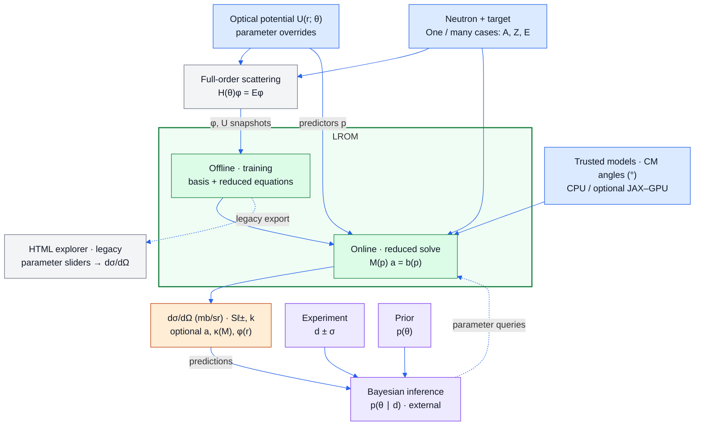
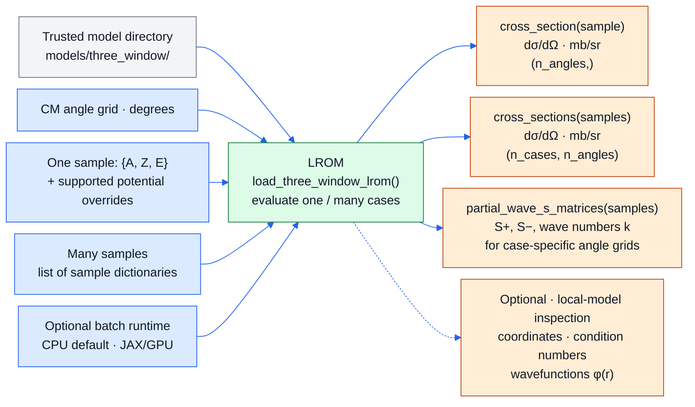

# LROM in nuclear-reaction theory

## Nuclear model → fast observables → inference

```mermaid
%%{init: {"themeVariables": {"lineColor": "#2563EB"}, "flowchart": {"nodeSpacing": 25, "rankSpacing": 30, "subGraphTitleMargin": {"top": 5, "bottom": 15}}}}%%
flowchart TB
    system["Neutron + target<br/>One / many cases: A, Z, E"]
    potential["Optical potential U(r; θ)<br/>parameter overrides"]
    fom["Full-order scattering<br/>H(θ)φ = Eφ"]
    settings["Trusted models · CM angles (°)<br/>CPU / optional JAX–GPU"]

    subgraph lrom["LROM"]
        train["Offline · training<br/>basis + reduced equations"]
        emulator["Online · reduced solve<br/>M(p) a = b(p)"]
        train --> emulator
    end

    observable["dσ/dΩ (mb/sr) · Sℓ±, k<br/>optional a, κ(M), φ(r)"]
    html["HTML explorer · legacy<br/>parameter sliders → dσ/dΩ"]
    data["Experiment<br/>d ± σ"]
    prior["Prior<br/>p(θ)"]
    inference["Bayesian inference<br/>p(θ ∣ d) · external"]

    system --> fom
    potential --> fom
    fom -->|φ, U snapshots| train
    potential -->|predictors p| emulator
    system --> emulator
    settings --> emulator
    emulator --> observable
    train -.->|legacy export| html
    observable -->|predictions| inference
    data --> inference
    prior --> inference
    inference -.->|parameter queries| emulator

    linkStyle default stroke:#2563EB
    classDef physics fill:#DBEAFE,stroke:#2563EB,color:#111827
    classDef reference fill:#F3F4F6,stroke:#6B7280,color:#111827
    classDef model fill:#DCFCE7,stroke:#15803D,color:#111827
    classDef result fill:#FFEDD5,stroke:#C2410C,color:#111827
    classDef external fill:#EDE9FE,stroke:#7C3AED,color:#111827
    class system,potential,settings physics
    class fom,html reference
    class train,emulator model
    class observable result
    class data,prior,inference external
    style lrom fill:#F0FDF4,stroke:#15803D,stroke-width:2px
```

## Package inputs / outputs

```mermaid
%%{init: {"themeVariables": {"lineColor": "#2563EB"}, "flowchart": {"nodeSpacing": 15, "rankSpacing": 25}}}%%
flowchart LR
    modeldir["Trusted model directory<br/>models/three_window/"]
    angles["CM angle grid · degrees"]
    sample["One sample: {A, Z, E}<br/>+ supported potential overrides"]
    samples["Many samples<br/>list of sample dictionaries"]
    runtime["Optional batch runtime<br/>CPU default · JAX/GPU"]

    lrom["LROM<br/>load_three_window_lrom()<br/>evaluate one / many cases"]

    one["cross_section(sample)<br/>dσ/dΩ · mb/sr<br/>(n_angles,)"]
    many["cross_sections(samples)<br/>dσ/dΩ · mb/sr<br/>(n_cases, n_angles)"]
    partial["partial_wave_s_matrices(samples)<br/>S+, S−, wave numbers k<br/>for case-specific angle grids"]
    inspect["Optional · local-model inspection<br/>coordinates · condition numbers<br/>wavefunctions φ(r)"]

    modeldir --> lrom
    angles --> lrom
    sample --> lrom
    samples --> lrom
    runtime --> lrom
    lrom --> one
    lrom --> many
    lrom --> partial
    lrom -.-> inspect

    linkStyle default stroke:#2563EB
    classDef physics fill:#DBEAFE,stroke:#2563EB,color:#111827
    classDef model fill:#DCFCE7,stroke:#15803D,color:#111827
    classDef result fill:#FFEDD5,stroke:#C2410C,color:#111827
    classDef artifact fill:#F3F4F6,stroke:#6B7280,color:#111827
    class angles,sample,samples,runtime physics
    class lrom model
    class one,many,partial,inspect result
    class modeldir artifact
```
