# LROM in nuclear-reaction theory

> A scientific context map and package-use guide. This is not a software
> architecture view and does not replace the versioned architecture pack.

## Shortest useful mental model

The learned reduced-order model (LROM) sits between a parameterized nuclear
reaction model and repeated downstream analysis. It learns a small,
physics-informed surrogate for the expensive radial scattering calculation,
then rapidly maps a new physical case to partial-wave S matrices and elastic
cross sections. That speed makes large parameter studies and Bayesian
inference practical; it does not replace the optical model, the experimental
data, or the statistical method.

## 1. Where LROM sits in the scientific workflow

```mermaid
flowchart LR
    subgraph theory["Nuclear-reaction theory: define the physical calculation"]
        direction TB
        system["System and kinematics<br/>projectile, target A and Z, beam energy E"]
        potential["Optical-potential model<br/>U(r; theta, A, Z, E)"]
        channels["Scattering definition<br/>partial waves (l, j), physical radius r, matching conditions"]
        fom["Radial Schrodinger full-order model (FOM)<br/>high-fidelity solve in every channel"]

        system --> fom
        potential --> fom
        channels --> fom
    end

    subgraph lrom["LROM — physics-informed surrogate of the FOM"]
        direction LR

        subgraph offline["Offline learning — pay the high-fidelity cost once"]
            direction TB
            design["Training design<br/>sample supported A, Z, E and potential parameters"]
            snapshots["FOM training data by channel<br/>wavefunctions, potentials, S matrices"]
            representation["Physics-informed compression<br/>centered SVD basis + max-volume potential predictors"]
            trained["Trained LROM assets<br/>basis + predictors + boundary maps<br/>per channel: (I + sum_j p_j M_j) a = sum_j p_j b_j"]

            design --> snapshots
            snapshots --> representation
            representation -->|learn reduced equations| trained
        end

        subgraph online["Online evaluation — cheap, repeated many times"]
            direction TB
            query["New physical case<br/>A, Z, E and supported potential parameters"]
            route["Select the applicable local model<br/>hard energy routing in the shipped global LROM"]
            solve["Evaluate predictors and solve small systems<br/>one reduced solve per partial-wave channel"]
            observable["Boundary maps to S matrices<br/>partial-wave assembly to d sigma / d Omega"]

            query --> route
            route --> solve --> observable
        end

        trained -->|load selected assets| route
    end

    subgraph trust["Scientific trust: four different questions"]
        direction TB
        rose["Independent ROSE benchmark"]
        implementation["FOM implementation check<br/>Numerov versus independent ROSE calculation"]
        fidelity["Emulator fidelity<br/>held-out LROM versus FOM"]
        support["Support and stability<br/>conditioning + in-domain coverage"]
        adequacy["Optical-model adequacy<br/>theory versus experiment"]
        retrain["Feedback to LROM construction<br/>enrich samples, basis, predictors, or support"]

        rose --> implementation
        fidelity -.-> retrain
        support -.-> retrain
    end

    subgraph uq["External statistical and decision workflow — enabled by LROM, not implemented here"]
        direction TB
        prior["Prior over optical-model parameters"]
        data["Measured angular distributions<br/>with experimental uncertainties"]
        inference["Likelihood + Bayesian sampler<br/>many repeated LROM evaluations<br/>with discrepancy/error model"]
        posterior["Posterior over model parameters"]
        predictive["Posterior-predictive observables<br/>uncertainty bands, sensitivity, model refinement, experiment design"]
        nextcycle["Feedback to the next cycle<br/>posterior draws become new LROM queries;<br/>predictions motivate new data or model revisions"]

        prior --> inference
        data --> inference
        inference --> posterior --> predictive --> nextcycle
    end

    fom -->|training solves| snapshots
    system -->|physical case| query
    potential -->|model parameters| query
    fom -->|independent package result| implementation
    fom -->|held-out reference predictions| fidelity
    observable -->|LROM predictions| fidelity
    solve -->|condition numbers| support
    query -->|requested domain| support
    observable -->|theory prediction| adequacy
    data --> adequacy

    observable -.->|fast theory prediction| inference
    fidelity -.->|emulator uncertainty belongs in the likelihood| inference

    classDef theoryNode fill:#E8F1FF,stroke:#2F5E9E,color:#102A4C,stroke-width:1.5px;
    classDef fomNode fill:#EEF1F4,stroke:#59636E,color:#202830,stroke-width:2px;
    classDef offlineNode fill:#FFF3D9,stroke:#9B6516,color:#513000,stroke-width:1.5px;
    classDef onlineNode fill:#E7F7EE,stroke:#28734A,color:#123B27,stroke-width:1.5px;
    classDef trustNode fill:#FBE8EE,stroke:#A23C5C,color:#54142A,stroke-width:1.5px;
    classDef externalNode fill:#F4F0FA,stroke:#72529A,color:#332146,stroke-width:1.5px,stroke-dasharray: 5 3;

    class system,potential,channels theoryNode;
    class fom fomNode;
    class design,snapshots,representation,trained offlineNode;
    class query,route,solve,observable onlineNode;
    class rose,implementation,fidelity,support,adequacy,retrain trustNode;
    class prior,data,inference,posterior,predictive,nextcycle externalNode;

    style theory fill:#F8FBFF,stroke:#2F5E9E,stroke-width:2px
    style lrom fill:#F3FBF6,stroke:#28734A,stroke-width:3px
    style offline fill:#FFFBF1,stroke:#9B6516,stroke-width:1.5px
    style online fill:#F4FCF7,stroke:#28734A,stroke-width:1.5px
    style trust fill:#FFF7F9,stroke:#A23C5C,stroke-width:2px
    style uq fill:#FAF7FD,stroke:#72529A,stroke-width:2px,stroke-dasharray: 5 3
```



The central box has two different jobs. During **offline learning**, independent
FOM calculations supply the wavefunctions and operator information from which
the reduced basis and reduced equations are learned. During **online use**, a
new case bypasses the radial FOM solve: selected potential values form the
predictors, a small reduced system is solved, and precomputed boundary maps
produce channel S matrices for observable assembly.

The result of training is therefore more than one equation. It is a collection
of channel-specific bases, predictor definitions, implicit reduced equations,
and boundary maps. The shipped global model groups those learned assets into
three local energy-window models and chooses exactly one window for each query.

The loops are scientifically important:

- Held-out LROM–FOM comparisons test **emulator fidelity**. A failure here calls
  for more training support, a larger basis, or improved predictors.
- FOM–ROSE comparisons test the package's independent **FOM implementation**.
- Theory–experiment comparisons test **optical-model adequacy**. A disagreement
  with data is not, by itself, an emulator failure.
- Bayesian inference repeatedly sends parameter samples through the online
  path. The likelihood combines the predicted observable with measurements,
  experimental uncertainty, model discrepancy, and—when material—emulator
  uncertainty. The resulting posterior feeds posterior-predictive calculations
  and can guide model refinement or new measurements.

## 2. How to use the current package

```mermaid
flowchart LR
    subgraph inputs["Caller-owned inputs"]
        direction TB
        modeldir["Trusted checked-in model directory<br/>models/three_window/"]
        angles["Center-of-mass angle grid<br/>degrees"]
        sample["One sample<br/>{A, Z, E}<br/>plus supported potential overrides when needed"]
        samples["Many samples<br/>list of the same named dictionaries"]
        runtime["Optional batch linear-solve runtime<br/>CPU by default; JAX/GPU when selected"]
    end

    subgraph package["Current pretrained deployment path"]
        direction TB
        load["load_three_window_lrom(modeldir, angles, runtime=...)"]
        deployment["HardRoutedScatteringLROM"]
        choose["Route E to one window<br/>[5,70), [70,135), [135,200] MeV"]
        local["Selected ScatteringLROM"]
        potentialvalues["Evaluate KD/local optical potential<br/>at selected physical radii"]
        reducedsolve["Solve learned equations<br/>for all partial-wave channels"]
        channeloutput["Boundary maps to S+ and S-"]
        angular["Precomputed elastic angular kernel"]

        load --> deployment --> choose --> local
        local --> potentialvalues --> reducedsolve --> channeloutput --> angular
    end

    subgraph outputs["Returned NumPy arrays"]
        direction TB
        one["cross_section(sample)<br/>shape: (n_angles,)<br/>d sigma / d Omega in mb/sr"]
        many["cross_sections(samples)<br/>shape: (n_cases, n_angles)"]
        partial["partial_wave_s_matrices(samples)<br/>S+, S-, wave numbers<br/>for case-specific angle grids"]
        inspect["Optional inspection path<br/>coordinates, condition numbers, wavefunctions"]
    end

    modeldir --> load
    angles --> load
    runtime -.-> load
    sample --> choose
    samples --> choose
    angular --> one
    angular --> many
    channeloutput --> partial
    local -.-> inspect

    classDef inputNode fill:#E8F1FF,stroke:#2F5E9E,color:#102A4C,stroke-width:1.5px;
    classDef packageNode fill:#E7F7EE,stroke:#28734A,color:#123B27,stroke-width:1.5px;
    classDef outputNode fill:#EDE9FE,stroke:#6D4BC3,color:#2E1C62,stroke-width:1.5px;
    class modeldir,angles,sample,samples,runtime inputNode;
    class load,deployment,choose,local,potentialvalues,reducedsolve,channeloutput,angular packageNode;
    class one,many,partial,inspect outputNode;

    style inputs fill:#F8FBFF,stroke:#2F5E9E,stroke-width:2px
    style package fill:#F3FBF6,stroke:#28734A,stroke-width:3px
    style outputs fill:#F8F6FF,stroke:#6D4BC3,stroke-width:2px
```



The shortest working use of the checked-in global model is:

```python
from pathlib import Path

import numpy as np

from lrom import load_three_window_lrom


angles = np.linspace(1.0, 179.0, 179)
deployment = load_three_window_lrom(
    Path("models/three_window"),
    angles,
)

sample = {"A": 40, "Z": 20, "E": 14.1}
cross_section = deployment.cross_section(sample)

samples = [
    {"A": 40, "Z": 20, "E": 14.1},
    {"A": 48, "Z": 20, "E": 65.0},
]
cross_sections = deployment.cross_sections(samples)
```

The scalar call evaluates one local model. The batch call groups cases by
energy window and evaluates each nonempty group together. GPU acceleration is
intended for large batches of reduced solves; it is not expected to improve a
single query.

For experiments whose cases use different measured angle grids, call
`partial_wave_s_matrices(samples)` once and apply an observation-specific
angular kernel downstream. Full radial-wavefunction reconstruction remains an
inspection path, not part of the fast cross-section route.

## 3. What is current, external, and prospective

| Scope | Status | Meaning in the figures |
| --- | --- | --- |
| Neutron elastic scattering with a local optical potential | Current package | The implemented physics scope of the shipped global LROM. |
| Independent Numerov FOM and ROSE comparison | Current verification workflow | Establishes confidence in the full-order implementation. ROSE remains outside the package. |
| Three pretrained KD-centered energy-window models | Current package artifacts | Trusted repository pickles loaded by `load_three_window_lrom()`; hard routing is deliberate. |
| LROM–FOM error and condition-number checks | Current package/notebook workflow | Establishes emulator fidelity and numerical stability over tested support. |
| Comparison with curated experimental data | Current notebook workflow | Tests the underlying KD optical model's adequacy; the notebook does not calibrate it. |
| Priors, likelihood construction, posterior sampling, and posterior prediction | External workflow enabled by fast LROM evaluations | Not implemented as a Bayesian engine in this package. |
| Using experimental data to fine-tune or discover more flexible reduced equations | Prospective research direction | Motivated by the scientific archive; not a current package capability. |
| Proton scattering, coupled channels, transfer, breakup, or general many-body solvers | Outside the current package scope | Related reduced-order ideas may extend there, but this implementation does not claim those capabilities. |

## 4. Scientific interpretation rules

1. **LROM emulates a chosen theory model.** It inherits the optical model's
   assumptions and validity limits even when its numerical approximation is
   excellent.
2. **Fidelity and adequacy are different claims.** LROM–FOM agreement validates
   the surrogate; theory–data agreement evaluates the underlying model.
3. **Online speed does not widen training support.** Energy routing chooses a
   model; it does not certify that every parameter combination is in domain.
4. **Bayesian inference needs an error model.** Experimental, model-discrepancy,
   and relevant emulator uncertainties should enter the likelihood rather than
   being hidden inside one goodness-of-fit number.
5. **The observable path is the production path.** Cross sections are obtained
   from reduced coordinates through boundary values and partial-wave S
   matrices; reconstructing every radial wavefunction is unnecessary online.

## 5. Evidence base

The map reconciles the current package and notebooks with these scientific
sources:

- D. Odell *et al.*, [ROSE: A reduced-order scattering emulator for optical
  models](https://arxiv.org/abs/2312.12426). This establishes the optical-model,
  scattering-observable, and Bayesian-UQ context for fast reduced-order
  emulators.
- C. Drischler *et al.*, [BUQEYE Guide to Projection-Based Emulators in Nuclear
  Physics](https://arxiv.org/abs/2212.04912). This supplies the broader nuclear
  physics context for offline/online reduced-basis emulation.
- I. Bakurov *et al.*, [Discovering Reduced-order Model Equations of Many-body
  Quantum Systems using Genetic Programming](https://arxiv.org/abs/2406.04279).
  This supports the clearly marked prospective direction of discovering
  reduced equations rather than treating it as a current package feature.
- The project's frozen `scientific_archive`: *Report on LROM*, *Paper Results
  Map*, the ROSE guide, and *Speeding-Up Computations* presentation. These
  sources motivate the learned implicit equation, the notebook progression,
  the global optical-potential example, and the longer-term flexible-LROM
  research direction.

Current code is authoritative for package behavior. In particular, the fast
online path uses boundary maps to form S matrices without routine full
wavefunction reconstruction, and the checked-in pretrained artifacts are
loadable even though this checkout does not provide a public fitted-model
export pipeline.
