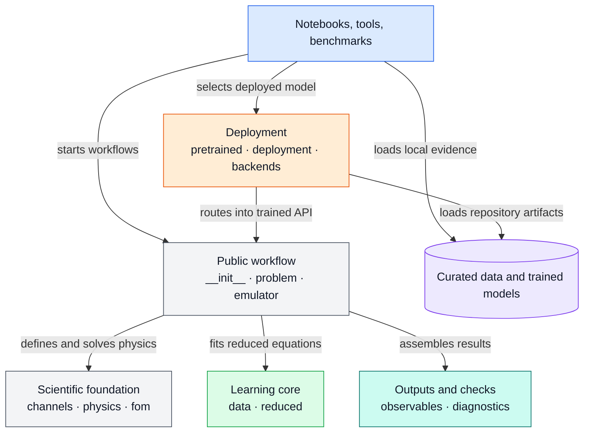

# Scattering LROM Architecture

> A top-down guide to the `CleanCode` system.
>
> Start with the whole picture. Zoom in only when you need implementation detail.

---

## 1. Start Here

### The architecture in one sentence

**The system spends expensive full-order physics work offline to learn small channel models, then uses those models online to produce wavefunctions and elastic-scattering cross sections quickly.**

### The fastest useful mental model

There are two halves:

1. **Offline training** creates the reduced models.
2. **Online evaluation** uses those models for new physical inputs.

The boundary between them is the **trained LROM**.

### What this system is

- A Python library for neutron elastic-scattering reduced-order modeling.
- A collection of scientific notebooks that teach and validate the workflow.
- A deployable three-model emulator with deterministic energy routing.

### What this system is not

- It is not a web service or distributed system.
- It has no database, message queue, or background worker.
- ROSE is not its production solver; ROSE is an external benchmark.

> **Keep this idea in view:** full-order physics creates knowledge offline; reduced models reuse that knowledge online.

**Source anchors:** `README.md`; `lrom/__init__.py:__all__`; `lrom/problem.py:ScatteringProblem`; `lrom/emulator.py:ScatteringLROM`; `lrom/deployment.py:HardRoutedScatteringLROM`.

---

## 2. The Whole System

### From physical inputs to scientific results

```mermaid
flowchart LR
    user([Research engineer])
    inputs[Training inputs]
    snapshots[Full-order snapshots]
    learning[Reduced-model training]
    models[(Trained LROMs)]
    query[New physical case]
    router[Energy router]
    solve[Reduced solves]
    results[Wavefunctions and cross sections]
    experiment[(Curated measurements)]

    subgraph offline[OFFLINE — learn]
        direction LR
        inputs -->|solve every case and channel| snapshots
        snapshots -->|compress and fit| learning
        learning -->|produce| models
    end

    subgraph online[ONLINE — evaluate]
        direction LR
        query -->|select by energy| router
        router -->|evaluate one local model| solve
        solve -->|assemble observables| results
    end

    user -->|defines| inputs
    user -->|submits| query
    models -->|supply learned equations| router
    experiment -.->|supports model comparison| results

    classDef entry fill:#DBEAFE,stroke:#2563EB,color:#111827
    classDef offlineStep fill:#DCFCE7,stroke:#16A34A,color:#111827
    classDef artifact fill:#EDE9FE,stroke:#7C3AED,color:#111827
    classDef onlineStep fill:#FFEDD5,stroke:#EA580C,color:#111827
    classDef output fill:#CCFBF1,stroke:#0F766E,color:#111827

    class user,inputs,query entry
    class snapshots,learning offlineStep
    class models,experiment artifact
    class router,solve onlineStep
    class results output
```



### How to read the diagram

- **Blue — entry:** choices made by the researcher.
- **Green — offline:** expensive work performed before deployment.
- **Purple cylinders — artifacts:** durable data or trained models.
- **Orange — online:** repeated evaluation after training.
- **Teal — output:** scientific quantities returned to the caller.

Shape and text carry the same meaning when color is unavailable.

### The central design choice

The online path does **not** rerun the Numerov full-order solver.

It evaluates selected potential features, solves small learned systems, extracts partial-wave S matrices, and assembles observables. Full wavefunctions are reconstructed only when explicitly requested.

**Source anchors:** `lrom/problem.py:ScatteringProblem.generate_training_data`; `lrom/reduced.py:LearnedROM.fit`; `lrom/emulator.py:ScatteringLROM._fast_cross_section`; `lrom/pretrained.py:load_three_window_lrom`; `lrom/curated_data.py:load_neutron_elastic`.

---

## 3. The Two Halves

### Offline: learn the reduced physics

**Question answered:** What must happen before fast prediction is possible?

#### Input

- A scattering problem.
- Named samples such as potential parameters, energy `E`, mass `A`, and charge `Z`.
- A basis rule and predictor-selection rule.

#### Work

- Solve every requested sample and partial-wave channel with the independent FOM.
- Store wavefunctions, potentials, physical radii, and S matrices.
- Compress wavefunction variation into reduced bases.
- Learn an implicit reduced equation for each channel.
- Pack the channel models for fast evaluation.

#### Output

- A trained `ScatteringLROM` containing one learned model per channel.

---

### Online: reuse the learned physics

**Question answered:** What happens for each new case after training?

#### Input

- A named physical sample.
- An angle grid when a differential cross section is requested.
- Optionally, a CPU or JAX/GPU runtime for supported batches.

#### Work

- Evaluate the potential only at selected predictor coordinates.
- Solve the small learned equation for reduced coordinates.
- Extract channel S matrices from reduced boundary values.
- Assemble the requested observable.

#### Output

- A wavefunction on physical radius `r` in fm, or
- A differential elastic cross section in mb/sr.

> **Key separation:** training owns accuracy construction; online evaluation owns repeated throughput.

**Source anchors:** `lrom/data.py:TrainingData`; `lrom/emulator.py:ScatteringLROM.train`; `lrom/emulator.py:Prediction`; `lrom/backends.py:Runtime`.

---

## 4. Zoom In: Offline Training

### How a trained model is created

```mermaid
flowchart LR
    space[InputSpace]
    problem[ScatteringProblem]
    fom[NumerovFOM]
    data[(TrainingData)]
    basis[ReducedBasis]
    learned[LearnedROM per channel]
    packed[(Packed online model)]

    space -->|sample and validate| problem
    problem -->|solve each sample × channel| fom
    fom -->|return wavefunction and S matrix| data
    data -->|center and compress snapshots| basis
    data -->|provide potential features| learned
    basis -->|provide reduced coordinates| learned
    learned -->|pack channel equations| packed

    classDef entry fill:#DBEAFE,stroke:#2563EB,color:#111827
    classDef shared fill:#F3F4F6,stroke:#4B5563,color:#111827
    classDef offlineStep fill:#DCFCE7,stroke:#16A34A,color:#111827
    classDef artifact fill:#EDE9FE,stroke:#7C3AED,color:#111827

    class space entry
    class problem,fom shared
    class basis,learned offlineStep
    class data,packed artifact
```



### The story, step by step

#### 1. Define the physical problem

`ScatteringProblem` owns the target, projectile, energy, potential model, partial-wave channels, mesh, and matching coordinate.

#### 2. Generate independent reference data

`NumerovFOM` solves the radial equation on the shared scaled coordinate `s = k r`.

The problem repeats that solve for every sample and channel.

#### 3. Preserve the training boundary

`TrainingData` stores the arrays needed for later experiments without repeating the full-order solves.

#### 4. Learn one channel at a time

For each channel:

- `ReducedBasis` compresses deviations from a reference wavefunction.
- Max-volume selection chooses informative potential coordinates.
- `LearnedROM` fits an implicit equation for the reduced coordinates.

#### 5. Build the online representation

`ScatteringLROM` converts the collection of channel models into an equal-size, padded, or grouped packed layout.

### Failure behavior worth knowing

- Mismatched channels stop training.
- Unknown control inputs stop training.
- Underdetermined fits emit a `RuntimeWarning`.
- Small sampling margins emit a `UserWarning`.

**Source anchors:** `lrom/data.py:InputSpace`; `lrom/problem.py:ScatteringProblem.generate_training_data`; `lrom/fom.py:solve_channel`; `lrom/reduced.py:ReducedBasis`; `lrom/reduced.py:LearnedROM.fit`; `lrom/emulator.py:ScatteringLROM.train`.

---

## 5. Zoom In: Online Prediction

### How one new case becomes a result

```mermaid
flowchart LR
    sample[Physical sample]
    route{Energy window}
    model[Selected LROM]
    features[Selected potential features]
    reduced[Small reduced solve]
    smatrix[Partial-wave S matrices]
    observable[Angular observable kernel]
    cross[Cross section]
    wave[Physical wavefunction]
    runtime{{Optional batch runtime}}

    sample -->|read E| route
    route -->|choose exactly one| model
    model -->|evaluate selected coordinates| features
    features -->|form learned system| reduced
    runtime -.->|replace batch linear solve only| reduced
    reduced -->|evaluate boundary values| smatrix
    smatrix -->|combine S+ and S-| observable
    observable -->|scale by wave number| cross
    reduced -.->|reconstruct when requested| wave

    classDef entry fill:#DBEAFE,stroke:#2563EB,color:#111827
    classDef decision fill:#FEF3C7,stroke:#D97706,color:#111827
    classDef onlineStep fill:#FFEDD5,stroke:#EA580C,color:#111827
    classDef shared fill:#F3F4F6,stroke:#4B5563,color:#111827
    classDef output fill:#CCFBF1,stroke:#0F766E,color:#111827

    class sample entry
    class route decision
    class model,features,reduced onlineStep
    class smatrix,observable,runtime shared
    class cross,wave output
```



### Scalar path

`HardRoutedScatteringLROM.cross_section(sample)`:

1. Reads `sample["E"]`.
2. Selects one local model.
3. Calls that model's packed cross-section path.
4. Returns one array in mb/sr.

The injected runtime is **not** used on this scalar path.

### Batched path

For many cases, the router:

1. Groups inputs by energy window.
2. Splits large groups into bounded chunks.
3. Evaluates each local model once per chunk.
4. Optionally delegates the dense reduced solves to `Runtime.solve`.
5. Restores results to the original input order.

### Hard energy routing

| Intended energy range | Selected model |
|---|---|
| `5 ≤ E < 70 MeV` | Window 0 |
| `70 ≤ E < 135 MeV` | Window 1 |
| `135 ≤ E ≤ 200 MeV` | Window 2 |

The internal boundaries are hard: exactly 70 MeV enters window 1, and exactly 135 MeV enters window 2.

> **Important:** the router chooses by the internal boundaries at 70 and 135 MeV; it does not reject values outside the intended outer range. Callers must enforce the 5–200 MeV deployment domain.

**Source anchors:** `lrom/deployment.py:HardRoutedScatteringLROM.route_energy`; `lrom/deployment.py:HardRoutedScatteringLROM.cross_sections`; `lrom/deployment.py:HardRoutedScatteringLROM.partial_wave_s_matrices`; `lrom/emulator.py:ScatteringLROM._fast_cross_section`; `lrom/observables.py:ElasticCrossSectionKernel`; `models/three_window/training_manifest.json:edges`.

---

## 6. The Shared Scientific Foundation

The offline and online halves share the same physical definitions and observable mathematics.

### Channels

`channels.py` defines the partial-wave channel vocabulary for spin-1/2 on spin-zero scattering.

- `ell = 0` has one channel.
- Higher partial waves have `j = ell + 1/2` and `j = ell - 1/2` partners.

### Physics

`physics.py` owns:

- Physical constants.
- Two-body kinematics.
- Woods–Saxon and Koning–Delaroche parameter maps.
- Optical-potential evaluation on physical radius `r` in fm.

ROSE is not imported here.

### Full-order model

`fom.py` owns:

- The shared coordinate `s = k r`.
- Numerov propagation.
- Matching to free-wave solutions.
- S-matrix extraction.
- Mapping back to physical radius.

### Observables

`observables.py` owns:

- The `S+` and `S−` partial-wave organization.
- Angular Legendre factors.
- Differential elastic cross sections in mb/sr.

> **Coordinate rule:** internal bases may use `s`; user-facing radii and wavefunction plots use `r` in femtometres.

**Source anchors:** `lrom/channels.py:elastic_channels`; `lrom/physics.py:PotentialModel`; `lrom/fom.py:ScatteringSystem`; `lrom/fom.py:solve_channel`; `lrom/observables.py:ElasticCrossSectionKernel`.

---

## 7. Where the Code Lives

### Responsibility map



### Translate a question into a file

#### “What physical problem are we solving?”

Read `lrom/problem.py`, then `lrom/physics.py`.

#### “How are exact reference solutions generated?”

Read `lrom/fom.py`.

#### “How is the reduced model learned?”

Read `lrom/reduced.py`, then `ScatteringLROM.train` in `lrom/emulator.py`.

#### “How does prediction avoid reconstructing every wavefunction?”

Read `_PackedOnlineModel` and `_fast_cross_section` in `lrom/emulator.py`.

#### “How are multiple energy models deployed?”

Read `lrom/pretrained.py`, `lrom/deployment.py`, and `lrom/backends.py`.

#### “Where do experiments and external comparisons enter?”

Read `lrom/curated_data.py`, `data/curated/PROVENANCE.md`, and `benchmarks/rose.py`.

**Source anchors:** package imports; `lrom/__init__.py:__all__`; `tools/architecture_graph.py:build_architecture`.

---

## 8. Boundaries, Rules, and Risks

### Boundary 1 — ROSE is comparison code

- Production physics and FOM modules do not import ROSE.
- The adapter lives under `benchmarks/`.
- Notebooks use it to compare implementations.

### Boundary 2 — plotting belongs to the narrative

- Plotting is inline in notebooks.
- `lrom/` exposes no plotting API.
- Figures remain next to their assumptions and captions.

### Boundary 3 — model pickles are trusted inputs

- `load_three_window_lrom` uses Python pickle.
- Only repository-owned model files should be loaded.
- Documented SHA-256 hashes are not checked by the loader.

### Boundary 4 — acceleration is injected

- NumPy CPU is the default.
- JAX/GPU is optional.
- The runtime replaces only supported batched linear solves.
- It does not create a second physics or observable implementation.

### Current release blocker

> `tools/release_check.py` currently fails because the required extracted curated-data directories are missing. The checkout contains `data/curated/data.zip`, but no inspected release path extracts it.

This blocks the documented Notebook 3 data-loading workflow in a fresh checkout.

### Areas to watch

- `emulator.py` is the largest and most connected implementation module. Size alone does not prove it needs splitting.
- `cpu_batched.py`, `cuda_batched.py`, and `global_kd.py` have no inbound references in the scanned repository area. Treat them as unreferenced in scope, not proven dead.
- The router does not validate its outer energy domain.
- The pretrained loader checks file presence, not artifact hashes.

**Source anchors:** `benchmarks/rose.py`; `lrom/backends.py:get_runtime`; `lrom/pretrained.py:load_three_window_lrom`; `tools/release_check.py:main`; `docs/architecture-pack.md:Dependency Rules and Smells`.

---

## 9. How to Learn the System

### Pass 1 — build the mental model

1. Read this guide through **Section 5**.
2. Read `README.md` for the scientific intent.
3. Open `lrom/__init__.py` to learn the supported vocabulary.

### Pass 2 — follow one complete offline path

1. Read `ScatteringProblem.generate_training_data`.
2. Read `NumerovFOM.solve` and `solve_channel`.
3. Read `ScatteringLROM.train`.
4. Read `LearnedROM.fit` only after the larger path is clear.

### Pass 3 — follow one complete online path

1. Read `load_three_window_lrom`.
2. Read `HardRoutedScatteringLROM.cross_section`.
3. Read `ScatteringLROM._fast_cross_section`.
4. Read `ElasticCrossSectionKernel.evaluate`.

### Pass 4 — connect code to behavior

Read:

- `tests/test_core.py:PublicApiTests.test_problem_data_prediction_and_serialization`
- `notebooks/01_single_wavefunction.ipynb`
- `notebooks/02_elastic_cross_sections.ipynb`
- `notebooks/03_curated_data_and_global_lrom.ipynb`

The test is the shortest executable tour. The notebooks add the scientific interpretation.

### Commands for orientation

```bash
python -m pytest -q
python tools/release_check.py
```

The first command currently passes 14 tests with three fit-capacity warnings. The second currently reports the missing extracted curated-data directories described above.

---

## 10. Evidence and Scope

### What was verified

- Public exports and package metadata.
- Production-module imports and responsibilities.
- Offline training and online prediction call paths.
- Hard-routing and optional-runtime behavior.
- Core tests, model metadata, data provenance, and release checks.
- A fresh static graph of 17 modules and 29 internal edges with no cycles.

### What was not verified

- The Git revision and working-tree state, because workspace policy prohibits reading `.git/`.
- Live GPU behavior on target hardware.
- Binary pickle contents through unpickling.
- The original end-to-end producer for the supplied pretrained files.
- Notebook re-execution and the contents of `data.zip`.

### Detailed evidence

This guide deliberately keeps evidence secondary to comprehension.

For claim-by-claim status, command outcomes, uncertainty, package ownership, and full evidence tables, see [the evidence-oriented architecture pack](architecture-pack.md).

The previous generated architecture documentation and ADR set remain preserved under `docs/old_arch/`.

### Verification snapshot

- Document generated: 2026-09-14.
- Core tests: 14 passed, 3 expected warnings.
- Static package graph: 17 modules, 29 internal edges, no cycles.
- Release check: fails on the two missing extracted curated-data directories.

