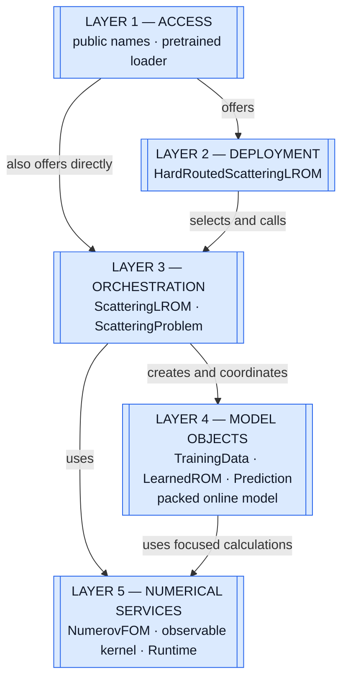
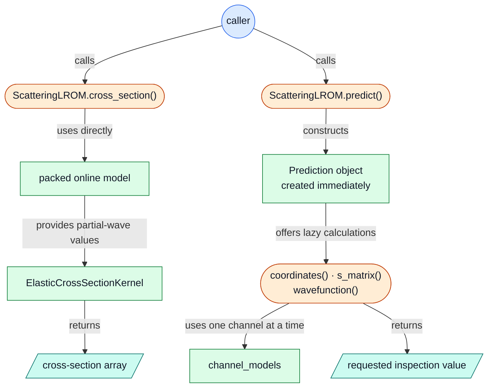
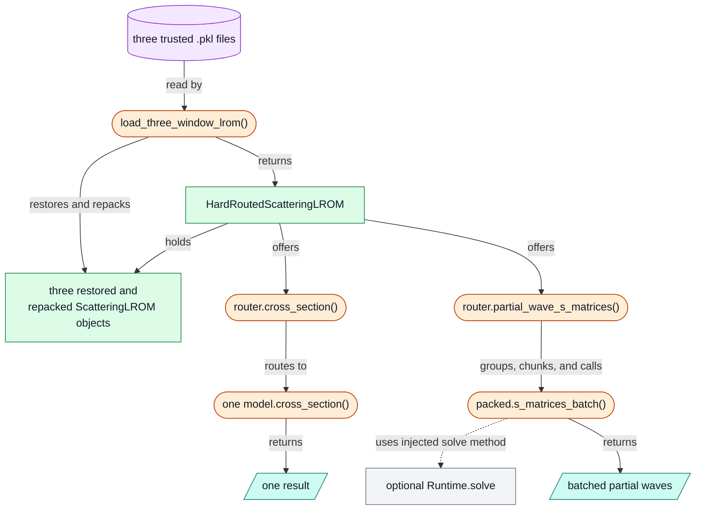
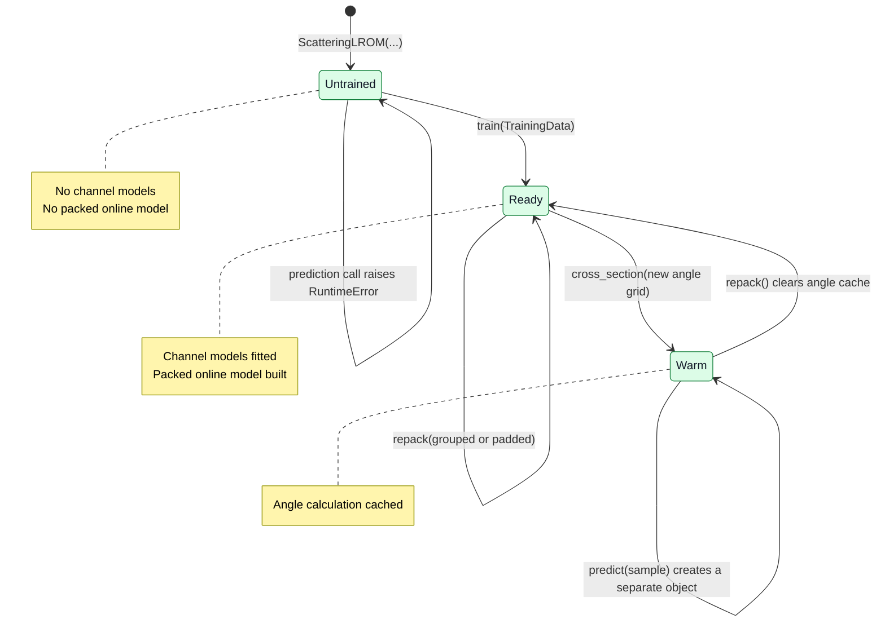
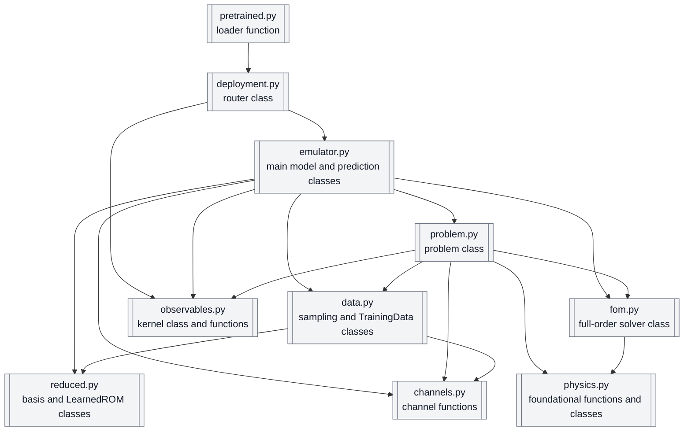

# Scattering LROM — Internal Architecture Map (V3)

> A visual guide to the software underneath the public API.
>
> Physics and package usage are intentionally omitted. The detailed evidence audit remains in [`architecture-pack.md`](architecture-pack.md).

---

## The Whole Idea

The package is a set of **objects arranged in layers**.

`ScatteringLROM` is the central object. Training fills it with learned channel objects and builds a packed object for fast evaluation. `HardRoutedScatteringLROM` can hold several trained `ScatteringLROM` objects and select one for each request.

Methods connect the objects. State stays with the object that owns it.

---

## How to Read the Figures

- **Package:** a folder of related code. Here, `lrom/` is the package.
- **Code file:** a `.py` file inside the package. Python also calls this a *module*.
- **Class:** a blueprint. An **object** is one instance of that class.
- **Method:** a function attached to a class.
- **State:** information an object remembers.
- **Cache:** rebuildable state saved to avoid repeating a calculation.

The flow figures use the same shapes throughout:

- Blue circle — caller outside the package
- Blue double rectangle — architectural layer
- Green rectangle — class or object
- Orange stadium — function or method
- Gold hexagon — remembered state
- Teal slanted box — temporary input or output
- Purple cylinder — durable file
- Gray rectangle or dashed arrow — optional or created only when requested
- Gray double rectangle — Python code file in the final zoom

Read every arrow as a sentence: **source — relationship → target**.

---

## 1. Layers: The Entire Architecture

**What is above what?**



Upper layers decide **what happens**. Lower layers provide focused objects that know **how to do one part**.

This is one Python process—not a network of servers, databases, or workers.

**Source:** `lrom/__init__.py`; `lrom/pretrained.py`; `lrom/deployment.py`; `lrom/emulator.py`; `lrom/problem.py`.

---

## 2. Classes and Objects: What Contains What?

**Which objects make up a running model?**

```mermaid
flowchart TB
    router["HardRoutedScatteringLROM<br/>deployment controller"]
    models["N × ScatteringLROM<br/>three in the supplied deployment"]
    problem["ScatteringProblem<br/>one belonging to each local model"]
    training["TrainingData<br/>retained after training"]
    channels["Many _ChannelModel objects<br/>one per channel"]
    learned["LearnedROM<br/>inside each channel model"]
    packed["Packed online model<br/>derived evaluation layout"]
    prediction["Prediction<br/>temporary query-inspection object"]
    kernel["ElasticCrossSectionKernel<br/>shared angle calculation"]

    router -->|holds| models
    router -->|owns and shares| kernel
    models -->|each references| problem
    models -->|retains| training
    models -->|owns| channels
    channels -->|contains| learned
    models -->|derives| packed
    models -.->|predict() creates| prediction

    classDef object fill:#DCFCE7,stroke:#15803D,color:#111827
    class router,models,problem,training,channels,learned,packed,prediction,kernel object
```

The nesting to remember is:

**router → local LROM → channel model → learned model**

`Prediction` is not another trained model. It is a small object created to inspect one query.

**Source:** `lrom/deployment.py:HardRoutedScatteringLROM`; `lrom/emulator.py:ScatteringLROM`; `lrom/emulator.py:_ChannelModel`; `lrom/reduced.py:LearnedROM`.

---

## 3. Functions: What `train()` Assembles

**What does training add to an empty `ScatteringLROM` object?**

```mermaid
flowchart LR
    data["TrainingData object"]
    train(["ScatteringLROM.train()"])
    basis["BasisConfig object"]
    maxvol["MaxVol object"]
    prepare(["scale() · choose_size()"])
    fit(["LearnedROM.fit()<br/>once per channel"])
    learned["LearnedROM object"]
    channel["_ChannelModel object"]
    collection{{"channel_models"}}
    pack(["_build_online_model()"])
    packed["packed or ragged<br/>online object"]
    caches{{"SVD and predictor<br/>selection caches"}}

    data -->|passed into| train
    train -->|reads| basis
    train -->|reads| maxvol
    basis -->|provides| prepare
    prepare -->|prepares fitting inputs| fit
    maxvol -->|provides predictor rules| fit
    train -->|calls| fit
    fit -->|returns| learned
    learned -->|wrapped as| channel
    channel -->|stored in| collection
    train -->|stores on TrainingData| caches
    collection -->|passed into| pack
    train -->|calls after all channels| pack
    pack -->|creates| packed

    classDef object fill:#DCFCE7,stroke:#15803D,color:#111827
    classDef method fill:#FFEDD5,stroke:#C2410C,color:#111827
    classDef state fill:#FEF3C7,stroke:#A16207,color:#111827
    class data,basis,maxvol,learned,channel,packed object
    class train,prepare,fit,pack method
    class collection,caches state
```



`train()` coordinates the assembly. `LearnedROM.fit()` creates the learned equation for one channel. `_build_online_model()` then reorganizes all channel objects for fast evaluation.

**Source:** `lrom/emulator.py:ScatteringLROM.train`; `lrom/reduced.py:LearnedROM.fit`; `lrom/emulator.py:ScatteringLROM._build_online_model`.

---

## 4. Functions: Two Evaluation Paths

**Why are `cross_section()` and `predict()` different?**



The fast path uses the packed model directly. The inspection path creates a `Prediction`; only its per-channel calculations are lazy.

Neither path calls `NumerovFOM`.

**Source:** `lrom/emulator.py:ScatteringLROM._fast_cross_section`; `lrom/emulator.py:ScatteringLROM.predict`; `lrom/emulator.py:Prediction`.

---

## 5. Functions: Deployment and the Optional Runtime

**Where do the supplied models and optional accelerator fit?**



The router owns selection and batching. Each selected `ScatteringLROM` still owns model evaluation.

The injected runtime is used only by routed `partial_wave_s_matrices()` batches. Scalar `cross_section()` and the router's ordinary `cross_sections()` path do not use it.

**Source:** `lrom/pretrained.py:load_three_window_lrom`; `lrom/deployment.py:HardRoutedScatteringLROM`; `lrom/backends.py:Runtime`.

---

## 6. States: The Central Object's Lifecycle

**What makes a `ScatteringLROM` ready?**



Construction does not train the object. The current API is `ScatteringLROM(...)` followed by `train(...)`; there is no `ScatteringLROM.build()` method.

`predict()` creates a separate `Prediction` object without changing the `ScatteringLROM` state.

**Source:** `lrom/emulator.py:ScatteringLROM.__init__`; `train`; `repack`; `predict`; `_fast_cross_section`.

---

## 7. States: Who Remembers What?

**Which object owns each piece of remembered information?**

```mermaid
flowchart LR
    problem["ScatteringProblem"]
    pstate{{"configuration<br/>system cache"}}

    data["TrainingData"]
    dstate{{"snapshots · metadata<br/>fitting caches — memory only"}}
    npz[("TrainingData .npz")]

    model["ScatteringLROM"]
    mstate{{"channel models · retained TrainingData<br/>packed model · angle cache"}}
    pkl[("trusted model .pkl")]

    prediction["Prediction"]
    qstate{{"sample copy · coordinate cache<br/>S-matrix cache"}}

    router["HardRoutedScatteringLROM"]
    rstate{{"local models · energy edges · angles<br/>batch limit · shared kernel · optional solver"}}

    problem -->|owns| pstate
    data -->|owns| dstate
    data -->|save() writes snapshots + metadata only| npz
    npz -->|load() restores| data
    model -->|owns or retains| mstate
    pkl -->|trusted unpickle restores| model
    prediction -->|owns| qstate
    router -->|owns or retains| rstate

    classDef object fill:#DCFCE7,stroke:#15803D,color:#111827
    classDef state fill:#FEF3C7,stroke:#A16207,color:#111827
    classDef artifact fill:#F3E8FF,stroke:#7E22CE,color:#111827
    class problem,data,model,prediction,router object
    class pstate,dstate,mstate,qstate,rstate state
    class npz,pkl artifact
```

A cache is one of the gold boxes. It is not another object, layer, or service.

Channel models hold the learned result. The packed model is derived from them. Angle, coordinate, S-matrix, SVD, predictor-selection, and system caches can be rebuilt. `Prediction` does not cache returned wavefunction or cross-section arrays.

`TrainingData` has explicit `save()` and `load()` methods. The package can load repository-supplied model pickles, but it has no public model-save function. Pickles must come from a trusted source.

**Source:** `lrom/problem.py:ScatteringProblem`; `lrom/data.py:TrainingData`; `lrom/emulator.py:Prediction`; `ScatteringLROM`; `lrom/deployment.py:HardRoutedScatteringLROM`; `lrom/pretrained.py`.

---

## 8. Final Zoom: Code Files

**Where do the classes and functions live?**

> In this final figure, every double rectangle is one Python code file—a *module*. Arrows mean **imports or statically depends on**.



The main dependency spine is:

**pretrained → deployment → emulator → problem → foundational files**

`emulator.py` is the main hub; `problem.py` is the second. The current static graph has 17 package files, 29 internal dependencies, and no cycles. Ten core files are shown above.

Files beside the main spine:

- `__init__.py` exposes public names; it is a façade, not another behavior layer.
- `backends.py` creates optional runtime objects that callers inject.
- `diagnostics.py` supports notebook analysis.
- `curated_data.py` reads vendored records independently of the model core.
- `cpu_batched.py`, `cuda_batched.py`, and `global_kd.py` have no detected callers in the scanned package. This means *standalone in this scope*, not necessarily dead.

**Source:** current imports under `lrom/`; `tools/architecture_graph.py`; `docs/old_arch/architecture.json`.

---

## The Architecture in Three Sentences

1. `ScatteringProblem` owns reusable problem state; `ScatteringLROM` owns the trained channel objects and derived packed representation.
2. `HardRoutedScatteringLROM` holds several trained `ScatteringLROM` objects and decides which one receives a request.
3. Methods connect the objects, caches are rebuildable state, and code files merely provide homes for the classes and functions.

For detailed evidence, risks, and repository boundaries, continue with [`architecture-pack.md`](architecture-pack.md).
