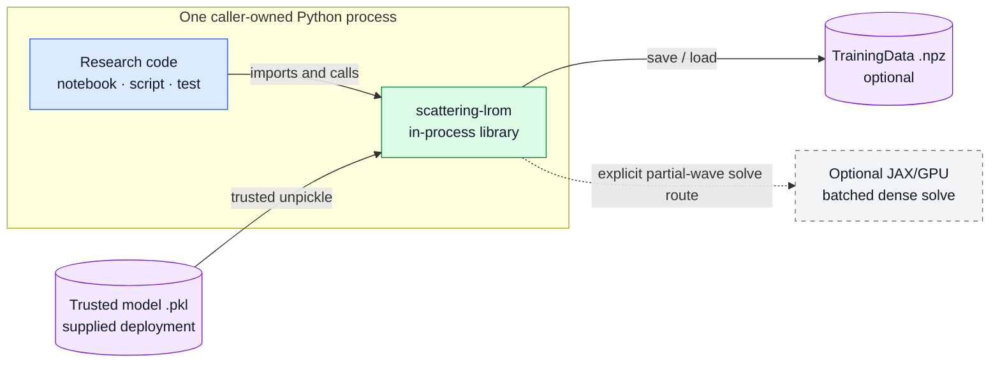
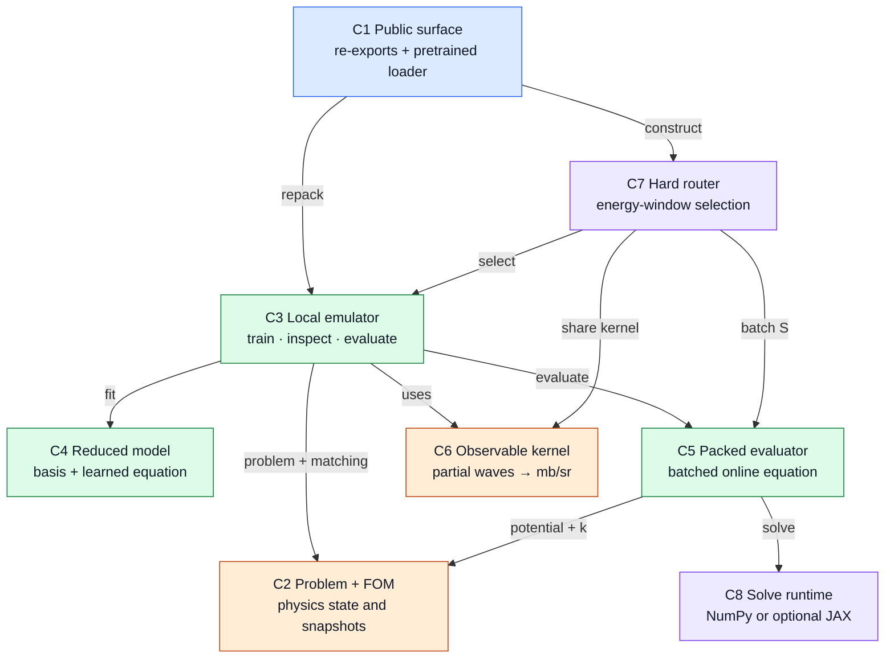
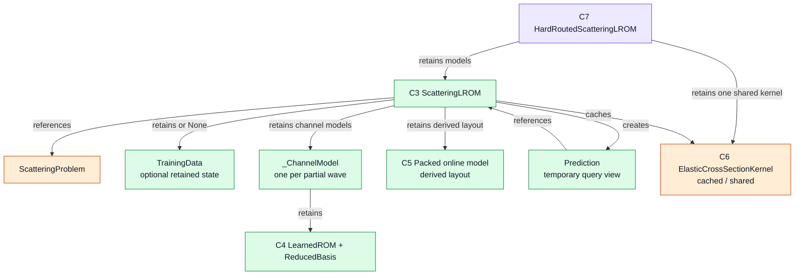
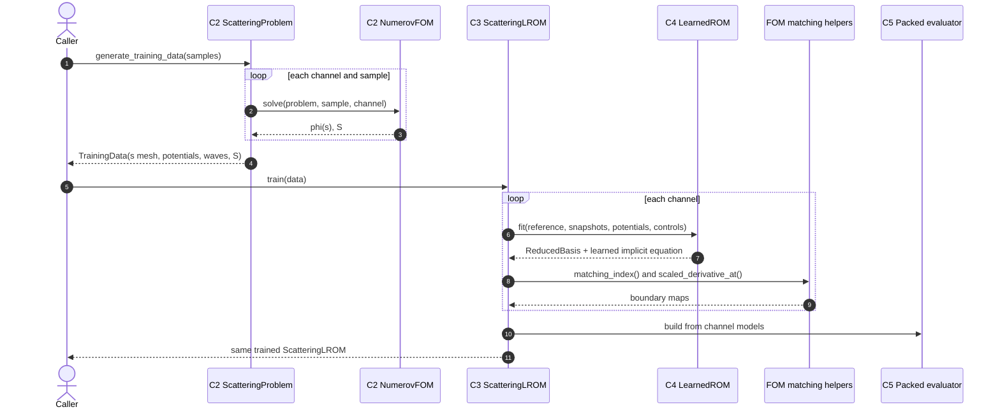
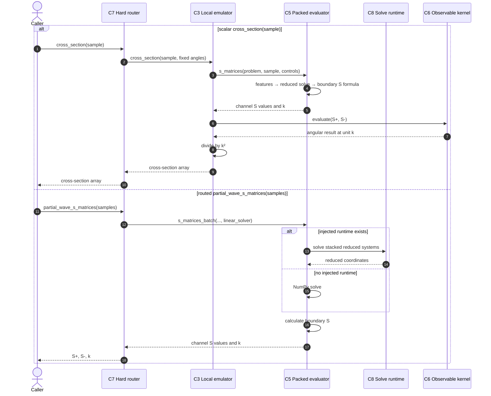
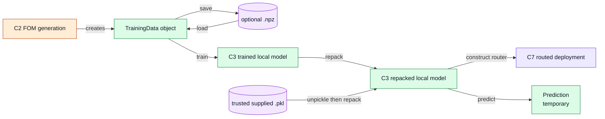

# Scattering LROM — Architecture Map (V5)

> A software mental model for the live `CleanCode` package. This is a selective,
> C4-inspired set of views, not a claim that Python files or responsibility groups
> are C4 containers. Detailed audit evidence remains in
> [`legacy/architecture-pack.md`](legacy/architecture-pack.md).

## How to read this map

Each component has a stable ID (`C1`–`C8`). A later heading such as
**Zoom: C3 → object ownership** means that the figure opens one box from the main
component map. Component and sequence arrows are calls; ownership arrows are labeled
with the exact relationship. Flowchart component colors stay stable; sequence diagrams
use neutral styling.

The notation is informed by the [C4 diagram types](https://c4model.com/diagrams)
and [C4 notation guidance](https://c4model.com/diagrams/notation), while staying small
enough to match this single-process scientific library.

## Boundary view — where the library runs

The caller hosts the library in one Python process. There is no service, worker, or
runtime dispatcher behind `lrom.__init__`; that module only re-exports public names.

## Main component map

This view names the runtime responsibilities that matter when following a request.
It is not an import graph and does not impose a top-to-bottom layer rule.

The shortest useful mental image is:

> `C7 router → C3 local emulator → channel model → C4 LearnedROM`, with `C5`
> as a derived fast layout and `C6` as the shared observable calculation.

`C2 NumerovFOM` participates in snapshot generation, not online prediction.

## Zoom: C3 → object ownership

This figure separates **retained state** from **calls**. A `ScatteringLROM` retains its
problem, optional training database, channel models, derived packed representation, and kernel
cache. The supplied pickle artifacts have `training_data is None`; loading repacks
their channel models and then constructs the router.

`Prediction` is request-local inspection state. It caches reduced coordinates and
S matrices only as its methods are called. The packed object is not another learned
model: it is a contiguous or grouped representation derived from the channel models.

## Sequence: offline snapshot generation and training

This is the actual call ownership. In particular, `ScatteringLROM.train()` directly
uses the matching-index and scaled-derivative helpers while wrapping each fitted
`LearnedROM` in a channel model.

The input space can reproducibly sample and validate cases, but validation is an
explicit caller action. `generate_training_data()` does not call it automatically.

## Sequence: routed online inference

The packed evaluator calculates potential features, assembles and solves the learned
reduced systems, and applies the boundary-matching formula for `S` itself. It performs
no Numerov solve and normally reconstructs no wavefunction.

Important API boundaries:

- The router's ordinary `cross_sections()` groups and chunks samples but does **not**
  pass its stored runtime into local cross-section evaluation.
- Runtime injection is used by routed `partial_wave_s_matrices()`.
- `ScatteringLROM.cross_sections(..., linear_solver=...)` is a separate local seam.
- `partial_wave_s_matrices_gpu(..., solver=...)` is a separate explicit GPU method.

## Artifact relationships and model lifecycle

There is a public, portable `TrainingData.save/load` path. There is currently no public
model-save API; the repository-supplied pickle files are trusted first-party artifacts,
not a general interchange format.

## Scientific software contracts

| Contract | Boundary that enforces or exposes it |
|---|---|
| **Coordinates and units** | Internally, snapshots, bases, predictors, and matching use `s = k r`; `Prediction.physical_wavefunction()` maps back to physical radius `r` in fm. Cross sections are returned in mb/sr. |
| **Model validity** | `InputSpace.validate()` checks declared ranges and integer choices only when called. Hard routing selects a window deterministically; it does not establish scientific validity outside calibrated/tested support. |
| **Verification, fidelity, adequacy** | Numerov-vs-ROSE checks the package FOM implementation. LROM-vs-the-package's own Numerov result measures emulator fidelity. Experiment comparisons additionally test optical-model adequacy. These are different claims. |
| **Precision and backend** | CPU solves follow their NumPy array dtype. The `precision` switch configures the optional JAX/GPU path. Backend substitution changes only supported batched dense reduced solves; it does not change the fitted equation. |
| **Reproducibility and trust** | Sampling is seedable; curated data carry pinned provenance; training metadata live beside supplied models. Only repository-trusted pickle artifacts should be loaded. |
| **Online cost** | Packed inference evaluates selected potential points and small reduced systems. Full wavefunction reconstruction is opt-in through `Prediction`; online Numerov solves are absent. |

## Component crosswalk

| ID | Main classes or functions | Primary source files |
|---|---|---|
| C1 | public re-exports; `load_three_window_lrom()` | `lrom/__init__.py`, `lrom/pretrained.py` |
| C2 | `ScatteringProblem`, `NumerovFOM`, `ScatteringSystem`, potential and matching functions | `lrom/problem.py`, `lrom/fom.py`, `lrom/physics.py` |
| C3 | `ScatteringLROM`, `Prediction`, `_ChannelModel` | `lrom/emulator.py` |
| C4 | `ReducedBasis`, `LearnedROM` | `lrom/reduced.py` |
| C5 | `_PackedOnlineModel`, `_RaggedPackedOnlineModel` | `lrom/emulator.py` |
| C6 | `ElasticCrossSectionKernel`, assembly functions | `lrom/observables.py` |
| C7 | `HardRoutedScatteringLROM` | `lrom/deployment.py` |
| C8 | `Runtime`, `get_runtime()` | `lrom/backends.py` |

## Current architecture vs possible evolution

The diagrams above describe current behavior. Possible future work, deliberately not
shown as present architecture:

- Define a public, versioned model serialization contract if collaborators must create
  and exchange fitted models; do not treat raw pickle as that contract.
- Unify batch-solver injection only if one consistent public behavior is desired across
  router cross sections, partial waves, and local batch calls.
- Attach explicit support-domain metadata to trained artifacts if runtime rejection or
  warnings outside calibrated ranges become a requirement.

These are recommendations, not missing boxes or implied dispatchers in the current code.
