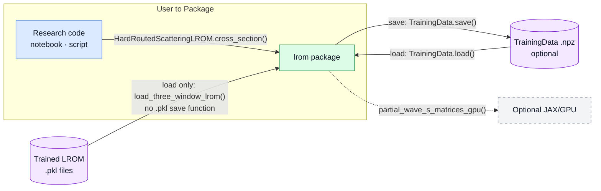

# Scattering LROM — Architecture Map (V6)

This document collects figures reviewed together against the live `lrom` package.
Figure 1 has been reviewed. Figure 2 is being reviewed in V5 before inclusion here.

## Boundary view — user to package

The notebook or script calls the `lrom` package directly. The library's files
also import code from one another to carry out that work. There is no separate
service or worker.
Training data can stay in memory. Saving them as an `.npz` file is optional;
loading that file later lets a researcher reuse the full-order results.

`TrainingData` is an object in memory that holds full-order results for the
sampled cases, including wavefunctions, potentials, and S-matrix values. The
optional `.npz` file saves that object for later reuse.
`ScatteringLROM` has no public `.pkl` save or load method. The separate
`load_three_window_lrom()` function reads the three repository-trained LROM
files; only trusted pickle files should be loaded.
`partial_wave_s_matrices()` processes many cases at once. Its reduced solves
use NumPy on the CPU by default, or an explicitly supplied runtime. The
separate `partial_wave_s_matrices_gpu()` method takes a GPU solver directly.
Figure 1 shows the boundary around the package: who uses it, which files it
reads or writes, and which optional hardware it can call. Later figures show
how the calculations work inside that boundary.
`HardRoutedScatteringLROM.cross_section()` on the caller arrow is one example:
it returns the cross section at the chosen angles for one input case. It is
not the only call a notebook can make.

