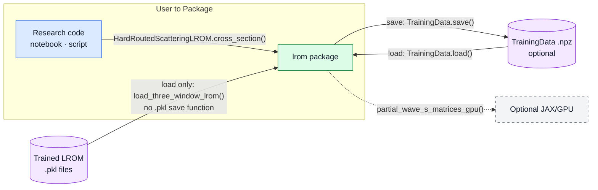

# LROM package — Architecture V6

Figures reviewed against the code. Figure 1 is reviewed; Figure 2 is still
being reviewed in [V5](legacy/architecture-pack-v5.md).

## Figure 1 — User to Package

The notebook or script calls the `lrom` package to calculate scattering results.

`TrainingData` contains wavefunctions, potentials, and S-matrix values.
Saving and loading these results as `.npz` is optional.

`load_three_window_lrom()` reads the three supplied trained LROM `.pkl` files.
The package has no `.pkl` saving function.

`partial_wave_s_matrices()` handles batches on CPU by default.
`partial_wave_s_matrices_gpu()` uses a supplied GPU solver.
The caller arrow shows one example: a cross section at the requested angles.
