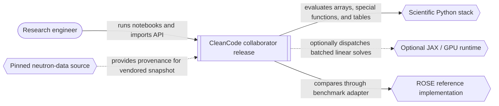
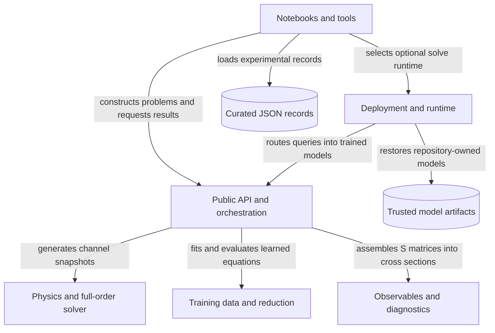
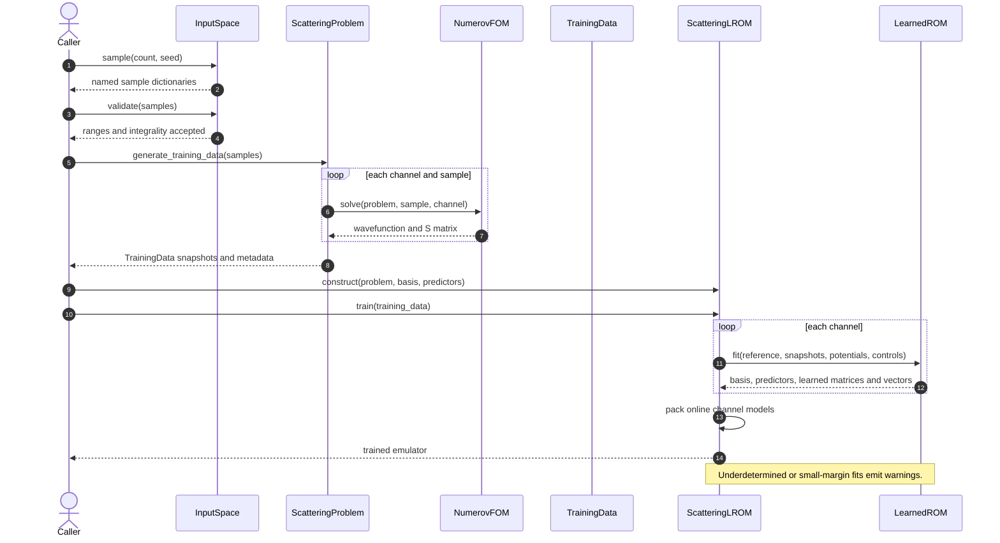
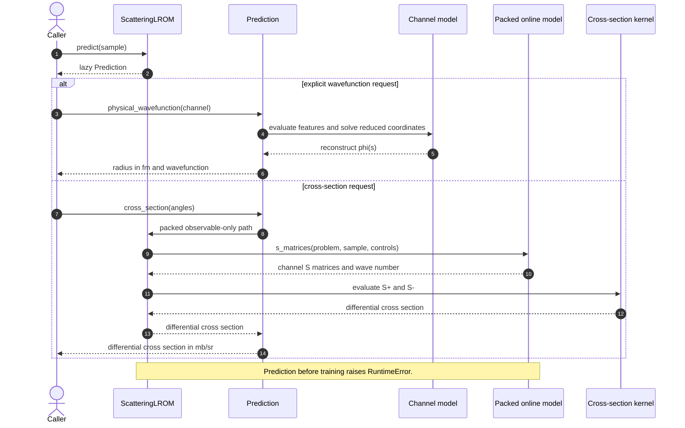

# Architecture Pack: Scattering LROM CleanCode

Status labels used throughout: **VERIFIED** means current repository evidence directly demonstrates the claim; **PARTIAL** means concrete evidence exists but an important link is missing; **UNVERIFIED** identifies useful context that needs another source of truth.

## 1. Executive Summary

- **VERIFIED** — `CleanCode` is the live, installable `scattering-lrom` 0.3.0 Python package and collaborator release for neutron elastic-scattering learned reduced-order models. Evidence: `pyproject.toml:project`, `lrom/__init__.py:__version__`, `README.md:L1-L7`.
- **VERIFIED** — The architecture is a single-process scientific library organized by responsibility: physical models and kinematics feed an independent Numerov full-order solver; training data feed reduced-basis and learned-equation fitting; deployment code routes queries and assembles observables. Evidence: `lrom/problem.py:ScatteringProblem`, `lrom/fom.py:NumerovFOM`, `lrom/reduced.py:LearnedROM`, `lrom/emulator.py:ScatteringLROM`, `lrom/deployment.py:HardRoutedScatteringLROM`.
- **VERIFIED** — The compact public API is exported from `lrom/__init__.py`; lower-level numerical and data-loading APIs remain importable from their modules but are not in `__all__`. Evidence: `lrom/__init__.py:__all__`, `lrom/curated_data.py:load_neutron_elastic`, `lrom/observables.py:ElasticCrossSectionKernel`.
- **VERIFIED** — Offline work generates full-order wavefunctions, potentials, and partial-wave S matrices on a shared scaled coordinate `s = k r`, then fits one learned implicit reduced equation per channel. User-facing reconstruction can map the shared coordinate back to physical radius in femtometres. Evidence: `lrom/problem.py:ScatteringProblem.generate_training_data`, `lrom/reduced.py:LearnedROM.fit`, `lrom/emulator.py:ScatteringLROM.train`, `lrom/emulator.py:Prediction.physical_wavefunction`.
- **VERIFIED** — Online scalar prediction evaluates only selected potential features, solves small reduced systems, derives S matrices from boundary values, and assembles differential cross sections without reconstructing every full wavefunction. Evidence: `lrom/emulator.py:_ChannelModel.features`, `lrom/emulator.py:_PackedOnlineModel.s_matrices`, `lrom/emulator.py:ScatteringLROM._fast_cross_section`.
- **VERIFIED** — The supplied deployment loads three trusted pickle artifacts and hard-routes energies at 5, 70, 135, and 200 MeV; only the selected local model is evaluated for a scalar query. Evidence: `lrom/pretrained.py:THREE_WINDOW_EDGES`, `lrom/pretrained.py:load_three_window_lrom`, `lrom/deployment.py:HardRoutedScatteringLROM.route_energy`.
- **VERIFIED** — CPU NumPy and optional JAX/GPU execution share the same fitted equations. Runtime injection affects supported batched reduced solves; scalar routed `cross_section` does not consult the injected runtime. Evidence: `lrom/backends.py:Runtime`, `lrom/backends.py:get_runtime`, `lrom/deployment.py:HardRoutedScatteringLROM.partial_wave_s_matrices`, `lrom/deployment.py:HardRoutedScatteringLROM.cross_section`.
- **VERIFIED** — The highest current operational risk is release-data availability: `tools/release_check.py` requires extracted curated-data directories, but the current checkout contains `data/curated/data.zip` instead. The release check exits with a missing-files error. Evidence: `tools/release_check.py:main`, `data/README.md`, `command:PYTHONDONTWRITEBYTECODE=1 python tools/release_check.py`.
- **PARTIAL** — The internal import graph was freshly measured as 17 modules, 29 internal edges, 3,377 physical lines, and no cycles. Static analysis cannot prove the behavior of external callers or every dynamic import. Evidence: `tools/architecture_graph.py:build_architecture`, `command:build_architecture summary probe`.

**Analysis record**

| Item | Value |
|---|---|
| Analyzed root | `LROM_Project/lrom_git/CleanCode/` |
| In scope | `lrom/`, package metadata, tests, notebook entry points, release/build tools, curated-data metadata, model metadata, and benchmark boundaries |
| Exclusions | Sibling package copies, `.git/`, generated plot images, binary pickle internals, ZIP contents, full notebook outputs, external services, and live deployment state |
| Primary audience | New engineer becoming productive in the live `CleanCode` package |
| Output date | 2026-09-14 |
| Git revision | **UNVERIFIED** — not read because the applicable workspace policy prohibits reading or touching `.git/` |
| Working-tree state | **UNVERIFIED** — not queried for the same policy reason; all pre-existing changes are treated as user-owned |
| Applicable instructions | Workspace-root `AGENTS.md` and `../../AGENTS.md` |

## 2. System Context

**Question:** Who uses the live release, and which systems or libraries sit outside its boundary?



**Evidence key**

| Diagram element or relationship | Status | Evidence | Note |
|---|---|---|---|
| Research engineer → CleanCode | VERIFIED | `README.md:The three notebooks`; `lrom/__init__.py:__all__` | Notebook and library entry points are both present. |
| CleanCode boundary | VERIFIED | `pyproject.toml:project`; `pyproject.toml:tool.setuptools.packages.find` | One installable Python distribution; no service process is declared. |
| Scientific Python stack | VERIFIED | `pyproject.toml:project.dependencies`; imports under `lrom/` | NumPy, SciPy, and Pandas are used by package modules; Matplotlib is used by notebooks. |
| Optional JAX/GPU runtime | VERIFIED | `lrom/backends.py:_jax_gpu_runtime`; `lrom/backends.py:get_runtime` | Import and device discovery are function-local and optional. |
| ROSE comparison | VERIFIED | `benchmarks/rose.py:_import_rose`; `notebooks/01_single_wavefunction.ipynb:L438`; `notebooks/02_elastic_cross_sections.ipynb:L809` | ROSE is outside `lrom/` and acts as a comparison boundary. |
| Pinned neutron-data source | VERIFIED | `data/curated/PROVENANCE.md` | The release does not contact upstream at runtime; the relationship is provenance only. |

## 3. Component Map

**Question:** Which responsibility boundaries best explain how a request moves from scientific inputs to predictions?

### Candidate grouping comparison

**VERIFIED** — Draft A groups the repository by executable or process boundary. It yields one main Python process, notebook/tool/test callers, optional GPU execution, and local files. This is faithful but hides most of the design because no server, queue, worker, or database process is declared. Evidence: `pyproject.toml:project`, `lrom/backends.py:get_runtime`, `command:rg import inventory across lrom, benchmarks, tools, and tests`.

**VERIFIED** — Draft B groups by domain responsibility: consumer studies, public orchestration, physics/FOM, training/reduction, observables, deployment/runtime, curated records, and trusted models. It matches the seams visible in production classes and imports and exposes the three requested workflows. Evidence: `lrom/problem.py:ScatteringProblem`, `lrom/reduced.py:LearnedROM`, `lrom/emulator.py:ScatteringLROM`, `lrom/deployment.py:HardRoutedScatteringLROM`.

| Candidate | Fidelity | Readability | Onboarding usefulness | Documentation maintainability | Diagram clarity | Explanation |
|---|---:|---:|---:|---:|---:|---|
| Draft A — process/runtime | 4 | 3 | 2 | 4 | 3 | Faithfully shows the single process and optional accelerator, but merges physics, training, and prediction into one box. |
| Draft B — responsibility/domain | 5 | 5 | 5 | 4 | 5 | Closely follows source responsibilities and reveals the main data and call directions. |

**Selected grouping: Draft B.** **VERIFIED** — production classes and imports align with responsibility boundaries, while process boundaries are minimal. Evidence: `lrom/problem.py:ScatteringProblem`, `lrom/emulator.py:ScatteringLROM`, `lrom/deployment.py:HardRoutedScatteringLROM`, `command:build_architecture summary probe`.



**Evidence key**

| Diagram element or relationship | Status | Evidence | Note |
|---|---|---|---|
| Notebooks/tools → API | VERIFIED | `notebooks/01_single_wavefunction.ipynb:L90-L93`; `notebooks/02_elastic_cross_sections.ipynb:L102-L108`; `notebooks/03_curated_data_and_global_lrom.ipynb:L71-L72`; `tools/build_collaborator_notebooks.py:L48-L49` | Consumers call exported and lower-level APIs. |
| API → physics/FOM | VERIFIED | `lrom/problem.py:ScatteringProblem.generate_training_data`; `lrom/fom.py:NumerovFOM.solve` | One FOM solve per sample and channel. |
| API → training/reduction | VERIFIED | `lrom/emulator.py:ScatteringLROM.train`; `lrom/reduced.py:LearnedROM.fit` | Training is explicit; construction alone does not fit. |
| API → observables | VERIFIED | `lrom/emulator.py:ScatteringLROM._fast_cross_section`; `lrom/observables.py:ElasticCrossSectionKernel.evaluate` | Online cross sections use packed S matrices. |
| Deployment → API | VERIFIED | `lrom/deployment.py:HardRoutedScatteringLROM.cross_section` | Router selects one `ScatteringLROM`. |
| Deployment → models | VERIFIED | `lrom/pretrained.py:load_three_window_lrom` | Three pickle files are opened and repacked. |
| Consumers → curated records | VERIFIED | `notebooks/03_curated_data_and_global_lrom.ipynb:L71-L72`; `lrom/curated_data.py:load_neutron_elastic` | The core emulator does not import curated data. |
| Consumers → deployment runtime | VERIFIED | `notebooks/03_curated_data_and_global_lrom.ipynb:L71`; `lrom/backends.py:get_runtime` | Runtime choice is caller-controlled. |

### Component table

| Component | Responsibility | Interface | State | Dependencies | Status | Evidence |
|---|---|---|---|---|---|---|
| Public API and orchestration | Define problems and coordinate FOM, fitting, and prediction | `ScatteringProblem`, `ScatteringLROM`, `Prediction` | Problem system cache; fitted channel models; angular-kernel cache | Physics/FOM, training/reduction, observables | VERIFIED | `lrom/__init__.py:__all__`; `lrom/problem.py:ScatteringProblem`; `lrom/emulator.py:ScatteringLROM` |
| Physics and FOM | Compute kinematics, potentials, scaled meshes, wavefunctions, and S matrices | `PotentialModel`, `ScatteringSystem`, `NumerovFOM.solve`, `solve_channel` | No durable state; a problem caches `ScatteringSystem` values | NumPy, SciPy | VERIFIED | `lrom/physics.py:PotentialModel`; `lrom/fom.py:solve_channel` |
| Training data and reduction | Store reusable snapshots; fit bases and learned implicit equations | `InputSpace`, `TrainingData`, `ReducedBasis`, `LearnedROM` | NPZ training archives; in-memory SVD/predictor caches attached during training | NumPy | VERIFIED | `lrom/data.py:TrainingData`; `lrom/reduced.py:LearnedROM.fit`; `lrom/emulator.py:ScatteringLROM.train` |
| Observables and diagnostics | Convert partial-wave S matrices to differential cross sections and calculate error metrics | `ElasticCrossSectionKernel`, assembly functions, diagnostic functions | Cached angular factors in immutable kernels | NumPy, SciPy | VERIFIED | `lrom/observables.py:ElasticCrossSectionKernel`; `lrom/diagnostics.py` |
| Deployment and runtime | Hard-route energies, batch requests, and optionally inject a solve backend | `HardRoutedScatteringLROM`, `Runtime`, `get_runtime`, `load_three_window_lrom` | Local model tuple, routing edges, angle kernel, selected runtime | Emulator, observables, optional JAX | VERIFIED | `lrom/deployment.py:HardRoutedScatteringLROM`; `lrom/backends.py:Runtime`; `lrom/pretrained.py:load_three_window_lrom` |
| Curated records | Parse vendored neutron-elastic JSON into point and record tables | `load_neutron_elastic`, `strict_lrom_selection` | Repository files and returned Pandas DataFrames | JSON, NumPy, Pandas | VERIFIED | `lrom/curated_data.py:load_neutron_elastic`; `data/curated/PROVENANCE.md` |
| Trusted models | Persist the three fitted window models and their manifest | Repository `.pkl` files and `training_manifest.json` | Durable first-party binary artifacts | Python pickle/class layout | VERIFIED | `models/three_window/README.md`; `models/three_window/training_manifest.json` |
| Consumer studies | Execute the three scientific narratives and comparisons | Notebook cells and notebook runner | Stored notebook outputs and generated plot atlas | Package, benchmark adapter, Matplotlib | VERIFIED | `README.md:The three notebooks`; `tools/run_notebooks.py` |

## 4. Package Ownership Map

Here, “owns” means code or state responsibility, not team ownership. No CODEOWNERS-style human ownership was inspected.

| Package/path | Owns | Public API | May depend on | Status | Evidence |
|---|---|---|---|---|---|
| `lrom/__init__.py` | Compact supported import surface and version | Names in `__all__` | Eight internal modules | VERIFIED | `lrom/__init__.py:__all__` |
| `lrom/problem.py` | Problem configuration, channel set, kinematics cache, FOM orchestration | `ScatteringProblem` | channels, data, FOM, observables, physics | VERIFIED | `lrom/problem.py:ScatteringProblem` |
| `lrom/physics.py` | Constants, kinematics, optical-potential maps and evaluation | `PotentialModel`, `potential_model`, physics functions | NumPy | VERIFIED | `lrom/physics.py:PotentialModel`; `lrom/physics.py:potential_model` |
| `lrom/fom.py` | Independent scaled-coordinate Numerov solution and S-matrix extraction | `NumerovFOM`, `ScatteringSystem`, solver functions | physics, NumPy, SciPy | VERIFIED | `lrom/fom.py:NumerovFOM`; `lrom/fom.py:solve_channel` |
| `lrom/data.py` | Input sampling/validation and reusable training database serialization | `InputSpace`, `TrainingData` | channels, reduced sampling, NumPy | VERIFIED | `lrom/data.py:InputSpace`; `lrom/data.py:TrainingData` |
| `lrom/reduced.py` | Centered reduced bases, predictor selection, learned implicit equations | `ReducedBasis`, `LearnedROM` | NumPy | VERIFIED | `lrom/reduced.py:ReducedBasis`; `lrom/reduced.py:LearnedROM` |
| `lrom/emulator.py` | Per-channel training, lazy predictions, packing, online observable path | `BasisConfig`, `MaxVol`, `Prediction`, `ScatteringLROM` | channels, data, FOM helpers, observables, problem, reduced | VERIFIED | `lrom/emulator.py:ScatteringLROM`; `lrom/emulator.py:Prediction` |
| `lrom/observables.py` | Elastic cross-section angular kernels and assembly | Functions and `ElasticCrossSectionKernel` | NumPy, SciPy | VERIFIED | `lrom/observables.py:ElasticCrossSectionKernel` |
| `lrom/deployment.py` | Hard energy routing and grouped/chunked batch evaluation | `HardRoutedScatteringLROM` | emulator, observables | VERIFIED | `lrom/deployment.py:HardRoutedScatteringLROM` |
| `lrom/backends.py` | Runtime resolution and solve-port implementation | `Runtime`, `get_runtime` | NumPy; function-local JAX | VERIFIED | `lrom/backends.py:get_runtime` |
| `lrom/pretrained.py` | Trusted three-window artifact loading | `load_three_window_lrom` | deployment, NumPy, pickle | VERIFIED | `lrom/pretrained.py:load_three_window_lrom` |
| `lrom/curated_data.py` and `data/curated/` | Data parsing, filtering, units conversion, provenance | Loader/filter functions; JSON snapshot | Pandas, NumPy, filesystem | VERIFIED | `lrom/curated_data.py:load_neutron_elastic`; `data/curated/PROVENANCE.md` |
| `lrom/diagnostics.py` | Notebook-oriented numerical error and projection helpers | Diagnostic functions | data, emulator, FOM, observables | VERIFIED | imports and functions in `lrom/diagnostics.py` |
| `benchmarks/` | ROSE adapter and cached external-reference arrays | Benchmark helper functions/classes | NumPy, optional ROSE/SciPy | VERIFIED | `benchmarks/rose.py:_import_rose`; `benchmarks/cache/*.npz` |
| `models/three_window/` | Three repository-trusted fitted models and training metadata | Files consumed by pretrained loader | Pickle-compatible package classes | VERIFIED | `models/three_window/README.md`; `models/three_window/training_manifest.json` |
| `notebooks/` | Scientific presentation, plots, and end-to-end studies | Three executable notebooks | Package, benchmarks, plotting/data stack | VERIFIED | `README.md:The three notebooks` |
| `tools/` | Notebook execution/building, release checking, archived architecture generation | Script entry points | Package and notebook libraries as declared by each script | VERIFIED | `tools/run_notebooks.py`; `tools/release_check.py`; `tools/architecture_graph.py` |
| `lrom/cpu_batched.py`, `lrom/cuda_batched.py`, `lrom/global_kd.py` | Standalone alternative solver/helpers | Module-level classes/functions | NumPy | PARTIAL | `command:build_architecture summary probe`; no inbound references found in the scanned in-scope tree, but external callers were not inspected |

## 5. Runtime Flow Diagrams

### Workflow 1 — FOM snapshot generation and LROM training

**Question:** How do named samples become a trained set of channel models?



| Element or relationship | Status | Evidence | Note |
|---|---|---|---|
| Sampling and validation | VERIFIED | `lrom/data.py:InputSpace.sample`; `lrom/data.py:InputSpace.validate` | Validation is explicit; `generate_training_data` does not call it automatically. |
| Per-channel/sample FOM loop | VERIFIED | `lrom/problem.py:ScatteringProblem.generate_training_data`; `lrom/fom.py:NumerovFOM.solve` | Potentials, wavefunctions, physical radii, and S matrices are retained. |
| Learned fit | VERIFIED | `lrom/emulator.py:ScatteringLROM.train`; `lrom/reduced.py:LearnedROM.fit` | One learned equation is fitted per channel. |
| Fit warnings | VERIFIED | `lrom/reduced.py:LearnedROM.fit`; `tests/test_core.py:FitCapacityWarningTests` | Warnings do not abort fitting. |
| Online packing | VERIFIED | `lrom/emulator.py:ScatteringLROM._build_online_model` | Equal, padded, or grouped/ragged layout depends on fitted shapes and strategy. |

**Trace completeness:** **VERIFIED complete** for the in-process production path from sampling through fitted emulator. Data-selection policy before `InputSpace` construction is caller-owned and outside this trace.

### Workflow 2 — Single-model wavefunction and cross-section prediction

**Question:** How does one named physical sample become a wavefunction or differential cross section?



| Element or relationship | Status | Evidence | Note |
|---|---|---|---|
| Lazy prediction | VERIFIED | `lrom/emulator.py:ScatteringLROM.predict`; `lrom/emulator.py:Prediction` | Coordinates and S matrices are cached per channel. |
| Feature-only reduced solve | VERIFIED | `lrom/emulator.py:_ChannelModel.features`; `lrom/reduced.py:LearnedROM.coordinates_from_features` | Selected potential values and optional controls drive the implicit solve. |
| Physical wavefunction | VERIFIED | `lrom/emulator.py:Prediction.physical_wavefunction`; `lrom/fom.py:ScatteringSystem.radius` | The internal shared mesh is converted to `r` in fm at the user-facing boundary. |
| Observable-only path | VERIFIED | `lrom/emulator.py:ScatteringLROM._fast_cross_section` | Full wavefunctions are not reconstructed on the packed route. |
| Cross-section units | VERIFIED | `lrom/observables.py:ElasticCrossSectionKernel.evaluate` | The factor of 10 returns mb/sr. |
| Untrained failure | VERIFIED | `lrom/emulator.py:ScatteringLROM.predict`; `lrom/emulator.py:ScatteringLROM._fast_cross_section` | Both reject prediction when no channel models exist. |

**Trace completeness:** **VERIFIED complete** for trained in-memory scalar prediction. Persistence of user-trained `ScatteringLROM` objects is not implemented by this API and is not inferred.

### Workflow 3 — Pretrained hard-routed deployment and optional batched runtime

**Question:** How are trusted local models loaded, routed by energy, and evaluated in scalar or batched form?

```mermaid
sequenceDiagram
    autonumber
    actor Caller
    participant Backend as get_runtime
    participant Loader as Pretrained loader
    participant Files as Model files
    participant Router as Hard router
    participant Model as Selected LROM
    participant Runtime

    opt caller selects a runtime
        Caller->>Backend: get_runtime(cpu, gpu, or auto)
        Backend-->>Caller: Runtime
    end
    Caller->>Loader: load_three_window_lrom(directory, angles, runtime)
    Loader->>Files: verify and unpickle three trusted artifacts
    Files-->>Loader: trained local models
    Loader->>Router: construct(models, edges, angles, runtime)
    alt scalar cross section
        Caller->>Router: cross_section(sample)
        Router->>Router: route_energy(E)
        Router->>Model: cross_section(sample, angles)
        Model-->>Caller: one differential cross section
    else batched partial waves
        Caller->>Router: partial_wave_s_matrices(samples)
        Router->>Router: group by window and chunk
        Router->>Model: s_matrices_batch(...)
        opt injected runtime exists
            Model->>Runtime: solve(reduced matrices, right sides)
            Runtime-->>Model: reduced coordinates
        end
        Model-->>Caller: S+, S-, and wave numbers
    end
    Note over Loader,Files: Missing files fail before loading; pickle inputs must be repository-trusted.
```

| Element or relationship | Status | Evidence | Note |
|---|---|---|---|
| Runtime selection | VERIFIED | `lrom/backends.py:get_runtime` | `auto` falls back to NumPy CPU on `RuntimeError`; invalid backend names raise `ValueError`. |
| Three artifact load | VERIFIED | `lrom/pretrained.py:load_three_window_lrom` | Missing paths raise `FileNotFoundError`; loaded models are repacked to padded layout. |
| Hard routing | VERIFIED | `lrom/deployment.py:HardRoutedScatteringLROM.route_energy`; `models/three_window/training_manifest.json:edges` | `np.searchsorted(..., side="right")` assigns internal boundary values to the higher window. |
| Scalar path | VERIFIED | `lrom/deployment.py:HardRoutedScatteringLROM.cross_section` | Evaluates exactly one local model and does not invoke `Runtime`. |
| Batched grouping/chunking | VERIFIED | `lrom/deployment.py:HardRoutedScatteringLROM.partial_wave_s_matrices` | Samples retain input ordering in output arrays. |
| Injected solve | VERIFIED | `lrom/deployment.py:HardRoutedScatteringLROM.partial_wave_s_matrices`; `lrom/backends.py:Runtime.solve` | Only supported packed batched paths use it. |
| Artifact trust | VERIFIED | `README.md:Data and model provenance`; `models/three_window/README.md`; `lrom/pretrained.py:load_three_window_lrom` | Loader performs no signature or hash verification at load time. |

**Trace completeness:** **VERIFIED complete** through the local file and optional GPU-device boundaries. The training process that originally produced the supplied pickle files is **PARTIAL** because only manifest/README metadata, not an executable training pipeline, was inspected.

## 6. Dependency Rules and Smells

### Enforced dependency rules

| Rule | Status | Evidence | Enforcement limit |
|---|---|---|---|
| Only packages matching `lrom*` are included by setuptools discovery | VERIFIED | `pyproject.toml:tool.setuptools.packages.find` | Does not restrict imports inside the package. |
| Release must contain three notebooks, extracted curated datasets, and three model files | VERIFIED | `tools/release_check.py:main` | Script must be invoked; it is not registered as a pytest test. |
| Release text must not reference named hidden workspace paths, except explanatory text in README/release checker | VERIFIED | `tools/release_check.py:FORBIDDEN`; `tools/release_check.py:main` | String scan only. |
| Stored notebook outputs must contain no error records | VERIFIED | `tools/release_check.py:main` | Does not execute notebooks. |
| Input and deployment constructors validate important ranges, shapes, and readiness | VERIFIED | `lrom/data.py:InputSpace.validate`; `lrom/problem.py:ScatteringProblem.__post_init__`; `lrom/deployment.py:HardRoutedScatteringLROM.__init__` | Validation is local to each API and does not create a repository-wide architecture policy. |

### Documented intended rules

| Intended direction | Status | Evidence | Enforcement |
|---|---|---|---|
| Keep the package modular by responsibility with a compact public surface | VERIFIED | `lrom/__init__.py` module docstring; `docs/old_arch/adr/ADR-0001-organize-the-live-package-by-responsibility.md` | Import graph can be generated, but no architecture test is registered in pytest. |
| Keep ROSE outside `lrom/` | VERIFIED | `README.md:Reproducing the notebooks`; `docs/old_arch/adr/ADR-0003-keep-rose-outside-the-package.md` | Current import scan supports it; no lint rule was found. |
| Keep plotting in notebooks | VERIFIED | `../../AGENTS.md:Deliberate decisions`; `docs/old_arch/adr/ADR-0004-keep-plotting-in-notebooks.md` | Current import scan supports it; packaging still lists Matplotlib as a normal dependency. |
| Treat hard routing and first-party pickle trust as deliberate deployment constraints | VERIFIED | `README.md:Current deployment choice`; `README.md:Data and model provenance` | Constructor/loader mechanics enforce routing shape and file presence, not artifact authenticity. |

### Observed dependency directions

- **VERIFIED** — A fresh AST probe found 17 modules and 29 internal imports with no cycles. Evidence: `tools/architecture_graph.py:build_architecture`, `command:build_architecture summary probe`.
- **VERIFIED** — `lrom/__init__.py` has internal fan-out 8 as the export facade; `lrom/emulator.py` has implementation-module fan-out 6 (`channels`, `data`, `fom`, `observables`, `problem`, `reduced`). Counts are direct static import targets within `lrom/`, measured across all 17 package modules. Evidence: `lrom/__init__.py` imports; `lrom/emulator.py` imports; `docs/old_arch/architecture.json:nodes`.
- **VERIFIED** — `problem` is the bridge from physical inputs to FOM/data/observables, while `deployment` depends inward on `emulator` and `observables`; the emulator does not depend on deployment. Evidence: `lrom/problem.py:L10-L17`, `lrom/deployment.py:L9-L10`, `lrom/emulator.py:L11-L16`.

### Verified violations

- **VERIFIED** — The executable release contract currently fails: extracted `data/curated/data/kduq/neutron_elastic` and `data/curated/data/test/neutron_elastic` are missing, although `data/curated/data.zip` exists. Evidence: `tools/release_check.py:main`, `data/README.md`, `command:PYTHONDONTWRITEBYTECODE=1 python tools/release_check.py`.
- **PARTIAL** — The new `architecture-pack.md` is intentionally hand-authored under the user's current instruction, while the archived ADR-0010 describes the older `ARCHITECTURE.md`/`architecture.json` generator pair. Whether the generator should be retired or adapted is not established. Evidence: `docs/old_arch/adr/ADR-0010-generate-architecture-documentation-from-source-evidence.md`; current output location instruction.

### Other architectural smells

- **PARTIAL** — `emulator.py` concentrates 1,071 of 3,377 package lines (31.7%) and directly imports six internal modules. This is measured concentration, not proof that it should be split; change-history evidence was unavailable under the `.git` restriction. Evidence: `command:build_architecture summary probe`, `lrom/emulator.py` imports.
- **PARTIAL** — `cpu_batched`, `cuda_batched`, and `global_kd` have zero inbound references in the scanned package, notebooks, tools, tests, and safe pickle opcode scan. External callers were not inspected, so these modules are “unreferenced in scope,” not dead. Evidence: `tools/architecture_graph.py:build_architecture`, `command:build_architecture summary probe`.
- **VERIFIED** — Core installation includes Matplotlib, Pandas, and `nuclear-rose`, although Matplotlib and ROSE are consumer/benchmark concerns and Pandas is isolated to `curated_data`. This widens the default install boundary. Evidence: `pyproject.toml:project.dependencies`; `command:rg import inventory across lrom, benchmarks, tools, and tests`.
- **VERIFIED** — Pickle loading is an explicit trust boundary without loader-side hash verification or sandboxing. Evidence: `lrom/pretrained.py:load_three_window_lrom`; hashes documented in `models/three_window/README.md`.

## 7. Data and Configuration Boundaries

| Boundary | Format / ownership | Read/write path | Validation and consistency | Status | Evidence |
|---|---|---|---|---|---|
| Named model inputs | In-memory mappings owned by `InputSpace` and callers | Sample/validate only | Continuous ranges, allowed integers, required names; fixed-value equality is not checked | VERIFIED | `lrom/data.py:InputSpace` |
| Problem configuration | Dataclass values plus in-memory system cache | Constructed by caller; cache keyed by `(A, Z, E)` | Mesh and matching bounds, potential parameter count | VERIFIED | `lrom/problem.py:ScatteringProblem.__post_init__`; `lrom/problem.py:ScatteringProblem.system` |
| Training database | Arrays plus JSON description in compressed NPZ | `TrainingData.save/load` | `allow_pickle=False`; channel-indexed array names; no schema version | VERIFIED | `lrom/data.py:TrainingData.save`; `lrom/data.py:TrainingData.load` |
| Curated measurements | Vendored JSON converted to Pandas point/record tables | Read under `data/{corpus}/neutron_elastic` | Projectile/type filter, exact units tuple, target parsing, strict selection | VERIFIED | `lrom/curated_data.py:load_neutron_elastic`; `lrom/curated_data.py:strict_lrom_selection` |
| Curated archive | ZIP file currently present instead of required extracted directories | No extraction path exists in inspected `lrom/`, tests, or release tool | Release checker fails when directories are absent | VERIFIED | `data/README.md`; `tools/release_check.py:main`; release-check command |
| Pretrained deployment | Three trusted pickle files | Read by `load_three_window_lrom` | Presence check only; documented SHA-256 values are not checked by loader | VERIFIED | `lrom/pretrained.py:load_three_window_lrom`; `models/three_window/README.md` |
| Training metadata | JSON manifest | Read by humans/notebook tooling; no production loader found | Records edges, basis size, predictors, ridge, supports, counts, timings | VERIFIED | `models/three_window/training_manifest.json` |
| Benchmark reference cache | NPZ arrays under `benchmarks/cache/` | Read by benchmark adapter/notebooks | Cache provenance and refresh mechanics were not fully traced | PARTIAL | `benchmarks/cache/*.npz`; `benchmarks/rose.py` |
| Prediction caches | In-memory dictionaries/arrays | `Prediction`, `ScatteringProblem`, and `ScatteringLROM` mutate their own caches | Process-local; no concurrency contract evidenced | VERIFIED | `lrom/emulator.py:Prediction`; `lrom/problem.py:ScatteringProblem.system`; `lrom/emulator.py:ScatteringLROM._fast_cross_section` |
| Runtime configuration | Function arguments (`backend`, `precision`) | Caller passes resolved `Runtime` into loader/router | Accepted backend names and precision checked; `auto` fallback catches `RuntimeError` | VERIFIED | `lrom/backends.py:get_runtime`; `lrom/pretrained.py:load_three_window_lrom` |

**VERIFIED** — No database, migration, queue, transaction, environment-variable loader, secret store, or network client is declared in the inspected production package. Evidence: `command:rg import inventory across lrom, benchmarks, tools, and tests`; `pyproject.toml:project.dependencies`. This is a repository claim, not a claim about uninspected external callers.

## 8. Key Decisions and Trade-offs

| Decision | Evidence | Benefit | Cost | Rejected alternative, if evidenced | Status |
|---|---|---|---|---|---|
| Organize live code by responsibility behind a compact export facade | `lrom/__init__.py`; `docs/old_arch/adr/ADR-0001-organize-the-live-package-by-responsibility.md` | Navigable seams and acyclic imports | Cross-module coordination and boundary maintenance | Legacy one-file implementation for the live package | VERIFIED |
| Use shared scaled coordinate `s = k r` internally and map to physical `r` for presentation | `lrom/fom.py:ScatteringSystem`; `lrom/emulator.py:Prediction.physical_wavefunction`; `../../AGENTS.md:Notebook 03 authoring conventions` | Shared wave frequency/mesh across energies while preserving physical user output | Developers must track the coordinate boundary carefully | Shared-fm basis was rejected in recorded project authority due measured accuracy limits | VERIFIED |
| Keep ROSE outside the package | `benchmarks/rose.py`; `docs/old_arch/adr/ADR-0003-keep-rose-outside-the-package.md` | Independent implementation and visible benchmark boundary | Separate adapter/cache maintenance | Importing ROSE into reusable `lrom` | VERIFIED |
| Keep plotting in notebooks | `notebooks/02_elastic_cross_sections.ipynb:L96-L98`; `notebooks/03_curated_data_and_global_lrom.ipynb:L64`; `docs/old_arch/adr/ADR-0004-keep-plotting-in-notebooks.md` | Figure assumptions remain next to scientific narrative | Repeated plotting code; no package plotting API | Package plotting layer | VERIFIED |
| Hard-route three energy windows | `lrom/deployment.py:HardRoutedScatteringLROM`; `models/three_window/training_manifest.json`; `docs/old_arch/adr/ADR-0005-route-energy-through-three-hard-windows.md` | One model evaluation per case and deterministic routing | Boundary continuity needs explicit validation; three artifacts to maintain | Overlap-and-blend routine evaluation | VERIFIED |
| Inject only the online linear-solve runtime | `lrom/backends.py:Runtime`; `lrom/deployment.py:HardRoutedScatteringLROM.partial_wave_s_matrices`; `docs/old_arch/adr/ADR-0006-inject-the-online-linear-solve-runtime.md` | Same fitted equations and observable code on CPU/GPU | Acceleration is limited to supported batches | Backend selection inside physics/emulator core | VERIFIED |
| Vendor and pin curated measurements | `data/curated/PROVENANCE.md`; `docs/old_arch/adr/ADR-0007-vendor-and-pin-curated-data.md` | Stable, attributable input snapshot | Storage, extraction, updates, and license review become repository responsibilities | Reading a moving upstream checkout | VERIFIED |
| Load only repository-trusted pickle models | `lrom/pretrained.py:load_three_window_lrom`; `models/three_window/README.md`; `docs/old_arch/adr/ADR-0008-trust-only-first-party-pickle-artifacts.md` | Restores full trained objects with little custom serialization | Unsafe for untrusted inputs and sensitive to class compatibility | Arbitrary downloaded pickle interchange | VERIFIED |
| Separate emulator fidelity from optical-model adequacy | `README.md:Scientific scope`; `docs/old_arch/adr/ADR-0009-separate-emulator-fidelity-from-model-adequacy.md` | Error attribution remains scientifically meaningful | Requires both FOM/LROM and experiment comparisons | One aggregate score for both questions | VERIFIED |

## 9. Onboarding Route

1. **`README.md`** — Learn the scientific purpose, the three notebook narratives, install/run commands, hard-window deployment, provenance, and the fidelity-versus-adequacy distinction. Next read the supported imports.
2. **`lrom/__init__.py:__all__`** — Learn the compact public vocabulary and confirm that construction is `ScatteringLROM(...)` followed by `.train(...)`; no `build` method exists. Next read the problem definition.
3. **`lrom/problem.py:ScatteringProblem`** — Learn how physical configuration, channels, kinematics, potentials, FOM generation, and direct FOM cross sections connect. Next inspect the numerical solver it delegates to.
4. **`lrom/fom.py:solve_channel` and `lrom/fom.py:ScatteringSystem`** — Learn the `s = k r` coordinate, Numerov propagation, physical-radius mapping, and S-matrix boundary extraction. Next inspect the stored training boundary.
5. **`lrom/data.py:TrainingData`** — Learn which snapshots and metadata cross from the FOM into training and how NPZ serialization works. Next inspect the learned model.
6. **`lrom/reduced.py:LearnedROM.fit`** — Learn basis construction, max-volume predictor selection, feature normalization, fit-capacity warnings, OLS/ridge fitting, and online reduced solves. Next see how this repeats across channels.
7. **`lrom/emulator.py:ScatteringLROM.train`, `Prediction`, and `_fast_cross_section`** — Learn channel-model assembly, packing strategies, lazy explicit reconstruction, and the fast observable-only path. Next inspect observable assembly.
8. **`lrom/observables.py:ElasticCrossSectionKernel`** — Learn how S+ and S− partial waves become mb/sr cross sections and how angular factors are cached. Next inspect deployment routing.
9. **`lrom/deployment.py:HardRoutedScatteringLROM` and `lrom/pretrained.py:load_three_window_lrom`** — Learn hard-window assignment, batching/chunking, optional runtime injection, and the trusted artifact boundary. Next read the executable behavioral checks.
10. **`tests/test_core.py:PublicApiTests.test_problem_data_prediction_and_serialization`** — See a compact end-to-end example covering data generation, training, scalar/batch agreement, routing, partial waves, wavefunctions, diagnostics, and NPZ round-trip. Then follow the corresponding notebook for scientific presentation.

## 10. Evidence and Uncertainty Register

| Claim or open question | Status | Evidence | Missing evidence | Source of truth |
|---|---|---|---|---|
| CleanCode is the live 0.3.0 package | VERIFIED | `pyproject.toml:project`; `lrom/__init__.py:__version__`; `../../AGENTS.md` | None for current workspace authority | Current package files and project authority |
| Internal package graph is acyclic with 17 modules and 29 edges | VERIFIED | `tools/architecture_graph.py:build_architecture`; fresh summary command | Dynamic behavior and external callers | Production imports plus runtime integration tests |
| Offline training trace is complete | VERIFIED | `InputSpace`, `ScatteringProblem.generate_training_data`, `ScatteringLROM.train`, `LearnedROM.fit` | Caller-specific sampling policy | Calling application/notebook |
| Scalar and batched routed deployment trace is complete | VERIFIED | `HardRoutedScatteringLROM`, `load_three_window_lrom`, `Runtime` | Live GPU execution was not run | Target deployment environment |
| Supplied model training is reproducible from this checkout | PARTIAL | Manifest and README describe inputs/settings | No complete executable training pipeline was identified | Model producer/training workflow |
| Curated data is not immediately available in the required extracted layout | VERIFIED | `data.zip` present; required extracted directories absent; release check fails | Extraction/packaging decision | Release maintainer and repository contents |
| Model pickles are authentic first-party artifacts | PARTIAL | Repository placement and documented SHA-256 values | Loader does not verify hashes; Git revision was not inspected | Trusted repository history/release signing |
| Git revision and dirty state | UNVERIFIED | Not queried under `.git` protection | Revision and status | Authorized Git metadata query by maintainer |
| Optional accelerator is scientifically equivalent in this environment | PARTIAL | Same solve interface and fitted equations in source | GPU/JAX parity run on target hardware | Target-environment benchmark/test |
| Unreferenced helper modules can be removed | UNVERIFIED | Static scan finds no in-scope inbound references | External caller inventory and current intent | Maintainer decision plus external usage search |
| New architecture pack should replace or join the old generator workflow | UNVERIFIED | Archived ADR-0010 describes the old generated pair | Updated documentation policy | Maintainer decision |

### Coverage statement

**PARTIAL** — Inspection covered all production-module names/imports, public exports, manifests, package metadata, primary runtime classes/functions for the three workflows, the full core test file, notebook import/call entry points, release checks, provenance, model metadata, and the prior ADRs. It did not exhaustively read every implementation line or notebook output, unpickle models, expand the data ZIP, execute notebooks, access external networks, or inspect sibling project copies.

### Commands executed and outcomes

| Command description | Outcome |
|---|---|
| `rg` source symbol and import inventories | Located production interfaces and direct dependency declarations across `lrom/`, tests, benchmarks, and tools. |
| Notebook JSON extraction plus targeted `rg` | Confirmed the three notebook entry-point imports and main calls without treating stored output as production wiring. |
| Fresh `build_architecture()` summary probe | 17 modules, 29 internal edges, 3,377 physical lines, three in-scope unreferenced modules, zero cycles. |
| `pytest -q -p no:cacheprovider` | Collection error: standalone launcher did not place `CleanCode` on its import path. Diagnostic checks showed the launcher and Python use the same interpreter but enter differently. |
| `PYTHONDONTWRITEBYTECODE=1 python -m pytest -q -p no:cacheprovider` | 14 passed; three expected fit-capacity warnings. |
| `PYTHONDONTWRITEBYTECODE=1 python tools/release_check.py` | Failed: extracted KDUQ and held-out neutron-elastic directories are missing. |
| Git revision/status commands | Not executed because applicable workspace policy prohibits reading or touching `.git/`. |

### Unresolved workflow gaps

- **PARTIAL** — The original training/export procedure for `models/three_window/*.pkl` is described by metadata but was not traced to a runnable producer.
- **PARTIAL** — GPU dispatch is traced to JAX device discovery and the injected solve call, but was not exercised on target hardware.
- **PARTIAL** — Curated-data ingestion is implemented, but the current checkout lacks the extracted directories required to enter that workflow.

### Exactly three facts a maintainer should verify before relying on this document

1. Verify the current Git revision and working-tree state from an authorized Git context.
2. Verify the intended extraction or packaging path for `data/curated/data.zip`, then rerun `tools/release_check.py`.
3. Verify whether the old source-generated architecture workflow should be adapted to generate this pack or formally retired.
