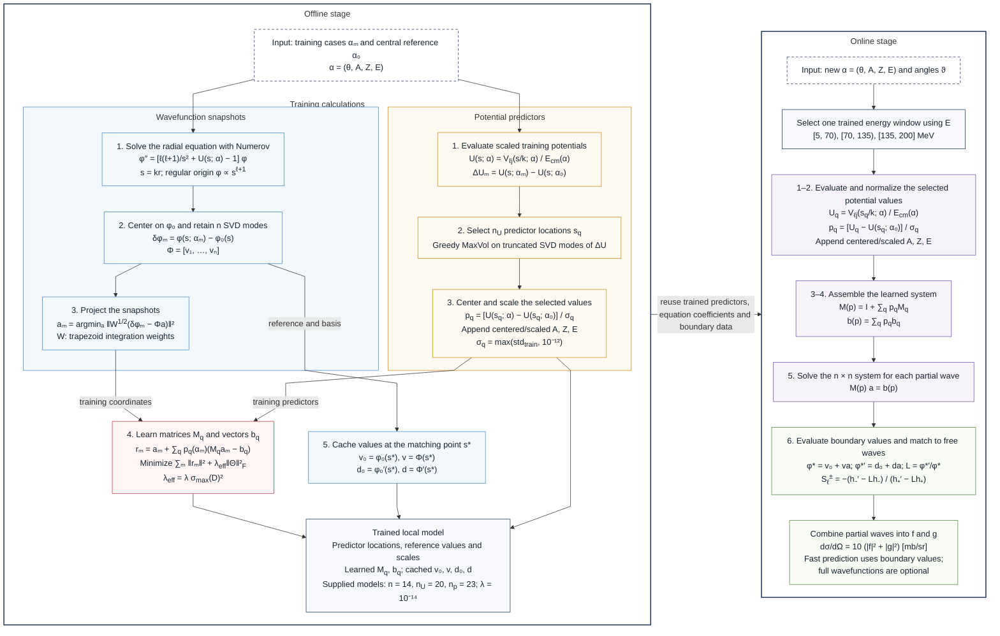

# Fig-2-sci — scientific workflow of the LROM

### Mermaid version

### Illustrated version

[Vector version](figures/fig-2-sci.svg).

**Fig-2-sci.** Offline construction and online evaluation of the supplied
three-window neutron-elastic LROM. Each window has a separate reduced model
for every partial wave. Numerov solutions on the common coordinate \(s=kr\)
provide centered wavefunction modes and training coordinates. Selected
potential values, together with \(A,Z,E\), become normalized predictors for
the learned implicit equation. The illustrated version uses colored arrows
for predictor definitions (orange), fitted equation coefficients (red), and
boundary data (blue); the Mermaid version collects these in the trained-model
box. At a new input, the selected window evaluates these predictors,
solves the reduced equations, obtains \(S_\ell^\pm\) by boundary matching,
and combines partial waves into the differential cross section.

Here \(\phi_0=\phi(s;\alpha_0)\) is the central reference solution, \(W\) contains
trapezoid integration weights, and \(s_*\) is the matching point. \(\Theta\)
collects the fitted \(M_q,b_q\) coefficients; the regression matrix \(D\) has
row blocks \([p_q(\alpha_m)a_m^T,-p_q(\alpha_m)]\).
\(h_\pm=s[j_\ell(s)\pm i y_\ell(s)]\), with primes denoting \(s\)-derivatives.
The amplitudes \(f,g\) are the spin-nonflip and spin-flip partial-wave sums,
including their \(1/(2ik)\) factors; the factor 10 converts fm² to mb.

Layout follows Fig. 3 (p. 7) of the
[ROSE paper](../../../scientific_archive/ROSE_Guide/ROSEPaper%5B7945%5D.pdf).
The equations and steps here follow the current `lrom` implementation:
`problem.py`, `fom.py`, `reduced.py`, `emulator.py`, `deployment.py`, and
`observables.py`. This LROM learns its matrix and right-hand side from
snapshot coordinates; no ROSE EIM inverse or Galerkin operator projection
is used in this path.
