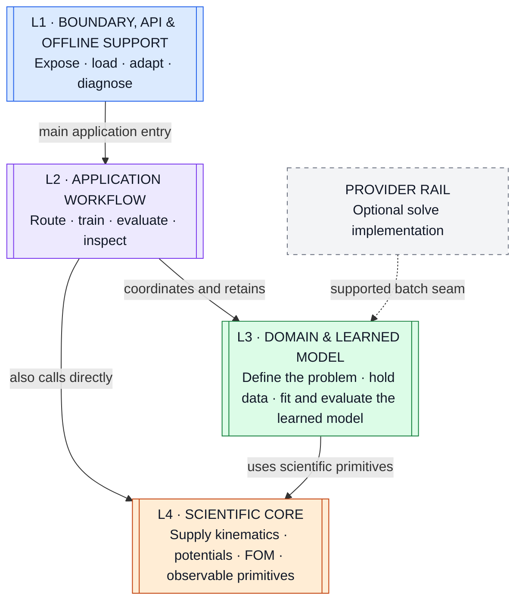
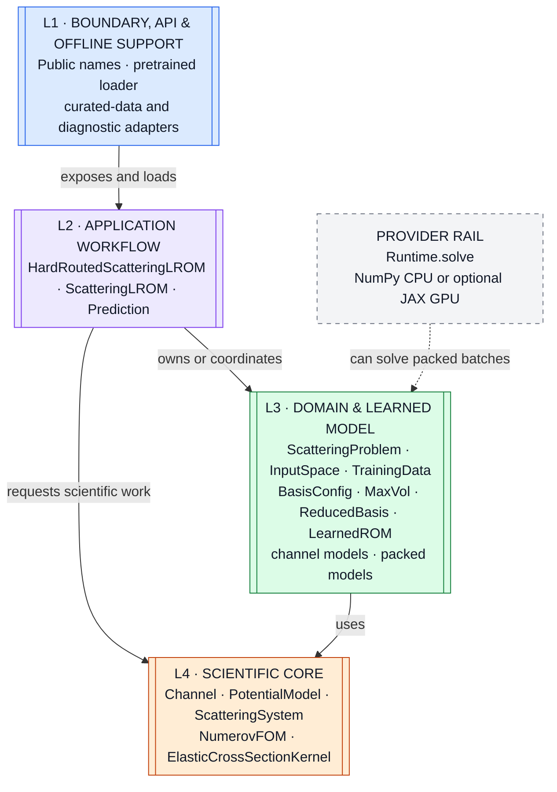
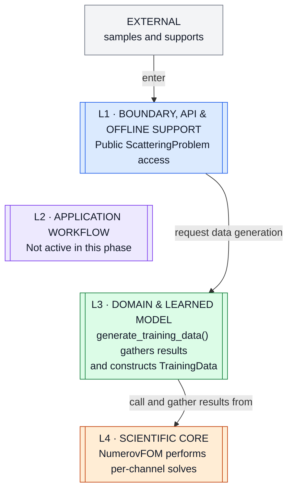
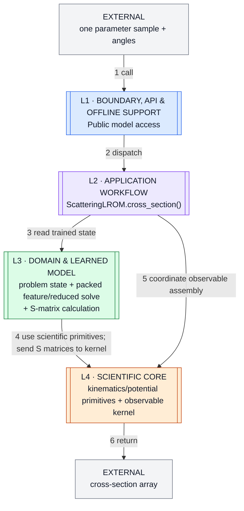
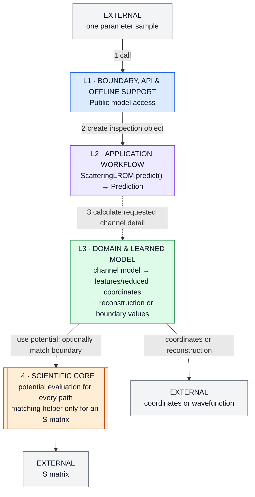
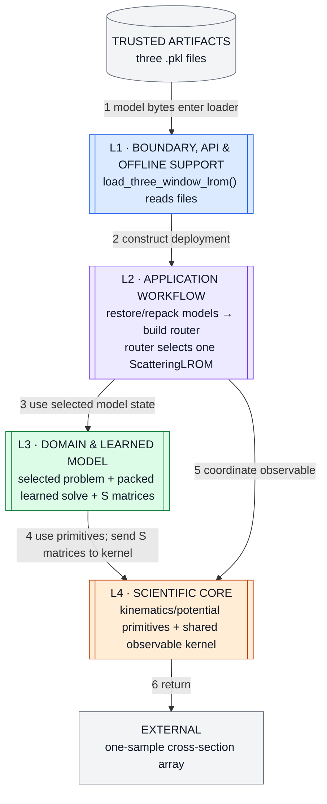
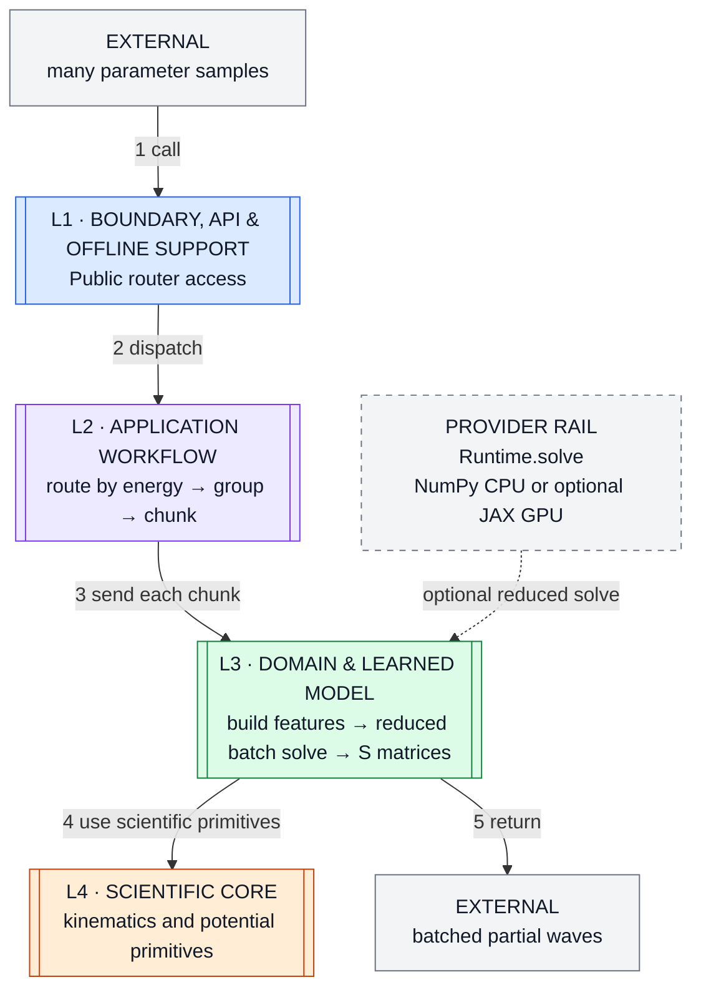

# Scattering LROM — Layered Architecture Map (V4)

> One fixed picture of the software underneath the public API.
>
> Physics and package usage are omitted. Detailed evidence remains in [`architecture-pack.md`](architecture-pack.md).

---

## Start Here: The One Map

This is a **responsibility map** for navigation—not a strict import hierarchy or mandatory call sequence.



### Fixed visual rules

- **Color and `L#` always mean the same layer.**
- Every workflow keeps the same vertical L1/L2/L3/L4 placement; a path may skip or revisit a layer.
- Gray shapes are outside the four layers. Cylinders are durable files; dashed arrows are optional.
- The provider rail appears only when it participates.

> **Home-layer rule:** place an entity by its primary job—not its class/function type, physical file, or current owner.

The public façade re-exports objects from several layers, and L2 can call L4 directly. The arrows above show the dominant architectural relationships, not an access restriction.

---

## Place the Main Objects on the Map



The nesting to remember is:

> **router → local LROM → channel model → learned model**

`Prediction` is request-local. A packed model is a fast layout derived from the learned channel models.

---

## Follow Training Through the Same Map

### Phase A — generate full-order data



### Phase B — fit and pack

```mermaid
flowchart TB
    input["EXTERNAL<br/>start training"]
    l1[["L1 · BOUNDARY, API & OFFLINE SUPPORT<br/>Public ScatteringLROM access"]]
    l2[["L2 · APPLICATION WORKFLOW<br/>ScatteringLROM.train() coordinates fitting"]]
    l3[["L3 · DOMAIN & LEARNED MODEL<br/>TrainingData + BasisConfig + MaxVol<br/>→ ReducedBasis + LearnedROM → channel models → packed model"]]
    l4[["L4 · SCIENTIFIC CORE<br/>Boundary-location and derivative helpers"]]

    l1 ~~~ l2
    l2 ~~~ l3
    l3 ~~~ l4
    input -->|enter| l1
    l1 -->|call train()| l2
    l2 -->|fit and retain| l3
    l3 -->|use focused helpers| l4

    classDef ioc fill:#F3F4F6,stroke:#6B7280,color:#111827
    classDef l1c fill:#DBEAFE,stroke:#2563EB,color:#111827
    classDef l2c fill:#EDE9FE,stroke:#7C3AED,color:#111827
    classDef l3c fill:#DCFCE7,stroke:#15803D,color:#111827
    classDef l4c fill:#FFEDD5,stroke:#C2410C,color:#111827
    class input ioc
    class l1 l1c
    class l2 l2c
    class l3 l3c
    class l4 l4c
```

The provider rail is not involved in training.

---

## Follow Evaluation Through the Same Map

### Fast observable path



The packed path avoids reconstructing every wavefunction.

### Inspection path



Neither evaluation path calls `NumerovFOM`.

---

## Follow Pretrained Deployment Through the Same Map

### Setup and one scalar request



### Routed partial-wave batch



The loader passes `Runtime` to the router, which retains it for this path. The lower-level `ScatteringLROM.cross_sections(linear_solver=...)` seam and `HardRoutedScatteringLROM.partial_wave_s_matrices_gpu()` can also accept a solver.

Equal/padded packing supports batching and solver injection; ragged packing supports scalar S-matrix evaluation only.

---

## Read State Inside Its Layer

### L2 lifecycle of `ScatteringLROM`

| L2 state | L3 state available | Entered by |
|---|---|---|
| **Untrained** | No channel models; no packed model | `ScatteringLROM(...)` |
| **Ready** | Learned channels and packed model | `train(TrainingData)` |
| **Warm** | Ready state plus remembered angle calculation | Evaluation on a new angle grid |

`repack()` rebuilds the packed state and clears remembered angle work. Prediction while untrained raises an error; `predict()` otherwise creates a separate object without changing lifecycle state.

### Intended state responsibility

| Home | Object | Remembered state |
|---|---|---|
| L3 | `ScatteringProblem` | Physical configuration and rebuildable system result |
| L3 | `TrainingData` | Snapshots, S matrices, metadata, memory-only fitting intermediates |
| L2 | `ScatteringLROM` | References to L3 trained state plus rebuildable angle results |
| L2 | `Prediction` | One sample and rebuildable coordinate/S-matrix results |
| L2 | `HardRoutedScatteringLROM` | Models, energy edges, shared kernel, batching, optional solver |
| L4 | `ElasticCrossSectionKernel` | Reusable angle tables |

A **cache** is a rebuildable remembered result—not a layer or separate service.

This responsibility is not fully sealed: the router currently reads packed private state and seeds each model's private angle storage; training attaches fitting intermediates to `TrainingData`.

### Persistence

- `.npz` saves `TrainingData` arrays and metadata, not fitting intermediates.
- The supplied trusted `.pkl` files restore the train-and-infer `ScatteringLROM` class, but their `training_data` field is `None`.
- The package has no public model-save method.

---

## Find Each Layer in the Code

A Python **code file** is sometimes called a *module*. A file is a physical home, not a layer.

| Responsibility | Code files |
|---|---|
| **L1 · Boundary, API & Offline Support** | `__init__.py`, `pretrained.py`, `curated_data.py`, `diagnostics.py` |
| **L2 · Application Workflow** | `deployment.py`, `emulator.py` |
| **L3 · Domain & Learned Model** | `problem.py`, `data.py`, `reduced.py`; internal learned/packed classes also live in `emulator.py` |
| **L4 · Scientific Core** | `channels.py`, `physics.py`, `fom.py`, `observables.py`; standalone `global_kd.py` |
| **Provider Rail** | supported `backends.py`; standalone `cpu_batched.py`, `cuda_batched.py` |

Two boundaries cross physical homes:

- `emulator.py` contains L2 workflow classes and L3 learned/packed structures.
- `ScatteringProblem` is L3 by primary responsibility, while `generate_training_data()` coordinates L4 work.

### Standalone within the scanned scope

| Code file | Home | Current evidence |
|---|---|---|
| `global_kd.py` | L4 · Scientific Core | Alternate KD coefficient map; no in-scope caller detected |
| `cpu_batched.py` | Provider Rail | Threaded solver; no in-scope caller detected |
| `cuda_batched.py` | Provider Rail | Windows CUDA solver; no in-scope caller detected |

The measured code graph has **17 files, 29 internal dependencies, and no cycles**. “No detected caller” means standalone in the scanned repository—not proven dead.

Full graph and evidence: [`architecture-pack.md`](architecture-pack.md#6-dependency-rules-and-smells).

---

## Architect's View: What Could Improve?

### Overall verdict

The **modular monolith is appropriate**. Keep the acyclic responsibility split, independent Numerov FOM, hard routing, narrow runtime injection, and plotting/ROSE boundaries.

The improvement opportunity is clearer lifecycle and trust boundaries—not more framework layers.

| Priority | Boundary to improve | Big-picture direction |
|---|---|---|
| **High** | Offline construction ↔ online inference | Let an offline builder produce a smaller, self-contained inference model. |
| **High** | Router ↔ local model | Route through one supported inference contract instead of private packed/angle state. |
| **High** | Artifact ↔ code | Version compatibility, provenance, valid input domain, and training lineage; trusted pickle may remain storage. |
| **Medium** | Reusable core ↔ distribution | Separate core requirements from plotting, notebook, Pandas, and ROSE dependencies. |
| **Medium** | Core ↔ standalone capabilities | Classify alternate solvers/helpers as supported, experimental, external-facing, or removable after evidence. |
| **Medium** | Guide ↔ generated evidence | Choose one architecture entry page and reconcile the archived ADR/generator paths. |

Recommended direction:

> **offline builder → versioned trained artifact → online inference model ← router**

This is not a rewrite recommendation. The shipped artifacts already omit `TrainingData`; the deeper issue is that deployment still restores the same class that owns training, packing, inference, and internal caches.

One unresolved gap remains: the repository describes the supplied model artifacts but no complete runnable producer was identified.

---

## The Architecture in Three Sentences

1. **L1 exposes, L2 coordinates, L3 owns and evaluates the learned model, and L4 supplies scientific primitives.**
2. Training uses the FOM to create learned state; evaluation starts from that state and does not return to the FOM.
3. Files are only physical homes, so one file can contain objects from more than one responsibility layer.

For detailed evidence, risks, and repository boundaries, continue with [`architecture-pack.md`](architecture-pack.md).
