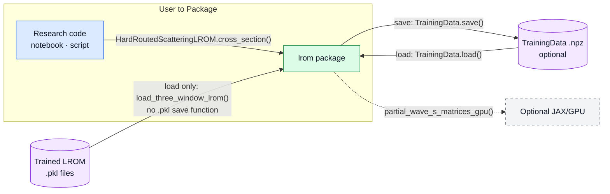
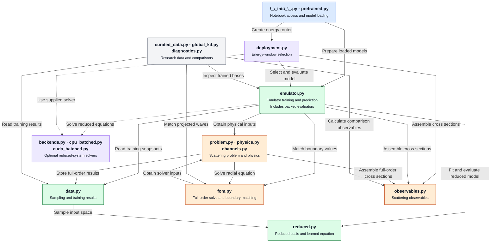
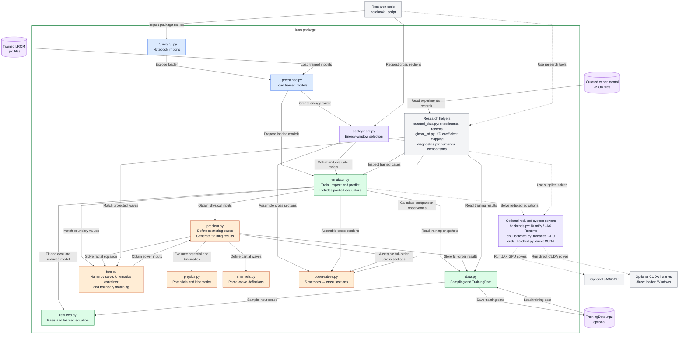
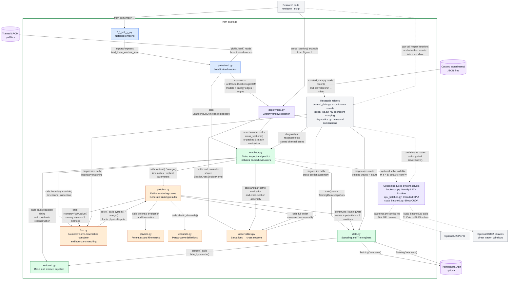
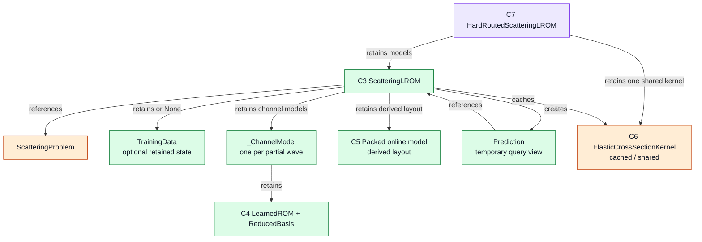
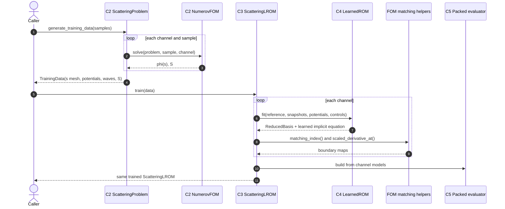
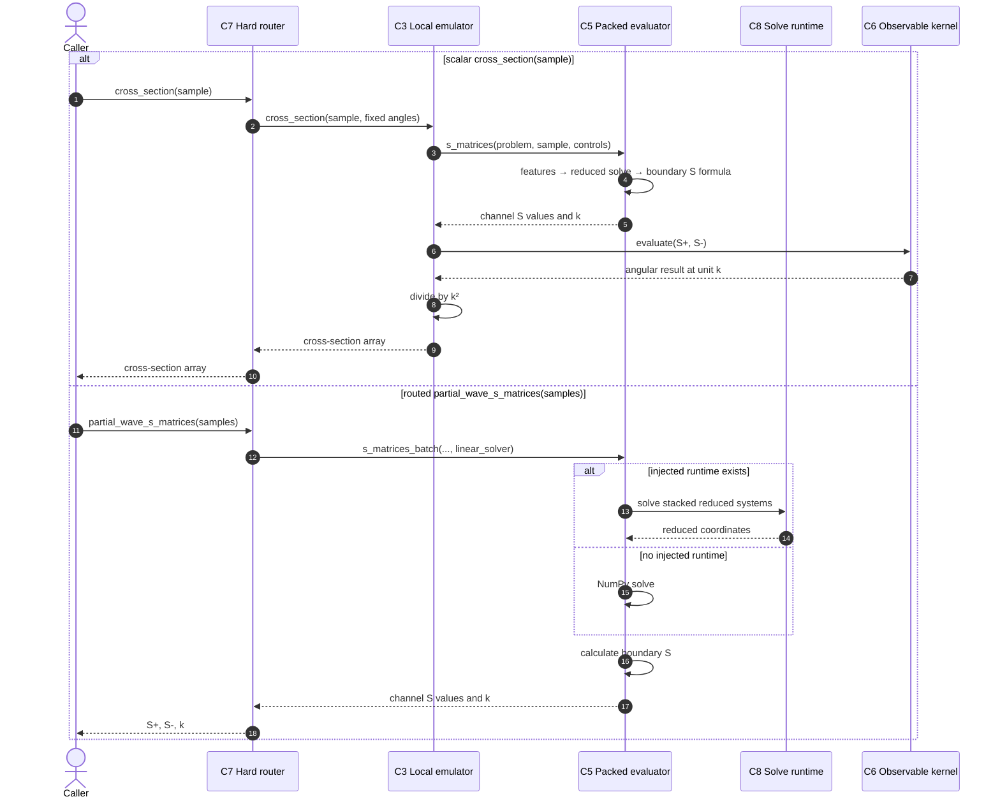
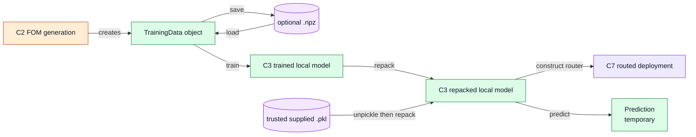

# Scattering LROM — Architecture Map (V5)

> A software mental model for the live `CleanCode` package. This is a selective,
> C4-inspired set of views, not a claim that Python files or responsibility groups
> are C4 containers. Detailed audit evidence remains in
> [`legacy/architecture-pack.md`](architecture-pack.md).

## How to read this map

Figure 2 groups whole Python files and labels the interactions between them.
Later figures retain the earlier responsibility IDs (`C1`–`C8`) during review.
**Zoom: C3 → object ownership** opens the local-emulator responsibility inside
`emulator.py`. Follow each arrow label for its meaning; arrows can describe
imports, calls, supplied information, or file transfers. Sequence diagrams
show call order.

The notation is informed by the [C4 diagram types](https://c4model.com/diagrams)
and [C4 notation guidance](https://c4model.com/diagrams/notation), while staying small
enough to match this single-process scientific library.

## Boundary view — user to package

The notebook or script calls the `lrom` package directly. The library's files
also import code from one another to carry out that work. There is no separate
service or worker.
Training data can stay in memory. Saving them as an `.npz` file is optional;
loading that file later lets a researcher reuse the full-order results.

`TrainingData` is an object in memory that holds full-order results for the
sampled cases, including wavefunctions, potentials, and S-matrix values. The
optional `.npz` file saves that object for later reuse.
`ScatteringLROM` has no public `.pkl` save or load method. The separate
`load_three_window_lrom()` function reads the three repository-trained LROM
files; only trusted pickle files should be loaded.
`partial_wave_s_matrices()` processes many cases at once. Its reduced solves
use NumPy on the CPU by default, or an explicitly supplied runtime. The
separate `partial_wave_s_matrices_gpu()` method takes a GPU solver directly.
Figure 1 shows the boundary around the package: who uses it, which files it
reads or writes, and which optional hardware it can call. Later figures show
how the calculations work inside that boundary.
`HardRoutedScatteringLROM.cross_section()` on the caller arrow is one example:
it returns the cross section at the chosen angles for one input case. It is
not the only call a notebook can make.

## Internal architecture overview — Figure 2

Figure 2 summarizes the code inside the package. Boxes group whole Python
files; arrows state a short purpose. External callers, artifacts, hardware,
and the package boundary are shown in the surrounding views rather than here.

The notebook-import file is grouped with model loading. Potential and
channel definitions are grouped with the scattering problem. These merge
files that had only one internal connection in the selective Figure 3 map;
they do not claim those files have only one import or caller in the code.
Figure 3 expands these groups, and Figure 4 adds detailed interaction labels.

## Whole-file overview — Figure 3

Figure 3 expands Figure 2 inside the `lrom package` boundary from Figure 1. Boxes contain whole
Python files; the optional solver and research-helper boxes collect several
whole files. Each file belongs to one box. Arrows give a short purpose for
each interaction. Positions do not prescribe calculation order.

This overview covers all 17 package files. Figure 4 keeps the same boxes and
connections, with more detailed interaction labels for manual code review.

The main prediction path is model loading → energy-window selection →
emulator evaluation → scattering observables. Training also uses the
scattering problem, full-order solver, training results, and reduced model.
The two arrows between `problem.py` and `fom.py` represent different calls:
the problem requests a radial solution; the solver obtains its physical
inputs from the problem.

## File interactions — Figure 4

This detailed version names functions or describes the call, data access,
or file transfer. The files and connections are the same as in Figure 3.
Normal function returns and supporting imports are omitted.

The notebook can load trained models or construct a scattering problem and
train an emulator from `TrainingData`. During prediction, `deployment.py`
selects a model, `emulator.py` evaluates its reduced equations and boundary
S matrices, and `observables.py` calculates the cross section. The packed
prediction code and the local emulator are both in `emulator.py`.

The problem and Numerov solver communicate in both directions:
`ScatteringProblem.generate_training_data()` calls `NumerovFOM.solve()`,
and that solver calls `problem.system()` and `problem.omega()` to obtain
its inputs. Full-order radial solves are used to generate training results;
shared kinematics and boundary helpers remain useful during prediction.

Optional solvers are supplied as objects or callables. `emulator.py` does
not import the solver implementation files. With no supplied solver, its
batched reduced systems use NumPy directly. `global_kd.py` and
`curated_data.py` are independently callable tools; their outputs are wired
into a research workflow by its caller. Their presence does not mean they
are automatically called by every prediction.

The curated-JSON and direct-CUDA connections extend Figure 1's selective
boundary view. NumPy, SciPy, pandas, and Python standard-library dependencies
are not exhaustively drawn. Bidirectional calls and file transfers are
explicitly labeled; ordinary returned numerical arrays are implicit.

For the later, not-yet-reviewed figures, the earlier responsibility IDs
remain: C1 access/loading; C2 problem/FOM; C3 local emulator; C4 reduced model;
C5 packed evaluator; C6 observables; C7 router; C8 runtime. C3 and C5 both
map to `emulator.py` in this whole-file view.

## Zoom: C3 → object ownership

This figure separates **retained state** from **calls**. A `ScatteringLROM` retains its
problem, optional training database, channel models, derived packed representation, and kernel
cache. The supplied pickle artifacts have `training_data is None`; loading repacks
their channel models and then constructs the router.

`Prediction` is request-local inspection state. It caches reduced coordinates and
S matrices only as its methods are called. The packed object is not another learned
model: it is a contiguous or grouped representation derived from the channel models.

## Sequence: offline snapshot generation and training

This is the actual call ownership. In particular, `ScatteringLROM.train()` directly
uses the matching-index and scaled-derivative helpers while wrapping each fitted
`LearnedROM` in a channel model.

The input space can reproducibly sample and validate cases, but validation is an
explicit caller action. `generate_training_data()` does not call it automatically.

## Sequence: routed online inference

The packed evaluator calculates potential features, assembles and solves the learned
reduced systems, and applies the boundary-matching formula for `S` itself. It performs
no Numerov solve and normally reconstructs no wavefunction.

Important API boundaries:

- The router's ordinary `cross_sections()` groups and chunks samples but does **not**
  pass its stored runtime into local cross-section evaluation.
- Runtime injection is used by routed `partial_wave_s_matrices()`.
- `ScatteringLROM.cross_sections(..., linear_solver=...)` is a separate local seam.
- `partial_wave_s_matrices_gpu(..., solver=...)` is a separate explicit GPU method.

## Artifact relationships and model lifecycle

There is a public, portable `TrainingData.save/load` path. There is currently no public
model-save API; the repository-supplied pickle files are trusted first-party artifacts,
not a general interchange format.

## Scientific software contracts

| Contract | Boundary that enforces or exposes it |
|---|---|
| **Coordinates and units** | Internally, snapshots, bases, predictors, and matching use `s = k r`; `Prediction.physical_wavefunction()` maps back to physical radius `r` in fm. Cross sections are returned in mb/sr. |
| **Model validity** | `InputSpace.validate()` checks declared ranges and integer choices only when called. Hard routing selects a window deterministically; it does not establish scientific validity outside calibrated/tested support. |
| **Verification, fidelity, adequacy** | Numerov-vs-ROSE checks the package FOM implementation. LROM-vs-the-package's own Numerov result measures emulator fidelity. Experiment comparisons additionally test optical-model adequacy. These are different claims. |
| **Precision and backend** | CPU solves follow their NumPy array dtype. The `precision` switch configures the optional JAX/GPU path. Backend substitution changes only supported batched dense reduced solves; it does not change the fitted equation. |
| **Reproducibility and trust** | Sampling is seedable; curated data carry pinned provenance; training metadata live beside supplied models. Only repository-trusted pickle artifacts should be loaded. |
| **Online cost** | Packed inference evaluates selected potential points and small reduced systems. Full wavefunction reconstruction is opt-in through `Prediction`; online Numerov solves are absent. |

## Component crosswalk

| ID | Main classes or functions | Primary source files |
|---|---|---|
| C1 | public re-exports; `load_three_window_lrom()` | `lrom/__init__.py`, `lrom/pretrained.py` |
| C2 | `ScatteringProblem`, `NumerovFOM`, `ScatteringSystem`, potential and matching functions | `lrom/problem.py`, `lrom/fom.py`, `lrom/physics.py` |
| C3 | `ScatteringLROM`, `Prediction`, `_ChannelModel` | `lrom/emulator.py` |
| C4 | `ReducedBasis`, `LearnedROM` | `lrom/reduced.py` |
| C5 | `_PackedOnlineModel`, `_RaggedPackedOnlineModel` | `lrom/emulator.py` |
| C6 | `ElasticCrossSectionKernel`, assembly functions | `lrom/observables.py` |
| C7 | `HardRoutedScatteringLROM` | `lrom/deployment.py` |
| C8 | `Runtime`, `get_runtime()` | `lrom/backends.py` |

## Current architecture vs possible evolution

The diagrams above describe current behavior. Possible future work, deliberately not
shown as present architecture:

- Define a public, versioned model serialization contract if collaborators must create
  and exchange fitted models; do not treat raw pickle as that contract.
- Unify batch-solver injection only if one consistent public behavior is desired across
  router cross sections, partial waves, and local batch calls.
- Attach explicit support-domain metadata to trained artifacts if runtime rejection or
  warnings outside calibrated ranges become a requirement.

These are recommendations, not missing boxes or implied dispatchers in the current code.
