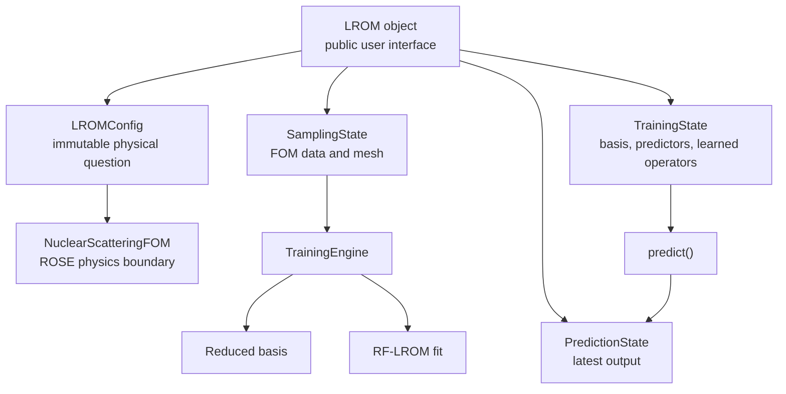
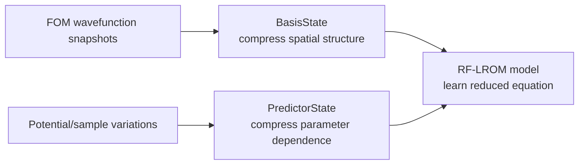
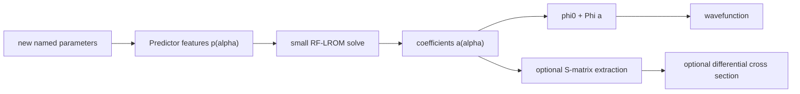

# LROM Architecture Understanding

## Purpose and ownership

This document is Daniel's maintained mental model of the LROM code. It explains what owns each state, where physics enters, and how a requested parameter set becomes a wavefunction.

Final prose ownership remains Daniel's: assistant-written text must receive his sentence-by-sentence review before advisor presentation.

## Object and state ownership

| Object part | Owns | Does not own |
|---|---|---|
| `LROMConfig` | Immutable physical identity | Solver outputs |
| `SamplingState` | FOM snapshots and mesh | Learned model |
| `TrainingState` | Basis, predictors, RF operators, diagnostics | Latest inference |
| `PredictionState` | Latest requested result | Training data |
| `LROM` | Lifecycle and public API | Raw numerical implementation details |

The `LROM` object coordinates the lifecycle. The state objects make the result of each lifecycle stage explicit, so configuration, expensive samples, trained models, and the latest prediction are not confused with one another.

## Training data flow

The wavefunction snapshots contain how the solution varies over physical radius. The predictor features contain how the physical inputs vary across parameter space. RF-LROM learns the reduced equation connecting those two compressed descriptions.

## Prediction data flow

Here `alpha` is the named physical parameter vector. The predictor map produces `p(alpha)`, the small RF-LROM equation produces reduced coefficients `a(alpha)`, and the basis reconstructs the physical wavefunction. Coefficients are coordinates inside a particular basis convention; they are not observables by themselves.

## Lifecycle calls and state transitions

| Public call | Requires | Work performed | State produced or changed |
|---|---|---|---|
| `LROM(...)` | Physical inputs | Validates and normalizes the physical question | Creates `LROMConfig` |
| `.sampling(...)` | Configuration and parameter design | Builds the mesh and runs the high-fidelity solver | Creates `SamplingState`; clears stale training and prediction state |
| `.train(...)` | `SamplingState` | Builds bases and predictors and fits RF-LROM | Creates `TrainingState`; clears the previous prediction |
| `.predict(...)` | `TrainingState` and named parameters | Maps parameters to features, solves the reduced equation, and reconstructs outputs | Replaces `PredictionState` |
| `.save(...)` | A trained object | Writes prediction-critical state | Creates a portable artifact on disk |
| `lrom.load(...)` | A portable artifact | Restores an inference-only object | Restores prediction ability without FOM sampling state |

A useful debugging question is: **which state first becomes wrong?** If parameter rows or snapshots are wrong, inspect sampling. If least-squares reconstruction is wrong, inspect the basis. If least squares is sound but LROM is wrong, inspect predictors and the RF-LROM fit. If only the latest requested output is wrong, inspect prediction and reconstruction.

## Physics and ROSE boundaries

ROSE has two different roles:

1. Inside `NuclearScatteringFOM`, ROSE supplies the high-fidelity scattering solver used to create authoritative snapshots.
2. In a benchmark notebook, a separate notebook-owned ROSE reduced-basis emulator is a comparison method. It is not part of package training or prediction.

LROM uses a central-reference affine basis,

\[
\phi(\alpha) \approx \phi_{\mathrm{central}} + \Phi_{\mathrm{LROM}}a_{\mathrm{LROM}}(\alpha).
\]

ROSE uses a free-reference affine basis,

\[
\phi(\alpha) \approx \phi_{\mathrm{free}} + \Phi_{\mathrm{ROSE}}a_{\mathrm{ROSE}}(\alpha).
\]

Reconstructed wavefunctions and their errors can be compared because they represent the same physical solution. Raw coefficient values cannot be compared across the two bases because their reference functions and vectors differ.

## Package version used by notebook 01

Notebook 01 deliberately imports `lrom_legacy.v1_2` version 1.2.0 for this advisor test. The notebook reads that frozen implementation through its public API. It does not alter the current `lrom` package or the frozen snapshot.

This distinction should remain visible:

- `lrom_legacy.v1_2`: implementation used by notebook 01 for the present advisor test.
- `lrom`: current package development line, not changed by this notebook correction.
- public `nuclear-rose`: supplies both the FOM solver boundary and the notebook-owned comparison emulator.

## Save/load boundary

The portable artifact retains the immutable configuration, physical mesh, kinematics, reduced bases, predictor state, RF-LROM operators, training options, and provenance needed for inference. It does not own the training/testing FOM snapshot arrays or live ROSE solver objects. Loading restores prediction ability, not the ability to repeat sampling.

## How to understand a code change

For every functional change, record five things:

1. **Methodology:** the scientific or architectural reason.
2. **Before:** the previous behavior and its consequence.
3. **After:** the implemented behavior and the function or state that owns it.
4. **Execution:** commands and measured evidence used to verify it.
5. **What did not change:** protected packages, data definitions, and unaffected lifecycle stages.

For a deeper reading, ask these questions in order:

1. Which public call does the user make?
2. Which state object should that call create or replace?
3. Which numerical transformation occurs inside that stage?
4. Which arrays enter and leave the transformation, and what are their shapes?
5. Which scientific assumption makes the transformation valid?
6. Which test or diagnostic would fail if that assumption were violated?

This sequence connects architecture to implementation without starting in low-level details.

## Change record

### Notebook 01 ROSE reference correction

- **Methodology:** ROSE's reduced equations require the free, no-interaction solution as their affine reference. Equal training data and equal retained rank do not require equal coordinate conventions.
- **Before:** notebook 01 supplied LROM's central solution and vectors to ROSE, then compared the resulting coefficients as if both methods used one basis. Three extrapolation cases developed coefficient norms of approximately 78–297, reduced-matrix condition numbers of approximately 2,365–12,485, and wavefunction errors of approximately 5.4–22.
- **After:** notebook 01 uses frozen `lrom_legacy.v1_2` for LROM and constructs a separate four-vector ROSE basis from the same snapshots around the free solution. It compares reconstructed wavefunctions and shows coefficients in separate convention-specific figures. For the three identified cases, free-reference wavefunction errors fall to approximately 0.036–0.171.
- **Execution:** the change is verified by a controlled three-case diagnostic, complete notebook execution, visual figure inspection, focused tests, and the full project test suite. Exact measured results live in `.agents/validation/2026-07-20-notebook01-rose-reference-results.md`.
- **What did not change:** neither package tree, the installed ROSE package, the scientific archive, parameter samples, high-fidelity snapshots, nor retained rank was modified.

Final prose ownership: pending Daniel's review.
