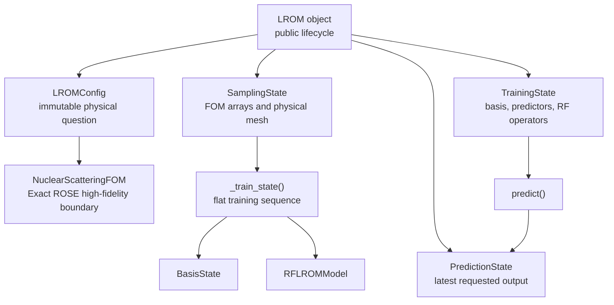
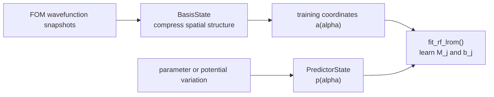
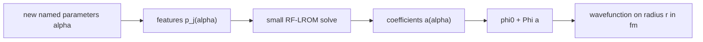

# LROM Architecture Understanding

## Purpose and ownership

This is Daniel's maintained mental model of the v1.2 active package. It connects each public call to the state it owns and the numerical function that performs the work.

Final prose ownership remains Daniel's. Assistant-written explanations and notebook prose require his sentence-by-sentence review before advisor presentation.

## Version boundary

- `import lrom` is the public v1.2 active package.
- `lrom/__init__.py` is a small public entry point.
- `lrom_legacy.v1_2` contains the one-file authoritative implementation.
- `lrom_legacy.v2_0` is the parked future shell for wavefunctions and cross sections.

The public lifecycle is intentionally rigid. `LROM(...)`, `sampling()`, `train()`, `predict()`, `save()`, and `load()` retain their roles. A major restructure requires user approval before implementation.

## Object and state ownership

| Object part | Owns | Does not own |
|---|---|---|
| `LROMConfig` | Immutable physical identity | Solver outputs |
| `SamplingState` | FOM snapshots, potential arrays, designs, and physical-radius mesh | Learned model |
| `TrainingState` | Basis, predictors, RF operators, and RF diagnostics | Latest inference request |
| `PredictionState` | Latest parameters, reduced coefficients, and reconstructed wavefunctions | Training data |
| `LROM` | Lifecycle and public API | Numerical implementation details |

The state boundary separates the physical question, expensive high-fidelity data, a trained reduced model, and the latest prediction.

## Numbered source map

The banners in `lrom_legacy/v1_2/__init__.py` are stable reading landmarks.

| Part | Owns | Main names to read |
|---|---|---|
| 1. Physical configuration and potentials | Validated nuclear problem and potential schema | `LROMConfig`, `PotentialSpec`, `real_woods_saxon()` |
| 2. Parameter designs and lifecycle state | Named cases and stage-specific NumPy containers | `ParameterCases`, `SamplingDesign`, `SamplingState`, `TrainingState`, `PredictionState` |
| 3. Centered reduced basis | Spatial compression around the central solution | `build_basis()`, `project_coordinates()`, `reconstruct()` |
| 4. Optional analysis utilities | Explicit LS benchmark and raw errors | `least_squares_baseline()`, `pointwise_absolute()`, `relative_l2()` |
| 5. Predictor construction | Features describing parameter or potential variation | `build_parameter_predictor()`, `build_potential_predictor()` |
| 6. RF-LROM numerical core | Stacked operator fit and online reduced solve | `fit_rf_lrom()`, `solve_rf_lrom()` |
| 7. Exact ROSE high-fidelity boundary | Authoritative Runge-Kutta wavefunction snapshots | `NuclearScatteringFOM` |
| 8. RF-LROM training orchestration | Basis, predictors, coordinates, and RF fit | `_reduced_basis_state()`, `_train_state()` |
| 9. RF-LROM prediction | Named inputs through reconstructed wavefunctions | `_parameter_rows()`, `predict()` |
| 10. Portable artifacts | Prediction-critical arrays and provenance | `save_artifact()`, `load_artifact()` |
| 11. Public LROM lifecycle | State transitions and user-facing calls | `LROM`, `load()` |

## Public calls mapped to numerical work

| Public call | Requires | Private work | State effect |
|---|---|---|---|
| `LROM(...)` | Physical inputs | `LROMConfig.create()` | Creates immutable configuration |
| `.sampling(...)` | Parameter design | Design builder, then `NuclearScatteringFOM.sample()` | Creates `SamplingState`; clears stale training and prediction |
| `.reduced_basis(...)` | `SamplingState` | `_reduced_basis_state()` and `build_basis()` | Creates basis-only `TrainingState` |
| `.train(...)` | `SamplingState` | `_train_state()` | Creates complete `TrainingState`; clears stale prediction |
| `.predict(...)` | Complete `TrainingState` | `features_for_values()`, `solve_rf_lrom()`, `reconstruct()` | Replaces `PredictionState` |
| `.save(...)` | Trained object | `save_artifact()` | Writes a portable `.lrom` file |
| `lrom.load(...)` | Portable artifact | `load_artifact()` | Restores an inference-only object |

## Training data flow

The high-fidelity wavefunctions determine the spatial basis and training coordinates. Parameter or potential samples determine the predictor features. RF-LROM learns a reduced equation connecting these descriptions.

## Prediction data flow

`alpha` is the named physical parameter vector. The index `j` labels predictor terms from 1 through `K`. The online stage solves only the reduced system; it does not call ROSE.

## The two least-squares calculations

### Training coordinates are required by RF-LROM

The centered basis represents a snapshot as

\[
\phi(\alpha_i) \approx \phi_0 + \Phi a_i.
\]

For each training snapshot, `project_coordinates()` solves

\[
a_i = \underset{a}{\operatorname{argmin}}\;
\left\|W^{1/2}\left[\phi(\alpha_i)-\phi_0-\Phi a\right]\right\|_2.
\]

`W` contains trapezoid weights on physical radius. The code forms `A = W**(1/2) Phi` and `b = W**(1/2)(phi - phi0)`, then uses `numpy.linalg.lstsq(A, b)`. It does not form normal equations because that squares the condition number and can lose accuracy. These coordinates are required training data for RF-LROM.

### LS baseline is opt-in analysis

`least_squares_baseline()` applies the same projection to a requested high-fidelity test wavefunction. It sees the target wavefunction and gives the best reconstruction available inside that fixed affine basis.

That result is an oracle basis floor, not an RF-LROM prediction. `LROM.train()` does not calculate or store it automatically. A notebook must call the baseline explicitly.

This explains why LS should normally be at least as accurate as LROM in the same basis and norm: LS receives the wavefunction it is reconstructing, while LROM infers coefficients from predictor features.

## RF-LROM fit methodology

RF-LROM assumes

\[
\left(I + \sum_{j=1}^{K}p_j(\alpha)M_j\right)a(\alpha)
= \sum_{j=1}^{K}p_j(\alpha)b_j.
\]

Once `a(alpha)` and `p_j(alpha)` are known, every unknown entry of `M_j` and `b_j` appears linearly. `fit_rf_lrom()` stacks all sample/equation rows into one complex design matrix and calls `numpy.linalg.lstsq` once. The flat solution is unpacked into the `M_j` matrices and `b_j` vectors.

At prediction time, `solve_rf_lrom()` builds the small matrix for each new predictor row and uses `numpy.linalg.solve`. This is neither another fit nor a high-fidelity solve.

## Exact and EIM boundaries

Package sampling constructs `rose.InteractionSpace` and runs the ROSE Runge-Kutta solver. No EIM basis is calculated in `sampling()`, because an EIM is not required to produce the exact high-fidelity snapshots used by RF-LROM.

A notebook-owned ROSE reduced emulator may require `rose.InteractionEIMSpace`. That EIM belongs visibly in benchmark methodology and is not package state.

- package sampling: exact interaction and authoritative FOM snapshots;
- RF-LROM training: central-reference basis, predictors, and learned operators;
- ROSE benchmark: its own free-reference basis and any required EIM.

## Basis-reference boundary

LROM uses a central-reference affine basis,

\[
\phi(\alpha) \approx \phi_{\mathrm{central}} + \Phi_{\mathrm{LROM}}a_{\mathrm{LROM}}(\alpha).
\]

The notebook-owned ROSE emulator uses a free-reference affine basis,

\[
\phi(\alpha) \approx \phi_{\mathrm{free}} + \Phi_{\mathrm{ROSE}}a_{\mathrm{ROSE}}(\alpha).
\]

Wavefunctions and errors can be compared because both reconstruct the same physical quantity. Raw coefficients cannot be compared as equal coordinates across the two conventions.

## Save/load boundary

The artifact retains configuration, physical mesh, kinematics, reduced bases, predictor transformation, RF-LROM operators, and provenance required for prediction. It omits full sampling arrays and live ROSE objects. Loading restores prediction ability, not sampling.

## How to understand a code change

For each functional change, record:

1. **Methodology:** scientific or architectural reason.
2. **Before:** previous behavior and consequence.
3. **After:** new behavior and the function or state that owns it.
4. **Execution:** commands and measured evidence.
5. **What did not change:** protected methods, physics inputs, data definitions, and unaffected states.

Then ask:

1. Which public call begins the work?
2. Which state should that call create or replace?
3. Which numbered source section owns the transformation?
4. Which arrays enter and leave, and what are their shapes?
5. Which scientific assumption makes it valid?
6. Which characterization test exposes an unintended change?

## Change record

### v1.2 package simplification

- **Methodology:** retain work required by high-fidelity sampling, RF-LROM training, prediction, and artifacts; make optional benchmarking explicit.
- **Before:** public `lrom` exposed 2.0; v1.2 sampling constructed an unnecessary EIM; `train()` automatically projected testing wavefunctions for LS; a one-use `TrainingEngine` wrapper hid the flat sequence.
- **After:** public `lrom` exposes v1.2; sampling uses `InteractionSpace`; LS is explicit; `_train_state()` shows the training sequence. `lrom_legacy.v2_0` remains parked.
- **Execution:** deterministic hashes lock central, training, testing, basis, RF matrices, RF vectors, and prediction arrays. Focused sampling, LS, lifecycle, training, and artifact tests pass.
- **What did not change:** public lifecycle meanings, physical-radius interface, ROSE Runge-Kutta solve, central-reference convention, RF-LROM equations, artifact behavior, scientific archive, or parked v2.0 physics.

### Notebook 01 ROSE reference correction

- **Methodology:** ROSE's reduced equations require the free solution as their affine reference.
- **Before:** notebook 01 supplied LROM's central solution and vectors to ROSE and treated coefficients as if both methods used one convention.
- **After:** notebook 01 constructs a separate ROSE basis around the free solution and compares reconstructed wavefunctions while keeping coefficient conventions separate.
- **Execution:** controlled results are recorded in `.agents/validation/2026-07-20-notebook01-rose-reference-results.md`.
- **What did not change:** installed packages, scientific archive, parameter samples, high-fidelity snapshots, or retained rank.

Final prose ownership: pending Daniel's review.
