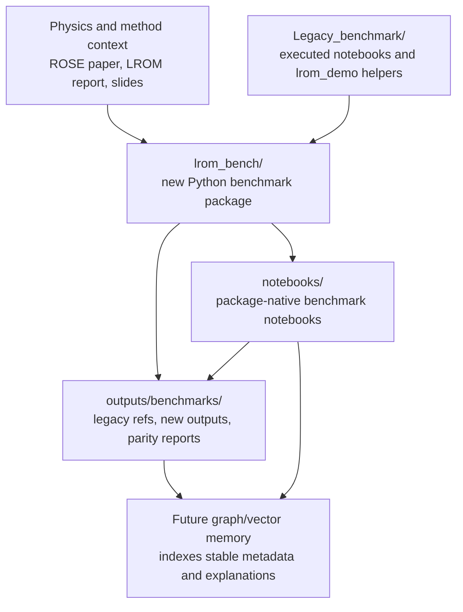
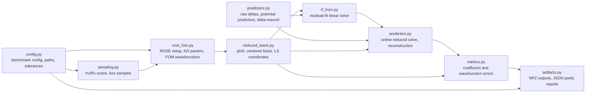
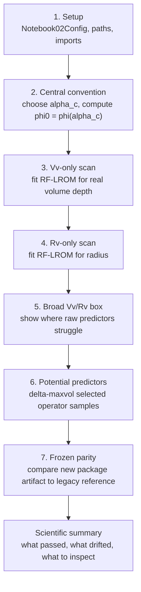
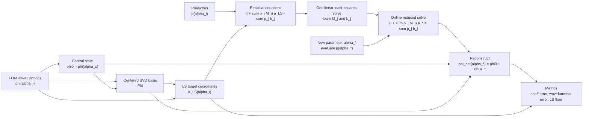

# LROM Benchmark Spine Architecture

This document shows the proposed research benchmark package at three abstraction levels. The diagrams are written in Mermaid so they stay reviewable as plain Markdown.

## Figure 1: Project Context



At this level, the legacy benchmark is an input and comparison source. The new package becomes the executable center of the project. The notebooks and artifacts are review surfaces produced by that package.

## Figure 2: Package Spine



This is the benchmark spine: each module owns one scientific stage. The flow is intentionally more concrete than a general framework, because the first goal is reliable Notebook 02 parity.

## Notebook-Driven Helper Rule

Notebook 1 adds only small reusable helpers needed by the notebook:

- `Notebook01Config` records the single-wavefunction benchmark settings.
- `sampling.centered_1d_values` creates the visible `Vv` scan.
- `reduced_basis.build_centered_svd_basis` creates the central-reference basis used by the notebook.
- `rose_fom.central_real_ws_parameters` and `rose_fom.real_woods_saxon_potential` expose the real Woods-Saxon teaching setup.
- `rose_fom.RealWSProblem`, `rose_fom.make_real_ws_problem`, `rose_fom.make_real_ws_custom_basis`, and `rose_fom.make_real_ws_rbe` split the ROSE-backed FOM/RBM setup into small reusable pieces.

Plotting remains in notebook cells. The package should not grow plotting functions or one-call notebook workflow functions.

## Figure 3: Notebook 02 Scientific Flow



This diagram is the visible notebook narrative. The notebook should not collapse these steps into one opaque runner.

## Figure 4: RF-LROM Training And Prediction



This is the mathematical core: training inserts known LS coordinates into the implicit equation, which turns the fit into a linear least-squares problem.

## Figure 5: Parity And Future Memory

```mermaid
flowchart TB
    legacy_npz["Frozen legacy NPZ<br/>outputs/benchmarks/legacy"]
    new_npz["New package NPZ<br/>outputs/benchmarks/new"]
    compare["Parity comparison<br/>array checks and scientific metrics"]
    report["JSON parity report<br/>metadata, tolerances, pass/fail"]
    notebook["Notebook output<br/>human-readable narrative and figures"]
    graph["Future graph memory<br/>runs, configs, datasets, model fits, artifacts"]
    vector["Future vector memory<br/>notebook summaries, decisions, report excerpts"]

    legacy_npz --> compare
    new_npz --> compare
    compare --> report
    report --> notebook
    report --> graph
    notebook --> vector
    report --> vector
```

The graph/vector layer is intentionally downstream. First the package must produce stable, metadata-rich artifacts; then memory can index them.
