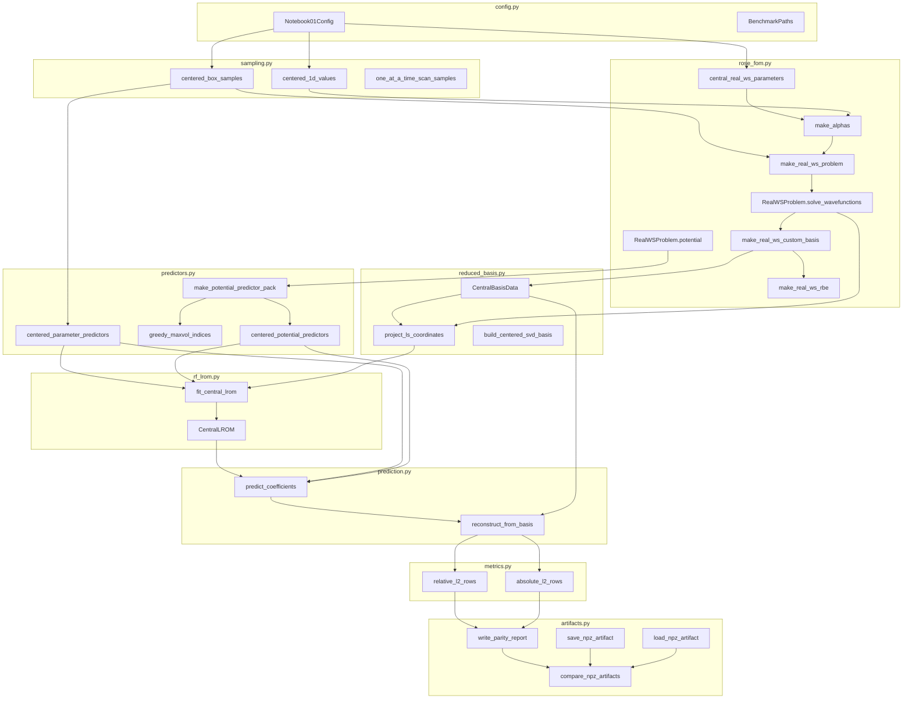

# LROM Bench Function Flow

This Mermaid flowchart connects the main functions/classes to their package files, then shows how the files are used in the Notebook 1 workflow.

```mermaid
flowchart TB
    subgraph config["config.py"]
        Notebook01Config["Notebook01Config"]
        BenchmarkPaths["BenchmarkPaths"]
    end

    subgraph sampling["sampling.py"]
        centeredBox["centered_box_samples"]
        centered1d["centered_1d_values"]
        oneScan["one_at_a_time_scan_samples"]
    end

    subgraph rose["rose_fom.py"]
        centralParams["central_real_ws_parameters"]
        makeAlphas["make_alphas"]
        makeProblem["make_real_ws_problem"]
        solvePhi["RealWSProblem.solve_wavefunctions"]
        makeBasisRose["make_real_ws_custom_basis"]
        makeRBE["make_real_ws_rbe"]
        potential["RealWSProblem.potential"]
    end

    subgraph rbasis["reduced_basis.py"]
        basisData["CentralBasisData"]
        lsCoords["project_ls_coordinates"]
        svdBasis["build_centered_svd_basis"]
    end

    subgraph predictors["predictors.py"]
        paramPred["centered_parameter_predictors"]
        maxvol["greedy_maxvol_indices"]
        pack["make_potential_predictor_pack"]
        potPred["centered_potential_predictors"]
    end

    subgraph fit["rf_lrom.py"]
        lromModel["CentralLROM"]
        fitLrom["fit_central_lrom"]
    end

    subgraph prediction["prediction.py"]
        predCoeff["predict_coefficients"]
        reconstruct["reconstruct_from_basis"]
    end

    subgraph metrics["metrics.py"]
        relErr["relative_l2_rows"]
        absErr["absolute_l2_rows"]
    end

    subgraph artifacts["artifacts.py"]
        saveNpz["save_npz_artifact"]
        loadNpz["load_npz_artifact"]
        compareNpz["compare_npz_artifacts"]
        report["write_parity_report"]
    end

    Notebook01Config --> centered1d
    Notebook01Config --> centeredBox
    Notebook01Config --> centralParams
    centralParams --> makeAlphas
    centered1d --> makeAlphas
    centeredBox --> makeProblem
    makeAlphas --> makeProblem
    makeProblem --> solvePhi
    solvePhi --> makeBasisRose
    makeBasisRose --> makeRBE
    makeBasisRose --> basisData
    basisData --> lsCoords
    solvePhi --> lsCoords

    centeredBox --> paramPred
    potential --> pack
    pack --> maxvol
    pack --> potPred
    paramPred --> fitLrom
    potPred --> fitLrom
    lsCoords --> fitLrom
    fitLrom --> lromModel
    lromModel --> predCoeff
    paramPred --> predCoeff
    potPred --> predCoeff
    predCoeff --> reconstruct
    basisData --> reconstruct
    reconstruct --> relErr
    reconstruct --> absErr
    relErr --> report
    absErr --> report
    report --> compareNpz
    saveNpz --> compareNpz
    loadNpz --> compareNpz
```
